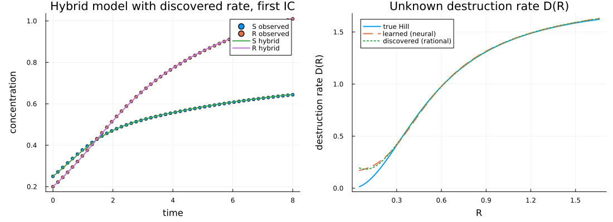

# BioDynaX.jl

Hybrid models of biochemical networks: compiled known kinetics plus one neural destruction term, recovered symbolically.

[](https://github.com/utkuyilmaz1903/BioDynaX.jl/actions/workflows/ci.yml) [](https://utkuyilmaz1903.github.io/BioDynaX.jl/dev/) [](LICENSE) [](https://julialang.org)

## What BioDynaX does

BioDynaX fits hybrid models of small biochemical networks. You give it a
known interaction graph and known kinetics (mass action, linear decay, Hill,
Michaelis-Menten saturation, competitive binding, or a custom rate); it
compiles those into a production-destruction ODE
`du_i/dt = P_i(u) - D_i(u) * u_i`. Exactly one destruction term may be marked
unknown. That term is replaced by a small neural network (a universal
differential equation), trained on time-series data from one or more initial
conditions, and then approximated symbolically by sparse rational regression
(implicit SINDy) over a library built only from that node's graph neighbours.

The package reports three things: whether the unknown term is practically
identifiable from the data (a Fisher-information and scale-collinearity
diagnostic), how well the hybrid model reproduces observed and held-out
trajectories, and which symbolic terms are recovered. It is a research tool
for the regime of roughly 2 to 20 states with a known graph, not a
general-purpose network-inference tool or reaction-network solver.

## Installation

BioDynaX requires Julia 1.10 or newer. It is not yet in the General registry;
install it from GitHub:

```julia
using Pkg
Pkg.add(url = "https://github.com/utkuyilmaz1903/BioDynaX.jl")
```

or clone the repository and instantiate its environment:

```bash
git clone https://github.com/utkuyilmaz1903/BioDynaX.jl.git
cd BioDynaX.jl
julia --project=. -e 'using Pkg; Pkg.instantiate()'
```

## Quick start

The block below builds a two-species network, marks one destruction term as
unknown, generates synthetic data, trains the hybrid model, prints the
identifiability warning, and discovers a symbolic rate. It runs in about two
minutes on a laptop.

```julia
using BioDynaX, Random

# Two species. S is produced in proportion to R and degraded by a Hill-type
# mechanism driven by R; R is produced from S and decays linearly.
# `known = false` marks the Hill degradation as the one unknown term.
function network(; known::Bool)
    nodes = [NodeSpec(name = :S), NodeSpec(name = :R)]
    reactions = [
        ReactionSpec(name = :produce_s, stoichiometry = Dict(1 => 1.0), regulators = [2],
            metadata = MassActionMetadata(rate_param = :k_prod)),
        ReactionSpec(name = :degrade_s, stoichiometry = Dict(1 => -1.0), regulators = [2],
            known = known, family = HILL,
            metadata = HillMetadata(vmax_param = :vmax, k_param = :K, hill_order = 2)),
        ReactionSpec(name = :produce_r, stoichiometry = Dict(2 => 1.0), regulators = [1],
            metadata = MassActionMetadata(rate_param = :k_rs)),
        ReactionSpec(name = :decay_r, stoichiometry = Dict(2 => -1.0), regulators = Int[],
            metadata = LinearDecayMetadata(rate_param = :k_r))]
    return BiologicalNetwork(nodes, EdgeSpec[]; reactions = reactions)
end

rng = MersenneTwister(1)
tspan = (0.0, 10.0)
truth = (k_prod = 0.9, vmax = 1.8, K = 0.55, k_rs = 1.0, k_r = 0.6)
data = generate_experiment_set(rng; network = network(known = true), truth_params = truth,
    initial_conditions = [[0.2, 0.1], [1.0, 0.5], [0.5, 1.2]], tspan = tspan,
    n_points = 40, noise_σ = 0.0)                     # or: experiment_from_csv("data.csv")

model, p0 = build_ude_model(rng, network(known = false))   # unknown term -> neural network
p_init = pack_parameters((k_prod = 0.8, k_rs = 0.8, k_r = 0.8), p0.nn)
trained = train_experiments(p_init, data, model;
    config = TrainingConfig(adam_iterations = 100, bfgs_iterations = 20), verbose = false)

e = data.experiments[1]
ident = BioDynaX.report_production_destruction_tradeoff(
    model, trained.params, e.observations, e.times, e.u0, tspan; verbose = true)
println("scale warning raised: ", ident.unidentifiable_edge)

X = hcat((predict_ude(trained.params, ex.u0, tspan, ex.times, model) for ex in data.experiments)...)
R, D, term = sample_unknown_destruction(model, trained.params, X)
found = discover_unknown_rate(R, 1:size(R, 2), D; verbose = false)
println(found.equations)
```

The full example uses the reference protocol (seed 103, nine initial
conditions, 50 points each, Adam 100 / BFGS 50, discovery on a regulator grid)
and takes about 10 to 15 minutes:

```bash
julia --project=. examples/unknown_inhibition.jl
```

It prints a four-section report. The lines that matter most:

```text
  unidentifiable_edge: true
  coefficients_are_biological_constants: false
  collinearity: 0.997
  hybrid_data_residual: 0.0017769252587108318
dx[1]/dt = (0.24118*1 + -1.3569*x[1] + 7.7609*x[1]^2) / (1 + -0.3862*x[1] + 4.1863*x[1]^2)
  extras: 1, r
```

Read top to bottom: the production rate `k_prod` and the scale of the unknown
term are collinear, so the recovered coefficients are not biological constants;
the hybrid model with the discovered rational rate reproduces the first
trajectory with a root-mean-square residual of about 0.002; the discovered
rate has the Hill-like `x^2 / (K + x^2)` structure, with two nuisance terms (a
constant and a linear term) remaining. `x[1]` is the regulator `R`.



## How it works

| Step | What happens | Main functions |
|---|---|---|
| Network specification | Nodes, edges or reactions, and typed kinetic metadata | `BiologicalNetwork`, `NodeSpec`, `ReactionSpec`, `HillMetadata`, ... |
| Compile | Known kinetics become production and destruction terms; the unknown term becomes a neural network with a softplus output | `build_ude_model`, `compile_mechanism` |
| Simulate | The model is an ordinary `ODEProblem` and works with OrdinaryDiffEq solvers | `ODEProblem(model, u0, tspan, p)`, `ude_system`, `ude_rhs!` |
| Train | Adam followed by BFGS on the trajectory mean-squared error across experiments, with adjoint sensitivities | `train_ude`, `train_experiments`, `TrainingConfig` |
| Identifiability check | Fisher condition number and the cosine between the production-rate and destruction-scale trajectory Jacobians | `BioDynaX.report_production_destruction_tradeoff` |
| Symbolic discovery | The learned rate is sampled and fitted by implicit sparse regression over a graph-local rational library | `sample_unknown_destruction`, `discover_unknown_rate`, `local_basis` |
| Resimulate | The discovered rate replaces the neural term and the hybrid model is compared with data | `compose_hybrid_rhs`, `hybrid_data_residual`, `export_rhs` |

Synthetic data for several initial conditions come from
`generate_experiment_set`; measured data can be loaded with
`experiment_from_csv`.

## Scope and limitations

- **One unknown term.** The recovery workflow requires exactly one unknown
  destruction term. The example and the recovery suite raise an error for zero
  or two or more unknown terms. The compiler accepts other configurations, but
  nothing in the package validates them.
- **The identifiability diagnostic is local and practical.** It flags an edge
  as unidentifiable when the Fisher condition number exceeds `1e6` or when the
  production-rate and destruction-scale trajectory Jacobians have a cosine of
  at least 0.95, on one trajectory. It is not a structural identifiability
  proof, and a passing check does not certify the recovered mechanism.
- **A good fit is not mechanism recovery.** A small trajectory residual shows
  that the hybrid model reproduces the data. It does not by itself show that
  the true mechanism was found.
- **Coefficients are not biological constants** unless the scale of production
  or destruction is fixed by outside information. With observed concentrations
  alone, the production rate and the scale of the unknown term trade off
  against each other.
- **The discovered form is a rational function, not a canonical Hill law.**
  The reference protocol recovers the true monomials of the Hill term (the
  acceptance criterion is recall of at least 0.99), but nuisance terms remain.
  The combined support F1 threshold in the benchmarks is 0.50; the package does
  not turn the neural term into a canonical Hill expression with named
  parameters.
- **Synthetic data only.** All validation uses data generated from the compiled
  ground-truth mechanism. No experimental dataset ships with the package, and
  the CSV in `examples/data/` is synthetic.
- **Held-out validation is reported, not enforced.** The reference protocol
  trains on seven of nine initial conditions and reports the residual and the
  destruction-rate error on the other two. Those numbers are evidence; they are
  not part of the acceptance criteria.
- **Robustness validation is partial.** The package includes a diagnostic that
  compares independently trained neural terms across five restart seeds, and a
  check that runs discovery with the graph-local, a global, and a wrong-graph
  library on the same trained model. A multi-seed robustness study of the full
  protocol is not implemented.
- **Partial observation** is limited to discovery from subsampled
  destruction-rate values; training on unobserved states is not supported.
- **Extensions are thin.** The GPU extension only transfers arrays; there is no
  batched GPU training. SBML import reads species, reactions, and
  stoichiometry, but does not parse kinetic laws (MathML); such reactions
  become unknown neural terms.
- Not in scope: inferring the interaction graph, general reaction-network
  solving, several unknown terms at once, and experimental design.

## Optional extensions

Each loads automatically when the trigger package is present. All are
experimental and unexported; call them as `BioDynaX.name`.

| Trigger package | What it adds |
|---|---|
| `CUDA` | Moves experiment arrays to the GPU (`BioDynaX.to_device`, `BioDynaX.gpu_execute`) |
| `Plots` | `BioDynaX.plot_training` for observations, truth, prediction, and the loss history |
| `ModelingToolkit` | `BioDynaX.export_mtk_system` converts a compiled model to an `ODESystem` |
| `SBML` | `BioDynaX.import_sbml_network` builds a network from species and reactions |
| `SBMLToolkit` + `Catalyst` | `BioDynaX.import_sbmltoolkit_network` with mass-action detection through Catalyst |
| `DataDrivenSparse` | `BioDynaX.DataDrivenSparseSTLSQ`, an alternative sparse-regression backend |

## Documentation

The documentation is at
[utkuyilmaz1903.github.io/BioDynaX.jl/dev](https://utkuyilmaz1903.github.io/BioDynaX.jl/dev/).
Main pages: Getting started, Tutorial (the unknown-inhibition walkthrough),
Concepts (model form, identifiability, discovery, the train/holdout protocol),
How-to recipes, Benchmarks, API reference, and Scope and limitations.

## Development

```bash
julia --project=. -e 'using Pkg; Pkg.test()'                                         # default tests
BIODYNAX_SMOKE=1 ADAM_ITERS=2 BFGS_ITERS=0 julia --project=. examples/unknown_inhibition.jl  # 1-IC smoke run
julia --project=. examples/unknown_inhibition.jl                                     # full example
julia --project=. test/run_recovery_hard.jl                                          # trained-model recovery checks
julia --project=. benchmark/recovery_suite.jl                                        # fast recovery benchmarks
julia --project=docs docs/instantiate.jl && julia --project=docs docs/make.jl        # build the docs
```

See [CONTRIBUTING.md](CONTRIBUTING.md) for the ground rules.

## Citing

Citation metadata is in [CITATION.cff](CITATION.cff).

```bibtex
@software{biodynax,
  author  = {Yılmaz, Utku},
  title   = {BioDynaX.jl: hybrid models of biochemical networks with one neural destruction term},
  year    = {2026},
  version = {0.10.0},
  url     = {https://github.com/utkuyilmaz1903/BioDynaX.jl},
  license = {MIT}
}
```

## License

MIT. See [LICENSE](LICENSE).
