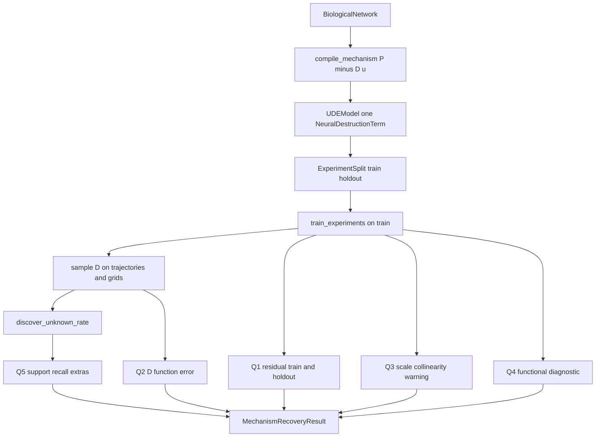
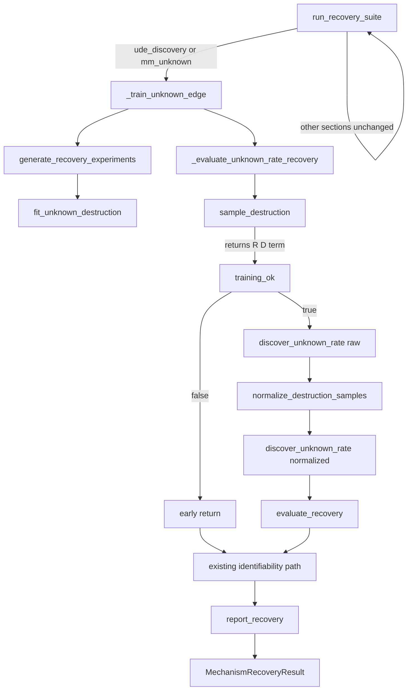
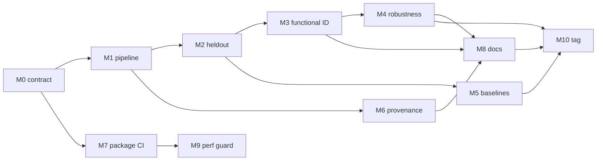

# BioDynaX v1.0 Geliştirme Planı

Bu plan, [docs/research/BIO-DYNAX-VISION.md](docs/research/BIO-DYNAX-VISION.md) ve [docs/research/FORENSIC-AUDIT.md](docs/research/FORENSIC-AUDIT.md) ile **gerçek kaynak ağacını** yan yana okuyarak yazıldı. Adli denetim büyük ölçüde doğru; birkaç yerde abartılı veya yanlış teşhis var. v1.0, Mechanism Repair motoru değildir. Hedef: bilinen graf + tam bir bilinmeyen yıkım + çoklu deney + mekanistik kurtarma + identifiability + bilimsel doğrulama + yeniden üretilebilirlik.

## Denetimin koda karşı doğrulanması

Aşağıdaki 12 zayıflık koda karşı kontrol edildi.

- **1. Fonksiyonel identifiability yok — DOĞRU.** [src/Identifiability.jl](src/Identifiability.jl) yalnızca fiziksel parametre Fisher’ı ve `k_prod`↔`D` ölçek kosinüsüdür. `D_1…D_m` karşılaştırması yok. [src/ScientificCore.jl](src/ScientificCore.jl) içindeki `DiscoveryUncertaintyReport` bootstrap terim sıklığıdır; fonksiyonel anlaşma değildir.
- **2. Residual / identifiability held-out değil — DOĞRU.** [src/Recovery.jl](src/Recovery.jl) `ref_exp = first(ude_set.experiments)` kullanır (satır ~1088–1101). Kullanıcı yüzü [examples/unknown_inhibition.jl](examples/unknown_inhibition.jl) de residual/ident’i `first_exp` üzerinde hesaplar. [src/Experiments.jl](src/Experiments.jl) `ExperimentSet` bir listedir; `experiment_batches` yalnızca Adam minibatch’tir. Discovery `validation_fraction` **sütun** bölmesidir, deney split’i değildir.
- **3. Tek tohuma bağımlılık — DOĞRU, nüanslı.** CI kırmızı kapısı seed 103’tür ([test/test_recovery_hard.jl](test/test_recovery_hard.jl)). [benchmark/recovery_seeds.jl](benchmark/recovery_seeds.jl) `--ude` raporu vardır ama kapı değildir ([docs/src/out-of-scope.md](docs/src/out-of-scope.md)).
- **4. Zayıf mekanistik metrikler — DOĞRU.** Kapılar: recall ≥ 0.99 (monomial üyelik), residual ≤ 0.30 (tipik ~0.003), F1 tabanı 0.50, `unidentifiable_edge == true`. Extras’lı `D` residual kapısını geçebilir.
- **5. Sentetik 1D + sahte zaman — DOĞRU, teşhis inceltilmeli.** Unique-claim `discover_unknown_rate` `times = range(0,1)` ve `derivatives = D_nn` verir ([src/Recovery.jl](src/Recovery.jl) ~675–680). Bu bilimsel olarak **fonksiyon regresyonudur**, `ẋ`-SINDy değildir. [src/Discovery.jl](src/Discovery.jl) içinde gerçek yörünge yolu (`_collect_trajectory_data`) vardır; unique-claim onu `D` için kullanmaz. Asıl boşluk sahte zamandan çok **ızgaranın eğitim yörüngesi occupancy’si olmamasıdır**.
- **6. Graph-local eğitilmiş UDE `D` üzerinde değil — DOĞRU.** Ablation analitik Hill + distractor `z` kullanır ([src/Recovery.jl](src/Recovery.jl) ~1142+). [test/test_graph_local_library.jl](test/test_graph_local_library.jl) çoğunlukla kütüphane üyeliği ve kaynak-string kilitleridir.
- **7. Harici baseline eksik — DOĞRU.** [benchmark/external_baseline.md](benchmark/external_baseline.md): DataDrivenSparse resolve olmaz. CI `continue-on-error`. İç kontrol graph vs global F1 eşitlenebilir; kilit kütüphane üyeliğidir.
- **8. Sert kodlu bilimsel alanlar — KISMEN DOĞRU.** `canonical_hill_from_nn = false` **bilinçli kapalı iddiadır**, sahte başarı değildir. `practical_not_structural = true` yöntem sınıfı sabitidir. Asıl sorun: `coefficients_are_biological_constants = !unidentifiable_edge` bağımsız ölçüm değildir; başarı `unidentifiable_edge == true` ister. Fisher aralıkları “credible interval” diye adlandırılır ([src/Identifiability.jl](src/Identifiability.jl) ~120–122) — bu yanlış güven dilidir.
- **9. Yeniden üretilebilirlik zayıf — DOĞRU.** Kök `Manifest.toml` yok (`.gitignore` `Manifest*.toml`). `RunMetadata` ([src/Types.jl](src/Types.jl)) golden path’e bağlanmaz. Benchmark artifact commit edilmez.
- **10. Şişmiş recovery / honesty — DOĞRU VE ALTINDA KALMIŞ.** [src/Recovery.jl](src/Recovery.jl) `run_recovery_suite` ~600 satırlık `Dict{Symbol,Any}` orkestratördür (varsayılan 7 + `:three_state`, `:wrong_graph`, `:identifiability`, `:partial_obs`, `:six_state`, …); RNG için dummy `build_ude_model` çağırır. Honesty yığını ~9k satır / ~19 `*_contract_holds()`; en büyüğü [src/ExperimentCheckpoint.jl](src/ExperimentCheckpoint.jl) (~1571). **Nüans:** [src/HybridCompose.jl](src/HybridCompose.jl) / [src/HybridResidual.jl](src/HybridResidual.jl) ikinci `compose_hybrid_rhs` üretimi değildir — `Recovery.jl` tek production, diğerleri sözleşme/fixture aynasıdır. `sample_learned_function` vs `sample_unknown_destruction` çift yol durur. Gizli `Ref` sayaçları: `COMPILE_NETWORK_COUNTER`, `TRAIN_UNKNOWN_EDGE_COUNTER`.
- **11. v1.0 sözleşmesi yok — DOĞRU.** `docs/src/design/` yok. Vizyon \(\dot x = f_{\mathrm{known}}+D\); kod \(P-D\cdot u\).
- **12. Paket / bilim kapıları ayrı — DOĞRU.** Format dosya listesidir ([.github/workflows/ci.yml](.github/workflows/ci.yml)). `standards` ayrı ve “kırmızı eşiği”dir. Recovery yalnızca Ubuntu × Julia 1.10. Aqua/JET `Project.toml` extras’ta değildir.

**Denetimin abarttığı / v1.0’a taşınmaması gerekenler**

- Yaş laboratuvar verisi v1.0 bilimsel bloğu değildir; sentetik metodoloji araştırma-grade olabilir. Yokluk kilidi kalsın.
- Derleyiciyi vizyon denklemine uydurmak. v1.0 \(P-D\cdot u\)’yu sözleşmeye yazar; IR’ı yeniden yazmaz.
- Sahte zamanı “yanlış bilim” sayıp implicit SINDy’yi `D(z)\dot x-N=0` yörünge formuna zorlamak. Unique-claim hedefi `D(z)` fonksiyonudur; `ẋ` değildir. API kokusu + ızgara occupancy sorunu vardır, formül hatası zorunlu değildir.
- `UnknownMechanism` tipi. Delik zaten `NeuralDestructionTerm`’dir ([src/MechanismCompiler.jl](src/MechanismCompiler.jl) ~113–119).
- HybridCompose/HybridResidual’ı “çift residual implementasyonu” diye birleştirmek. Production tek yerdedir; M1 bunları silerek “dedupe” yapmasın.

Kod envanteri (üç keşif taraması) plan kararlarını değiştirmiyor: `IdentifiabilityReport` fonksiyonel ID sayılmaz; `ExperimentSet` split değildir; graph-local kapıları analitik `D` üzerindedir; kök Manifest / persist benchmark yoktur.

## v1.0 bilimsel kimlik (sözleşme taslağı)

Bilinen:

- Kullanıcı grafı (`BiologicalNetwork`) doğru ve tam kabul edilir.
- Bilinen kinetik derlenir; nöral olmaz.
- Tam gözlem (unique-claim); maskeli UDE eğitimi kapalı kalır.

Bilinmeyen:

- Tam bir yıkım hızı \(D(z)\geq 0\), \(\dot u_i = P_i - D_i u_i\).
- Üretim deliği, topoloji keşfi, 2+ delik **iddia dışıdır**. `validate_network` delik saymaz; `assert_single_unknown_destruction` ayrı kapıdır. Bu ayrım korunsun.

Başarı katmanları (karışmayacak):

- **Q1 Predictive fit:** yörünge / hybrid residual (eğitim ve held-out).
- **Q2 Mechanism function:** \(\hat D(z)\) vs \(D_{\mathrm{true}}(z)\) (ızgara + yörünge occupancy + held-out \(r\)).
- **Q3 Scale / parameter practical ID:** `k_prod`↔`D` kolinerliği **beklenen sınırlama** olarak raporlanır; biyolojik sabit iddiası kapalı kalır.
- **Q4 Functional ID:** bağımsız eğitimlerde \(D_i(z)\) anlaşması vs yörünge anlaşması. Sertifika değil, tanı.
- **Q5 Symbolic support:** true-monomial recall; F1 iskelet; kanonik Hill-from-NN kapalı.
- **Q6 Constraints:** \(D\geq 0\), payda işareti, pozitif orthant yapısı (teorem değil).
- **Q7 Held-out generalization:** görülmeyen IC ve \(r\) bölgesi.

**Identifiability reframing (kritik sözleşme kararı):** Bugün unique-claim `unidentifiable_edge == true` **ister** ([src/UniqueClaim.jl](src/UniqueClaim.jl) ~420–423). Bu ölçek belirsizliğini gizlememek için dürüsttür ama “mekanizma belirlendi” ile ters yöndedir. v1.0: ölçek uyarısı **zorunlu rapor** olarak kalır; identifiability **başarısı** fonksiyonel tanı + held-out `D` olur. Eski kapı, yeni katman yeşil olana kadar migration süresince durur; sessizce silinmez.

**Eşik disiplini:** `data_residual = 0.30` körlemesine sıkılaştırılmaz (Kural 0.2). Önce held-out dağılımı ölçülür, gerekçe yazılır, sonra eşik değişirse breaking sayılır.

## En küçük tutarlı “research-grade” küme

v1.0’ı gerçekten araştırma kalitesine taşıyan minimum:

1. Yazılı v1.0 sözleşmesi (\(P-D\cdot u\), Q1–Q7, kapalı iddialar).
2. `run_recovery_suite` ayrışması + tipli recovery sonucu.
3. `ExperimentSet` train/holdout + held-out residual **ve** `D` hatası.
4. Pratik fonksiyonel identifiability tanısı (sertifika değil).
5. Çok tohum başarı oranı (release artifact; her PR’da N×40 dk değil).
6. Graph-local’ın **eğitilmiş** `D` üzerinde tekrarı.
7. Aynı görev, aynı split, aynı metrik baseline (önce iç: saf UDE + ExplicitSTLSQ).
8. Golden-path provenance + research lockfile + persist edilen metrik tablosu.
9. Honesty testlerini bilim testlerinden ayırma; string kilit büyütmeyi durdurma.

Bunun dışı (Bayes, OED, multi-hole, SBML, GPU, LLM, JOSS) research-grade v1.0 için gerekli değildir.

## Tip kararları — yalnızca gerçek sorunu çözüyorsa

- **`MechanismRecoveryResult` — A, evet.** `run_recovery_suite` `Dict{Symbol,Any}` + `build_protocol_result` NamedTuple karışımı Q1–Q7’yi ayıramaz. Tek bilimsel çıktı nesnesi olsun. [src/RecoveryAdmission.jl](src/RecoveryAdmission.jl) `UniqueClaimProtocolRow` yazıcı/parmak izi olarak kalsın.
- **`FunctionalIdentifiabilityDiagnostic` — A, evet.** `IdentifiabilityReport` parametre-only’dir. Yeni nesne: yörünge anlaşması, fonksiyon anlaşmazlığı, tohum listesi, domain tanımı. Adında “certificate” / “structural” olmasın.
- **`ExperimentSplit` — A, evet; `ExperimentSet`’i şişirmeyin.** `split_experiments(set; train, holdout)` + hangi IC’lerin nereye gittiğinin provenance’ı. `ExperimentSet` semantiğini bozmayın.
- **`RunMetadata` — A, mevcut tipi güçlendirin.** Yeni `Provenance` icat etmeyin. `config::Any`’yi typed/named yapın; golden path’e bağlayın; `data_hash` doldurun.
- **`ValidationReport` — B, ayrı tip değil.** `MechanismRecoveryResult` üzerinde Q-katman görünümü + `format_*`. İkinci paralel bilim nesnesi doğurmayın.
- **`MechanismHypothesis` — D / ertele.** Tek aday + `ImplicitCandidate` + `DiscoveryResult` var. Tam sıralama v1.0 dışı. Şimdi sarmak spekülatif zarafettir.
- **`UnknownMechanism` — D.** `NeuralDestructionTerm` yeterli.
- **`RecoveryOutcome` — B.** `DiscoveryRetcode` / `TrainingRetcode` kalsın. İnce bir birleşik sonuç enum’u (`ScaleNonidentifiable`, `FunctionalDisagreement`, `HoldoutMechanismFailure`, `OptimizationFailure`, …) yalnızca pipeline’ın ürettiği sınıflar için. [src/FailureModes.jl](src/FailureModes.jl) bu iş için yanlış yerdir (honesty string envanteri).

`UDEModel` `Any` sarmalayıcısı ([src/UDE.jl](src/UDE.jl) ~23–37) bilinçlidir (JET UnionAll kaçışı). v1.0’da tam parametrik rewrite **C**; önce golden-path `Any` sızıntısını ölçün, kırılgan rewrite yapmayın.

## A / B / C / D

**A — v1.0 zorunlu**

- `docs/src/design/v1_contract.md` (kod gerçeği: \(P-D\cdot u\), tek yıkım deliği).
- Recovery pipeline ayrışması + `MechanismRecoveryResult`.
- Held-out IC + held-out \(r\) üzerinde residual ve `D` hatası.
- Fonksiyonel identifiability tanısı.
- Ölçek uyarısının “mekanizma belirlendi” olmaktan çıkarılması (migration ile).
- Çok tohum başarı oranı (release/nightly artifact).
- Graph-local’ın eğitilmiş UDE `D` üzerinde gösterimi.
- Aynı-görev iç baseline.
- Golden-path `RunMetadata` + research lock + persist metrik.
- Q-katmanlı test/CI ayrımı; residual eşiğinin gerekçesi (sıkılaştırma kanıta bağlı).
- Kanonik Hill-from-NN kapalı kalır; F1 iskelet kalır.
- Fisher aralıklarını “credible interval” diye sunmama.

**B — v1.0 güçlü öneri**

- Yörünge-örnekli `D` keşfi (ızgaraya ek).
- Extras’ın held-out `D` üzerindeki fonksiyonel etkisi (cebirsel kanonikleştirme değil).
- `RecoveryOutcome` ince enum.
- Honesty → typed field assert migration (string kilit büyütmeyi durdur).
- Format’ı tüm `src/` + `test/`’e yayma; Aqua/JET’i extras’a alma; `standards`’ı bilinçli kırmızı olmaktan çıkarma.
- 0-delikte dummy NN kafasını kaldırma (`n_heads = max(n,1)`).
- Compat’i research lock’ta sıkı tutma; paket compat’i makul bırakma.
- Saf UDE (semboliksiz) vs hibrit residual karşılaştırması.

**C — iyi gelecek iş**

- Çok aday hipotez sıralama / Pareto.
- Cebirsel destek eşdeğerliği / kanonik Hill-from-NN (yeni major kapı).
- Gürültü + örnek yoğunluğu tam zarfı (script’ler var; v1.0’da nokta + bir orta gürültü yeter).
- `UDEModel` somut parametrikleştirme.
- Bayes UQ, ensemble kalibrasyonu.
- MM’de kanonik destek.
- 3/6-durum **eğitilmiş** UDE (analitik prior’ın ötesi).
- Harici DataDrivenSparse, resolve edilirse izole env.

**D — açıkça kapsam dışı**

- Tam hipotez ranking, OED, aktif öğrenme, sıralı mekanizma tamiri.
- Keyfi çok-delik, genel topoloji, genel CRN / SINDy / neural ODE çerçevesi.
- Geniş SBML MathML, GPU eğitim yığını, LLM.
- Yapısal identifiability (StructuralIdentifiability.jl).
- Yaş laboratuvar / lisanslı seri.
- JOSS. General kayıt **maintainer eylemi**, bilimsel v1.0 kabul kriteri değil.
- Vizyon denklemini implementasyona sessizce dayatma.



---

## Milestone 0 — v1.0 bilimsel sözleşmesi (P0, P6 başlangıç)

- **Hedef:** Kodun gerçekten çözdüğü problemi yazmak; vizyon denklemini miras almamak.
- **Bilimsel soru:** “Başarı” Q1–Q7’nin hangisidir? Hangisi kapalıdır?
- **Sorun:** `docs/src/design/` yok. README / [docs/src/stability.md](docs/src/stability.md) / vizyon üç farklı denklem/başarı dili kullanır.
- **Neden önemli:** Sonraki her kapı bu metne bağlanmazsa metrik kayması tekrarlar.
- **Dosyalar:** yeni [docs/src/design/v1_contract.md](docs/src/design/v1_contract.md); çapraz bağ [docs/src/unique-claim.md](docs/src/unique-claim.md), [docs/src/architecture.md](docs/src/architecture.md), [README.md](README.md), [docs/src/out-of-scope.md](docs/src/out-of-scope.md). Kod değişikliği yok veya yalnızca “sözleşme dosyası var / kilit cümleler duruyor” testi.
- **Mimari:** Belge katmanı. `RECOVERY_THRESHOLDS` ve export listesi değişmez.
- **Matematik:** \(\dot u_i=P_i-D_i u_i\); tek `NeuralDestructionTerm`; ölçek kolinerliği beklenen.
- **API:** Yok.
- **Testler:** Sözleşme dosyasının varlığı; yasaklı cümleler (`ẋ = f_known + D` ürün iddiası olarak, “canonical Hill from NN”, “structural identifiability certificate”).
- **Bilimsel doğrulama:** Mevcut kapıların Q-etiketleri (Q1 residual, Q3 edge, Q5 recall).
- **Benchmark:** Yok.
- **Dokümantasyon:** Sözleşmenin kendisi.
- **Kabul:** Bir araştırmacı “ne kurtarıldı?” sorusuna tek sayfada doğru cevap alır; vizyon §3 denklemi ürün iddiası değildir.
- **Riskler:** Honesty string testleri belge cümlelerine bağlı; cümle değişince kırmızı. Önce kilitleri envanterle, sonra yaz.
- **Rollback:** Dosyayı silmek.
- **Ertelenen:** Mechanism Repair döngüsü, OED, multi-hole.

---

## Milestone 1 — Recovery pipeline mimarisini ayrıştır (P1)

### M1 genel bakış

M0 sözleşmesi durur. M1 **yalnızca altyapıdır**. Unique-claim bilimsel semantiği,
eşikler, export listesi, stdout ve \(P-D\cdot u\) değişmez. M2/M3/M4 bilimsel
problemleri M1 içinde çözülmez; bu milestone onları “kanca” diye de eklemez.

Eski M1 tasarımı suite kabuğuna `sample → discover ×2 → evaluate` dizisini
yazıyordu. Onaylı revize mimari bunu **reddeder**. Keşif dizisini suite’e
çekmek, `training_ok == false` iken bile iki `discover_unknown_rate`
çalıştırırdı: RNG, süre, `DiscoveryResult` ve residual semantiği değişirdi.

`run_recovery_suite` **ince gated dispatcher** olarak kalır. Unique-claim
kontrol akışının sahibi `_evaluate_unknown_rate_recovery` olarak kalır.
Suite unique-claim için yalnızca şunu çağırır:

`_train_unknown_edge` → `_evaluate_unknown_rate_recovery` → mevcut ident/rapor yolu

Suite **doğrudan çağırmaz:**

- `sample_destruction`
- `discover_unknown_rate`
- `evaluate_recovery`
- `normalize_destruction_samples`

Aşama fonksiyonları (generate / fit / sample / evaluate / report) unexported
yardımcılardır. Public `discover_unknown_rate` durur; çağrı yeri composer’dır.

### Korunacak bilimsel davranış

M1 boyunca değişmez:

- \(\dot u_i = P_i - D_i u_i\)
- `RECOVERY_THRESHOLDS` sayıları (residual 0.30 körlemesine sıkılaştırılmaz)
- unique-claim kapıları (recall, residual, F1 bandı, `unidentifiable_edge`)
- paylaşılan dummy RNG tüketimi (`consume_shared_suite_rng!`); **per-section
  `MersenneTwister(seed)` yok** — hard job seed 103/113 buna bağlıdır
- training configuration ve warmup (`lock_training_config` +
  `train_experiments_with_warmup`)
- ham + normalize çift keşif (composer içinde, aynı sıra ve argümanlar)
- `training_ok` erken çıkışı: keşif çalışmaz; erken NamedTuple alanları aynıdır
- `first(experiments)` residual semantiği (Q1 hâlâ IC[1])
- stdout bölüm isimleri ve sırası (IDENTIFIABILITY → FIT → DISCOVERY → REPRODUCTION)
- public export listesi / `LOCKED_PUBLIC_EXPORTS`
- dış suite dönüşü `Dict{Symbol,Any}`
- `TRAIN_UNKNOWN_EDGE_COUNTER` yalnızca `_train_unknown_edge` girişinde artar
- `COMPILE_NETWORK_COUNTER` dokunulmaz
- `examples/unknown_inhibition.jl` suite’e bağlanmaz (ayrı public yol)
- HybridCompose / HybridResidual / IdentifiabilityProduct taşınmaz, birleştirilmez
- `sample_learned_function` unique-claim yoluna alınmaz
- `canonical_hill_from_nn === false` durur

### Kesinlikle M1 dışında (M2 / M3 / M4 kapsamı)

M1 bunları implemente etmez ve “hazır kanca” diye dondurmaz:

- `ExperimentSplit`, held-out residual, held-out \(D\) (M2)
- fonksiyonel identifiability / Q4 tanı (M3)
- uncertainty, hypothesis ranking
- domain occupancy / yörünge-örnekli `D` (M4)
- yeni discovery algoritması
- yeni public API
- threshold değişikliği
- \(P-Du\) rewrite; `UDEModel` redesign
- graph-local trained-UDE bilim iddiası
- multi-hole inference
- honesty yığınını silme; HybridCompose birleştirme
- dummy RNG kaldırma; per-section RNG
- suite gövdesine keşif dizisi yazma
- yeni genel `occursin("function …")` kaynak-string envanteri
- yeni örnekleme struct’ı / `MechanismRecoveryResult` üzerinde `samples` alanı
  (örnekleme çıktısı mevcut `(R, D, term)` kalır)

M2/M3 işlevi **yoktur**. `v1_contract.md` Q4/Q7 “not implemented” kalır.

### Mevcut gerçek durum

M0 tamamlandı.

`src/Recovery.jl` hâlâ büyük recovery orchestration katmanıdır.
`run_recovery_suite` gated `Dict{Symbol,Any}` dispatcher’dır. Unique-claim
eğitimi yalnızca `:ude_discovery` ve `:mm_unknown` section’larındadır.

**M1-A tamamlandı (tarihsel):**

- internal / unexported `MechanismRecoveryResult`
- `getindex` / `haskey` / `keys` uyumu (`hasproperty`)
- public export değişmedi

**M1-B tamamlandı (tarihsel):**

- `generate_recovery_experiments`
- `consume_shared_suite_rng!`
- `fit_unknown_destruction`
- `_train_unknown_edge` compatibility wrapper
- TrainingReuse warmup kilidi `fit_unknown_destruction` gövdesine retarget edildi

**M1-C tamamlanmadı:**

- `sample_destruction` yok
- `evaluate_recovery` yok
- `report_recovery` yok
- composer hâlâ `sample_unknown_destruction_grid` + satır içi metrik
- suite hâlâ NamedTuple splat + `locked_ude_kpis` + `build_protocol_result`

**M1-D tamamlanmadı:**

- final validation
- docs
- hard recovery
- benchmark
- scientific audit
- software audit

Bugünkü unique-claim kabuğu (kaynak sırası):

1. `admit_recovery_suite_network` + `consume_shared_suite_rng!` + `build_ude_model`
2. `_train_unknown_edge`
3. `only_unknown_destruction` + `first(experiments)` residual kapanışı + `_regulator_grid`
4. `_evaluate_unknown_rate_recovery(...)` — **tek orkestrasyon çağrısı**
5. `report_production_destruction_tradeoff` on `first(experiments)` (eğitim/keşif
   başarısız olsa da)
6. NamedTuple splat + `locked_ude_kpis` + `build_protocol_result`

Composer bugün şunların **sahibidir:** grid örnekleme, `training_ok`, erken
NamedTuple (`discovery = nothing`, residual `Inf`; erken yolda
`extras_denominator` alanı yoktur), sahte `times = range(0,1)`,
`unique_claim_discovery_config()`, ham + normalize `discover_unknown_rate`,
satır içi Q1/Q2/Q5 metrikleri, mevcut NamedTuple alan listesi.

### Hedef mimari

`run_recovery_suite` ince gated dispatcher kalır. Unique-claim section gövdesi
keşif dizisini **yazmaz**. `_evaluate_unknown_rate_recovery` Recovery.jl’de
kalır ve kontrol akışının sahibidir: örnekleme, `training_ok`, erken çıkış,
ham keşif, `normalize_destruction_samples`, normalize keşif, metrik sırası.



Hedef unique-claim kabuğu (semantik bugünküyle aynı; 6. adım M1-C’de tiplenir):

1. `admit_recovery_suite_network` + dummy RNG consume + `build_ude_model`
2. `_train_unknown_edge` (sayaç + needle)
3. `only_unknown_destruction` + `first(experiments)` residual kapanışı + `_regulator_grid`
4. `_evaluate_unknown_rate_recovery(...)` — **tek orkestrasyon çağrısı**
5. `report_production_destruction_tradeoff` on `first(experiments)`
6. `report_recovery` → `report[:ude_discovery]` / `report[:mm_unknown]`

`report_recovery` yasak listede değildir; ident/rapor yolunun typed adımıdır.
Composer `::MechanismRecoveryResult` yazmaz (late-bind; NamedTuple evaled döner).

Fikstür-özel mantık (Hill/MM truth, 9 IC, `fill_value=0.3`, graph-prior, ablation)
suite / Recovery.jl gövdesinde kalır. Aşama fonksiyonları fikstür alabilir, içermez.
`build_*_network` taşınmaz. Diğer 14 section çıkarılmaz.

### M1-A — `MechanismRecoveryResult` temeli (tamamlandı)

Tarihsel iş; yeniden açılmaz.

- [src/RecoveryPipeline.jl](src/RecoveryPipeline.jl): yalnızca internal
  `MechanismRecoveryResult` + `getindex` / `haskey` / `keys`
- Include: Recovery.jl / TrainingReuse.jl sonrası, RecoverySuiteSkip.jl öncesi
- Recovery.jl imzalarına `::MechanismRecoveryResult` yazılmaz (late-bind)
- Public export / `LOCKED_PUBLIC_EXPORTS` değişmedi
- `haskey` / `hasproperty` **alanın varlığıdır**, değerin anlamlı olduğu
  anlamına gelmez (`discovery` / `protocol_result` / `locked_kpis` `nothing`
  olabilir)

Mevcut alanlar (property erişimi): `nn_correlation`, `nn_rate_rmse`, `success`,
`retcode`, `message`, `support_f1`, `support_recall`, `discovered_rate_rmse`,
`data_residual`, `denominator_violations`, `normalized_support_f1`,
`normalized_support_recall`, `extras`, `extras_denominator`, `discovery`,
`term`, `identifiability`, `locked_kpis`, `protocol_result`, isteğe `model`,
`params`, `experiments::ExperimentSet`.

`protocol_result` + `PROTOCOL_RESULT_FIELDS` sırası değişmedi.
`experiments` M2 split’i değildir.

### M1-B — generate / shared RNG / fit (tamamlandı)

Tarihsel iş; yeniden açılmaz.

- `generate_recovery_experiments(rng, truth_net, truth_params; tspan, n_points,
  noise_σ, initial_conditions = _unknown_edge_ics())` → `ExperimentSet`.
  `unique_claim_experiment_set` ile birleşmez. Holdout / split yok.
- `consume_shared_suite_rng!(rng, truth_net)` aynı atılan
  `build_ude_model(rng, truth_net)` tüketimi. Per-section seed yoktur.
- `fit_unknown_destruction(...)` → mevcut `TrainingResult`. Yeni optimizer /
  loss / `UDEModel` redesign yok.
- `_train_unknown_edge` Recovery.jl’de kalır; sarmalayıcı:

```julia
function _train_unknown_edge(...)
    _note_train_unknown_edge()
    set = generate_recovery_experiments(...)
    fit = fit_unknown_destruction(...)
    return fit, set
end
```

- Suite generate/fit’i doğrudan çağırmaz; yalnızca `_train_unknown_edge` çağırır.
- Tek honesty retarget: `train_unknown_edge_reuses_warmup_source`
  (`TrainingReuse.jl`) `train_experiments_with_warmup` + `lock_training_config`
  aramasını `fit_unknown_destruction` gövdesine taşıdı. Yeni
  `occursin("function …")` eklenmedi.

### M1-C — sample / evaluate / report + composer kablolama (bekliyor)

Yalnızca üç unexported yardımcı ve mevcut unique-claim yoluna bağlama.
Bilimsel semantik değişmez.

**`sample_destruction(model, params, term; r_range)` → `(R, D, term)`**

- İnce sarmalayıcı; mevcut `sample_unknown_destruction_grid` yolu.
- `fill_value` varsayılanı `0.3` olduğu gibi geçer.
- `sample_learned_function` yok. Yeni struct / `r_range` dondurma / occupancy yok.
  Örnekleme temsili yalnızca `(R, D, term)`.
- **Yalnızca** `_evaluate_unknown_rate_recovery` çağırır.
- İsim: [src/HybridCompose.jl](src/HybridCompose.jl)
  `sample_destruction_matches_identity_row` ile önek çakışması; kaynak
  taramalarında tam isim kullan.

**`evaluate_recovery` yalnızca metrik**

- Sahip olmaz: `discover_unknown_rate`, `training_ok`, erken çıkış, `times`,
  `unique_claim_discovery_config`, `normalize_destruction_samples`, residual
  kapanışı inşası.
- Girdi: `R`, `D` matrisleri, iki `DiscoveryResult`, truth rate/support,
  residual kapanışı.
- Çıktı: mevcut eval alanlarının metrik altkümesi (`support_f1` / recall,
  `discovered_rate_rmse`, `data_residual`, `denominator_violations`, `extras`,
  `extras_denominator`, normalize F1/recall).
- Yalnızca composer, kapı geçildikten sonra çağırır.
- Held-out residual, held-out `D`, Q4 yoktur.

**`report_recovery(evaled, ident; model, params, experiments)` → internal
`MechanismRecoveryResult`**

- Suite, composer’dan sonra mevcut ident yolunu çağırır; sonra `report_recovery`.
- `locked_ude_kpis` + `build_protocol_result` **her zaman** doldurulur
  (`nothing` bırakılmaz). `canonical_hill_from_nn === false` /
  `PROTOCOL_RESULT_FIELDS` sırası korunur.
- Format fonksiyonları Recovery.jl / UniqueClaim.jl’de kalır.
- Yeni alan yok (`holdout`, `functional_identifiability`, `uncertainty`,
  `hypothesis`, occupancy metadata).

**`haskey` / `nothing` tuzağı:** `haskey(result, :discovery)` keşif çalıştı
demez. Keşif: `result.discovery !== nothing`. Protokol:
`hasproperty(...) && value !== nothing`. Erken `evaled` NamedTuple
`extras_denominator` **taşımaz**.

**Composer kontrol akışı sahibi kalır** ([src/Recovery.jl](src/Recovery.jl)
`_evaluate_unknown_rate_recovery`):

1. `sample_destruction` → `(R, D, term)`
2. `nn_corr` / `nn_rmse`; `training_ok` (eşik sayıları aynı)
3. `!training_ok` → **bugünkü erken NamedTuple birebir** (`success=false`,
   `retcode=DiscoveryFailed`, `support_*=0`, residual `Inf`,
   `discovery=nothing`, …). Bu yolda `discover_unknown_rate` ve
   `evaluate_recovery` **yoktur**. Erken NamedTuple’ta `extras_denominator`
   alanı yoktur.
4. `training_ok` → `times`, `unique_claim_discovery_config()`, ham
   `discover_unknown_rate`, `normalize_destruction_samples`, ikinci keşif
5. `evaluate_recovery` yalnızca kapı sonrası
6. Mevcut alan listesi NamedTuple

Ham + normalize keşif **composer’da** kalır. Suite gövdesine
`discover_unknown_rate(` yazılmaz (`:competitive_unknown` needle’ı ayrı ve
değişmez). `first(experiments)` residual kapanışı suite’te kalır; composer’a
`data_residual_fn` olarak geçer.

**Payda kaynak sözleşmesi (M1-C kilitleri):**

- `function ude_extras_denominator_row` tanımı [src/Recovery.jl](src/Recovery.jl)
  içinde kalır (`ude_extras_denominator_source_holds`).
- Taşınan çağrı yeri (`extras_denominator = ude_extras_denominator_row(`)
  ayrı izlenir: [test/test_denominator_domain.jl](test/test_denominator_domain.jl).
  `evaluate_recovery` çıkarımı bu satırı Recovery.jl’den alırsa iğne
  `RecoveryPipeline.jl` / `evaluate_recovery` gövdesine retarget edilir.
- `recovery_jl_source_path_for_denominator()` küresel olarak Pipeline’a
  çevrilmez.
- Yeni genel kaynak-string envanteri eklenmez.
- [src/DenominatorDomain.jl](src/DenominatorDomain.jl)
  `extras_path_calls_split_source_holds` /
  `ude_path_field_source_holds` iğneleri `evaluate_recovery` gövdesine
  retarget edilir (M1-B TrainingReuse kalıbı). Yeni `occursin("function …")`
  yoktur.

### M1-D — final doğrulama (bekliyor)

M1-C kablolamasından sonra, bilimsel iddia değiştirilmeden:

- Fast: [test/test_recovery_pipeline.jl](test/test_recovery_pipeline.jl) —
  `(R, D, term)` 3-tuple; composer erken çıkış (`discovery === nothing`,
  residual `Inf`, keşif yok); `evaluate_recovery` metrik-only; `haskey` /
  `nothing`; unexported; suite gövdesinde `sample_destruction(` /
  `evaluate_recovery(` / `discover_unknown_rate(` yok; mevcut honesty / v1
  contract / skip / TrainingReuse / DenominatorDomain yeşil
- Docs: [docs/src/architecture.md](docs/src/architecture.md) dört cümle —
  suite = gated dispatcher; unique-claim =
  `_train_unknown_edge` → composer → ident → `report_recovery`; composer =
  örnekle → kapı → (erken | çift keşif → metrik); Q1 hâlâ IC[1]. Landing
  yasaklı cümlelere ve skip kilit cümlesine dokunma. Suite’in keşif dizisini
  yaptığını söyleme.
- Hard recovery: [test/test_recovery_hard.jl](test/test_recovery_hard.jl)
  seed 103 Hill (recall / residual 0.30 / `unidentifiable_edge` /
  F1 ∈ [0.50, 0.99) / extras); σ=0.02 seed 113; MM `nn_rmse` + residual
  (Hill recall yok). Kapılar değişmez.
- Benchmark: [benchmark/recovery_suite.jl](benchmark/recovery_suite.jl) aynı
  section adları ve dört stdout bloğu. Script semantiği değişmez.
- Scientific audit: Q1–Q7 iddiası kaymadı mı; held-out / fonksiyonel ID
  “implemented” sanılmadı mı; eşikler aynı mı.
- Software audit: export, Dict dış kabuk, skip needle, dummy RNG, include
  sırası, honesty envanteri şişmedi mi.

Fast testler unique-claim UDE eğitmez; erken çıkış eğitilmemiş modelle sınanır.

### Honesty / kaynak-sözleşme kuralları

- [`recovery_suite_section_body`](src/RecoverySuiteSkip.jl) suite gövdesini
  parse eder. Needle’lar literal kalır: `_train_unknown_edge`,
  `admit_recovery_suite_network(:ude_discovery|:mm_unknown)`,
  `UNIQUE_CLAIM_PROTOCOL.tspan/n_points`, `family = :mm`.
- `_train_unknown_edge` tanımı Recovery.jl içinde kalır.
- Yeni genel `occursin("function …")` envanteri eklenmez. Aynı PR’da honesty
  silinmez.
- [`sample_unknown_destruction_source_holds`](src/HybridCompose.jl)
  `sample_unknown_destruction` tanımında kalır; `sample_destruction`
  sarmalayıcısı onu taşımaz.
- Skip `discovers` bayrağı `discover_unknown_rate(` / `discover_equations(`
  arar; unique-claim section’a bunları eklemek skip matrisini bozar.
- M1-B TrainingReuse retarget’i durur; geri alınmaz.
- M1-C payda çağrı-yeri retarget’i yukarıdaki kilitlere uyar.

### Kabul

M1 ancak M1-A…M1-D birlikte yeşil olduğunda biter. M1-A/B tek başına M1
değildir.

- Unique-claim aşamaları suite dışında çağrılabilir; suite yine de
  unique-claim için composer’ı kullanır
- `run_recovery_suite` gated `Dict{Symbol,Any}` dispatcher
- `:ude_discovery` / `:mm_unknown` kaynakta `_evaluate_unknown_rate_recovery`
  çağırır; suite gövdesinde `sample_destruction`, `discover_unknown_rate`,
  `evaluate_recovery`, `normalize_destruction_samples` yoktur
- `training_ok == false` yolunda keşif çalışmaz; alanlar bugünkü erken
  dönüşle aynıdır
- Çift keşif (ham + normalize) composer içindedir
- `first(experiments)` residual semantiği aynıdır
- Seed 103 kapıları yeşil; stdout blok adları aynı
- Dummy RNG belgelenmiş ve semantik duruyor
- Skip sayacı + needle matrix yeşil; yeni genel `occursin("function …")` yok
- `function ude_extras_denominator_row` Recovery.jl’de; taşınan çağrı yeri
  `test_denominator_domain.jl` ile izlenir
- Public export ve `RECOVERY_THRESHOLDS` bit-eşit
- `MechanismRecoveryResult` mevcut alan erişimini bozmaz
- M2/M3/M4 tipleri, held-out metrikleri, occupancy ve yeni keşif algoritması yok

### Rollback

Suite kabuğunu mevcut `_train_unknown_edge` + `_evaluate_unknown_rate_recovery`
+ NamedTuple splat’e döndür. Composer’ı tekrar inline
`sample_unknown_destruction_grid` + satır içi metrik + çift
`discover_unknown_rate` yap. `_train_unknown_edge` içine generate/fit’i geri
yapıştırma — M1-B sarmalayıcısı durabilir; M1-C geri alınırken üç yardımcı
ve composer/suite kablolaması kalkar. DenominatorDomain / 
`test_denominator_domain.jl` iğnelerini Recovery.jl composer çağrı yerine
al. Dict / stdout / export / eşikler gerilemez.

---

## Milestone 2 — Held-out çoklu-deney doğrulama (P0, P2)

- **Hedef:** Residual ve `D` hatasını eğitim dağıtımından ayırmak.
- **Bilimsel soru:** Q7 — aday görülmeyen IC / \(r\) bölgesinde yaşar mı? Q1 ile Q2 ayrılır mı?
- **Sorun:** 9 IC’nin 8’i residual’da yok; `r` ızgarası eğitim extrema’sından şişer (`_regulator_grid`).
- **Neden önemli:** extras’lı `D` eğitim IC[1] residual 0.30’u kolay geçer; bu “mekanizma kurtarıldı” değildir.
- **Dosyalar:** [src/Experiments.jl](src/Experiments.jl), [src/Recovery.jl](src/Recovery.jl), [src/Identifiability.jl](src/Identifiability.jl), [src/DataGen.jl](src/DataGen.jl), [examples/unknown_inhibition.jl](examples/unknown_inhibition.jl), [test/test_recovery_hard.jl](test/test_recovery_hard.jl), [test/test_experiments.jl](test/test_experiments.jl).
- **Mimari:** `ExperimentSplit` (train / holdout IC indeksleri, isteğe holdout \(r\) aralığı). Değerlendirme: `hybrid_data_residual` train ve holdout; `rate_rel_rmse` / korelasyon train ızgarası, holdout ızgarası, yörünge occupancy. Identifiability hem ref IC hem holdout IC’de raporlanır (tek IC Fisher’ın zayıflığı belgelenir).
- **Matematik:** Holdout IC protokolü önceden kilitlenir (ör. 9 IC’den 2–3 holdout, seed’den bağımsız indeks — sızıntı yok). Holdout \(r\): eğitim `[lo,hi]` dışına taşan bant veya ayrı IC occupancy. `D` hatası scale-invariant olmalı (`normalize_destruction_samples` zaten var); hem ham hem normalize raporlanır.
- **API:** `split_experiments` iç. Public `ExperimentSet` kırılmasın.
- **Testler:** Split provenance; holdout’un train IC’leriyle kesişmediği; sentetik “ezberleyen” extras `D`’nin holdout `D` RMSE’de yakalanabileceği bir birim senaryo (fikstür-özel sihir değil).
- **Bilimsel doğrulama:** Seed 103 Hill: holdout residual ve holdout `D` RMSE raporlanır. İlk v1.0 kapısı: holdout `D` hatası sonlu + train’den sistematik olarak gizlenmez. 0.30’u holdout’a kopyalamayın.
- **Benchmark:** Holdout sütunları [docs/src/benchmarks.md](docs/src/benchmarks.md) ve persist tablo.
- **Dokümantasyon:** Sözleşme Q1 vs Q2 vs Q7; “IC[1] residual = protokol” cümlesi kalkar.
- **Kabul:** Unique-claim çıktısı `data_residual_train` ve `data_residual_holdout` + `d_rmse_holdout` taşır. Tek sayı 0.30 artık tek başarı anlatısı değildir.
- **Riskler:** Kötü split şansı. İndeksleri protokole kilitleyin, optimize etmeyin. Holdout çok küçükse gürültü; 9 IC’de 6/3 veya 7/2 makul.
- **Rollback:** Eski `ref_exp = first(...)` alanını `legacy_data_residual` olarak bir süre tutun.
- **Ertelenen:** Zaman penceresi holdout, girdi rejimi, kısmi gözlem UDE.

---

## Milestone 3 — Pratik fonksiyonel identifiability (P2)

- **Hedef:** “Yörünge uydu ⇒ `D` tek” yanılsamasını ölçmek.
- **Bilimsel soru:** Q4 — bağımsız \(\hat D_i\) bilimsel bölgede anlaşır mı, yoksa yalnızca \(x(t)\) mi anlaşır?
- **Sorun:** Tek fit, tek tohum, NN hariç Fisher. Unique-claim başarı olarak ölçek *belirsizliğini* ister.
- **Neden önemli:** Softplus kafa + `softplus(k_prod)` ölçek soğurur; extras `1`,`r` aynı yörüngeye oturabilir.
- **Dosyalar:** [src/Identifiability.jl](src/Identifiability.jl) (parametre tanısı kalsın), yeni ince `src/FunctionalIdentifiability.jl`, [src/UDE.jl](src/UDE.jl) / training girişleri, [src/UniqueClaim.jl](src/UniqueClaim.jl) ürün bloğu, testler.
- **Mimari:** `FunctionalIdentifiabilityDiagnostic`: tohumlar, ortak `z` domain (train occupancy ∪ holdout \(r\)), pairwise `D` RMSE / korelasyon (ölçek-normalize), pairwise yörünge RMSE, dürüst özet (`trajectory_agree_function_disagree` bayrağı). `m` küçük (3–5 restart) v1.0 için yeter.
- **Matematik:** Sertifika değil. Domain ve normalize kuralı belgede. `unidentifiable_edge` Q3 uyarısı olarak kalır; Q4 ayrı. `parameter_credible_intervals` yeniden adlandırılır: asymptotic Fisher interval; “credible” kalkar.
- **API:** Unexported. `production_destruction_tradeoff` imzası korunur.
- **Testler:** Sentetik iki `D` (ölçek katı vs şekil farkı) tanının ayırdığı. Hard job: tanı üretilir; “certificate” kelimesi yasak.
- **Bilimsel doğrulama:** Seed 103 + en az 2 ek tohumda Q1 yakın / Q4 uzak olabilir — bu geçerli negatif veya belirsizliktir, gizlenmez.
- **Benchmark:** Çok tohum `D` anlaşma tablosu.
- **Dokümantasyon:** [docs/src/identifiability-product.md](docs/src/identifiability-product.md) Q3 vs Q4.
- **Kabul:** Çıktıda Q3 ve Q4 ayrı. Hiçbir satır “functionally identifiable” demez; “practical functional diagnostic” der.
- **Riskler:** Küçük `m` ve dar domain sahte anlaşma. Domain’i occupancy’den üretin, `[0.05,2]` sabitine sapmayın. CI maliyeti: her PR’da tam `m` değil; birim test + nightly `m`.
- **Rollback:** Q3-only ürüne dönüş; tanı alanı opsiyonel.
- **Ertelenen:** Bayes fonksiyonel UQ, yapısal ID, global rank teoremleri.

---

## Milestone 4 — Kurtarma kanıtını sağlamlaştır (P3)

Üç bağlı ama ayrı iş; tek “başarı hikayesi” yazılmadan bitmez.

### 4a Yörünge bağlamında `D` örnekleme

- **Hedef:** Keşfi yalnızca sentetik 1D ızgara + sahte `t∈[0,1]` olmaktan çıkarmak.
- **Bilimsel soru:** `D` eğitimde gerçekten ziyaret edilen \((z,t)\)’de mi, yoksa düzgün \(r\) ızgarasında mı öğrenildi?
- **Sorun:** `_regulator_grid` + dummy times; `discover_equations` API’si `times` ister.
- **Mimari:** Birincil: IC yörüngelerinden `(z(t), D_nn(x(t)))`. Izgara ikincil / görselleştirme. Dummy time kalırsa adı `sample_index` veya keşif API’sine “times optional” — bilimsel iddia “dinamik SINDy” olmaz.
- **Kabul:** Unique-claim keşfi yörünge-örnekli `D` üzerinde çalışır; ızgara ablation olarak kalabilir.
- **Ertelenen:** `ImplicitCandidate` docstring’indeki `D(z)ẋ-N=0`’ı unique-claim’e zorlamak. Unique-claim `y=D_nn` fonksiyon regresyonudur; bunu dokümante edin ([docs/src/architecture.md](docs/src/architecture.md) satır 22 şu an yanıltıcı).

### 4b Graph-local eğitilmiş `D`

- **Hedef:** Prior sızıntısını kapatmak (analitik `D` ≠ yöntem).
- **Bilimsel soru:** Eğitilmiş UDE `D` üzerinde graph kütüphanesi yanlış ebeveyni düşürür mü?
- **Dosyalar:** [src/Recovery.jl](src/Recovery.jl) ablation, [src/GraphLocalLibrary.jl](src/GraphLocalLibrary.jl), [test/test_recovery.jl](test/test_recovery.jl).
- **Mimari:** 3-durum (veya 2-durum + distractor durum) unknown Hill → UDE eğit → `sample_*` → `scope=:graph` vs `:global` vs wrong-graph. Analitik ablation “library membership control” olarak etiketlenir, UDE iddiası olmaz.
- **Kabul:** En az bir eğitilmiş-`D` graph vs wrong-graph satırı CI’da (bütçe: 3-durum, kısaltılmış iterasyon kabul — kapı gevşetilmeden protokol küçültülürse açıkça `:ude_graph_prior` smoke vs protocol ayrılır).
- **Risk:** 40 dk iş. Ayrı section + kısa iterasyon smoke; tam protokol recovery/nightly.

### 4c Çok tohum başarı oranı

- **Hedef:** Tek şanslı optimizasyonun ürün olmaması.
- **Sorun:** [docs/src/out-of-scope.md](docs/src/out-of-scope.md) “N × 40 dk CI’ya ekleme” diyor — bu kısıt korunsun.
- **Mimari:** [benchmark/recovery_seeds.jl](benchmark/recovery_seeds.jl) persist JSON/CSV + `RunMetadata`. Release/nightly job. PR: seed 103 iskelet. v1.0 **iddiası** N tohumda başarı oranı (N≥5, önceden kilitli liste `(103,107,111,113,127)`). Başarısız tohum gizlenmez.
- **Kabul:** Medyan + başarı oranı yayın artifact’ında. “Typical” yalnızca en iyi tohum değildir.
- **Eşik:** Körlemesine N’den 1’e düşürmeyin; başarı tanımı M2/M3 katmanlarına bağlanır.

**4 ortak kabul:** Mechanistic recovery “recall + IC[1] residual + edge” olmaktan çıkar; en az holdout `D` + fonksiyonel tanı + tohum oranı + eğitilmiş graph-local kanıtı vardır.

**4 ortak ertelenen:** Tam gürültü ızgarası, sample-density merdiveni, 6-durum eğitilmiş UDE, kanonik Hill.

---

## Milestone 5 — Aynı-görev baseline (P3/P4)

- **Hedef:** Self-referential “BioDynaX vs BioDynaX graph/global” iddiasını kırmak.
- **Bilimsel soru:** Bu problemde (bilinen graf, tek `D(z)`, aynı örnekler) yöntem ne ekler?
- **Sorun:** DDS yok; skip ≠ win (dürüst). Saf UDE ve ExplicitSTLSQ aynı split’te yok.
- **Mimari:** Aynı `(R, D_nn veya D_true)`, aynı kütüphane, aynı train/holdout: (1) saf UDE — sembolik yok, Q1/Q2; (2) `ExplicitSTLSQ` on `D`; (3) mevcut `ImplicitSINDyPI`; (4) opsiyonel izole DDS. Metrikler: holdout `D` RMSE, recall, extras etkisi. Runtime ayrı sütun.
- **Dosyalar:** [benchmark/sindy_baseline.jl](benchmark/sindy_baseline.jl), [benchmark/probe_datadriven.jl](benchmark/probe_datadriven.jl), [test/test_baseline.jl](test/test_baseline.jl), [docs/src/benchmarks.md](docs/src/benchmarks.md).
- **Kabul:** En az (1)–(3) persist tablo. DDS `UNAVAILABLE` ise bilimsel kayıp yazılır, zafer yazılmaz. `continue-on-error` “geçti” sayılmaz.
- **Risk:** Zayıf baseline seçmek. ExplicitSTLSQ zaten in-tree; kasıtlı olarak zayıf bir rakip uydurmayın.
- **Ertelenen:** PySINDy, geniş yöntem yarışması, “üstünüz” iddiası kanıt yoksa.

---

## Milestone 6 — Yeniden üretilebilirlik ve provenance (P4)

- **Hedef:** Unique-claim satırını başka makinede pin’li ortamda yeniden üretmek.
- **Sorun:** Paket geleneği kök Manifest’i istemez; research sayıları pin’sizdir. `RunMetadata` kullanılmaz.
- **Mimari:** Kök `Project.toml` paket compat’i. Ayrı `research/Manifest.toml` (veya `benchmark/environments/recovery/`) gitignore istisnası. Artifact: seed, Julia, package, manifest hash, git SHA, ham KPI, split indeksleri. `save_result` / [src/ExperimentCheckpoint.jl](src/ExperimentCheckpoint.jl) golden path’e bağlanır.
- **API:** `RunMetadata.config` typed named tuple (training + discovery + split + solver).
- **Testler:** Fingerprint alanları dolu; smoke artifact protocol diye yaftalanamaz (`UniqueClaimFingerprint` kalsın).
- **Kabul:** `julia --project=research` (veya belgelenmiş komut) seed 103 tablosunu üretir; SHA + metrik dosyası vardır.
- **Risk:** Manifest drift. CompatHelper kökü günceller, research lock’u elle/CI’da yeniler.
- **Ertelenen:** GPU/thread pin’inin ötesi (`BLAS.set_num_threads(1)` dursun).

---

## Milestone 7 — Paket kalitesi ve kapı birleştirme (P5)

- **Hedef:** Bilim kapısı ile paket kapısını aynı “v1.0 yeşil” tanımında birleştirmek; her PR’da 40 dk bilim yığını koşturmamak.
- **Sorun:** Format kısmi; Aqua/JET geçici env; `standards` kırmızı olabilir; recovery tek OS.
- **Mimari (katmanlı CI, vizyon §53–54 ile uyumlu):**
  - **PR fast:** birim + IR + analitik keşif + split/tanı birim testleri + format **tüm src/test** + Aqua.
  - **PR recovery:** mevcut Ubuntu 1.10 hard job (iskelet).
  - **Nightly/release:** çok tohum + eğitilmiş graph-local + baseline tablosu.
  - **standards:** v1.0’da kırmızıya izin yok veya job “required” değilse v1.0 kesilmez — ikisini karıştırmayın. Tercih: JET/Aqua extras’ta, `quality` required, `standards` opt daraltılır.
- **UDEModel / dummy head:** 0-delik `n_heads=max(n,1)` kaldırma B; allocation gate’leri regresyon olarak kullanın ([benchmark/allocation_gate.jl](benchmark/allocation_gate.jl)).
- **Compat:** Research lock sıkı. Paket: `OrdinaryDiffEq="7"`, `Lux="1"` genişliğini ölçün; gerekçesiz daraltmayın, gerekçesiz genişletmeyin.
- **Kabul:** Format listesi kalkar (tüm Julia). Aqua extras’ta. Coverage `fail_ci_if_error` ayrı tartışılır; v1.0 bloğu değildir.
- **Risk:** Honesty + format tüm ağaçta kırılır. Önce format-only PR.
- **Ertelenen:** macOS recovery, Windows hard job, General kayıt.

**Honesty migration kuralı (bu milestone’un parçası, ayrı “temizlik şenliği” değil):** Yeni string kilit eklemeyin. Bilim değişince kilitleri **typed alan assert**’e taşıyın. `FailureModes.jl` / `*Honesty.jl` / `*Product.jl` / `ExperimentCheckpoint.jl` büyümesini durdurun. Toplu silme C — iddia gerilemesi riski yüksek. Gizli `Ref` sayaçlarını production semantiğinden ayırın; M1 skip davranışını fonksiyon sayacı olarak yeniden bağlasın.

---

## Milestone 8 — Dokümantasyon ve iddia hizası (P6)

- **Hedef:** Landing sayfaların M0–M5 ile aynı cümleyi söylemesi.
- **Sorun:** [docs/src/architecture.md](docs/src/architecture.md) unique-claim’i `D(z)ẋ-N=0` diye anlatır; gerçek `y=D_nn`. Vizyon 3080 satır charter’dır, implementasyon değil.
- **Dosyalar:** [README.md](README.md), [docs/src/index.md](docs/src/index.md), [docs/src/unique-claim.md](docs/src/unique-claim.md), [docs/src/architecture.md](docs/src/architecture.md), [docs/src/benchmarks.md](docs/src/benchmarks.md), [docs/src/stability.md](docs/src/stability.md), [docs/src/failure-modes.md](docs/src/failure-modes.md), [docs/src/howto.md](docs/src/howto.md), [CHANGELOG.md](CHANGELOG.md). Vizyon dosyasına “v1.0 implemented” yazmayın.
- **Kabul:** Q1–Q7 ayrı; held-out ve fonksiyonel tanı anlatılır; kanonik Hill kapalı; yaş veri yok; “not a general solver”.
- **Ertelenen:** Yeni tutorial ailesi (gürültü/belirsizlik örnekleri C), JOSS methods note.

---

## Milestone 9 — Performans bekçisi (P7, bloker değil)

- **Hedef:** M1–M5 regresyonunu yakalamak; yeni performans programı açmamak.
- **Sorun:** Allocation kapıları var; `UDEModel` `Any` hot-path riski bilinçli.
- **Kabul:** [benchmark/allocation_gate.jl](benchmark/allocation_gate.jl) ve mevcut sensealg sınırları (64/65) yeşil. Yeni allocation tavanı uydurmayın.
- **Ertelenen:** GPU, derleme stratejisi rewrite, tam type-stable UDE.

---

## Milestone 10 — Sürüm / topluluk (P8, bilimsel v1.0 sonrası)

- **Hedef:** Semver v1.0.0 + changelog + dondurulmuş public API. General / TagBot / JOSS **ayrı maintainer kapısı**.
- **Kabul (bilimsel v1.0):** A maddeleri yeşil; README hâlâ abartısız; export listesi bilinçli dondurulmuş ([docs/src/stability.md](docs/src/stability.md) freeze listesi gözden geçirilir, şişirilmez).
- **Ertelenen:** Registry, JOSS, community infrastructure.

---

## Bağımlılık ve teslim sırası



M0 belgesiz M2 eşiği yazılmasın. M1’siz M2/M3 yığına yama olmasın. M4 gece işi M6 artifact olmadan “yayın kanıtı” sayılmasın.

## Bilinçli olarak yapılmayacaklar

Derleyiciyi \(f_{\mathrm{known}}+D\) yapmak; `validate_network`’e tek-delik kapısı koymak; residual 0.30’u kanıtsız 0.003 yapmak; F1’i 0.99’a boyamak; Hill-from-NN açmak; yaş veri uydurmak; her PR’da N×full UDE; honesty yığınını tek PR’da silmek; `MechanismHypothesis` public API; Bayes/OED/LLM/SBML/GPU.

## Literatür duruşu

v1.0 katkısı yeni bir keşif algoritması iddiası değildir. UDE + graph-local implicit STLSQ-PI + pratik Fisher uyarısı mevcut yöntemlerin **dar, dürüst, doğrulanmış birleşimidir**. Yenilik cümlesi yazılmayacak. Yakın bağlam: hybrid UDEs, SINDy-PI, practical identifiability / sloppiness, systems-biology’de gürültünün UDE’yi bozması. Her iddia cümlesi bir teste veya persist benchmark satırına bağlanır.
