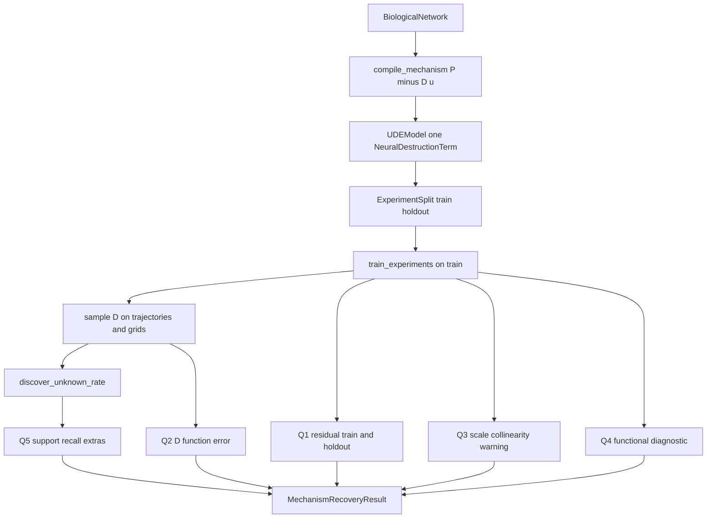
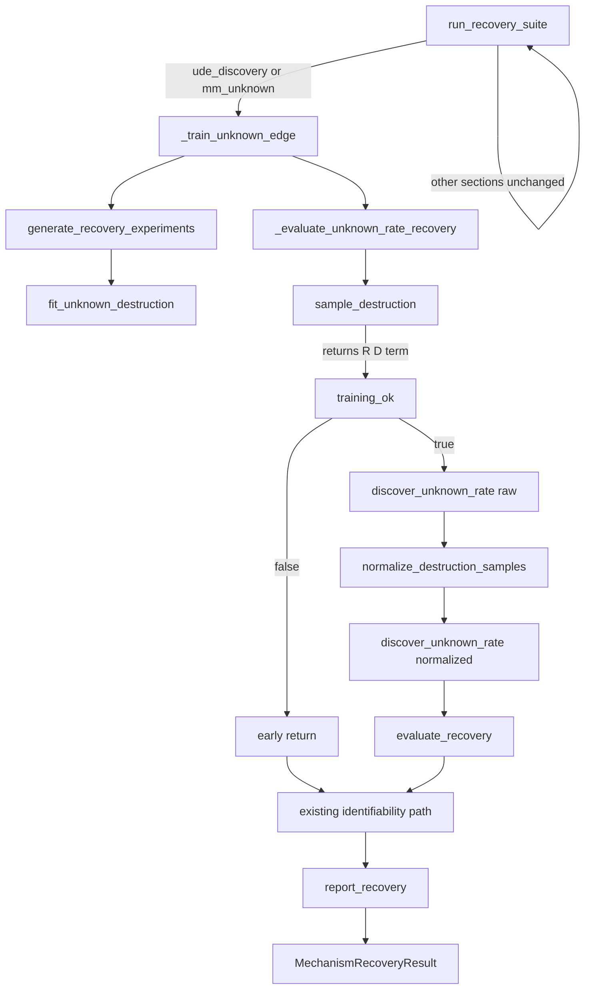
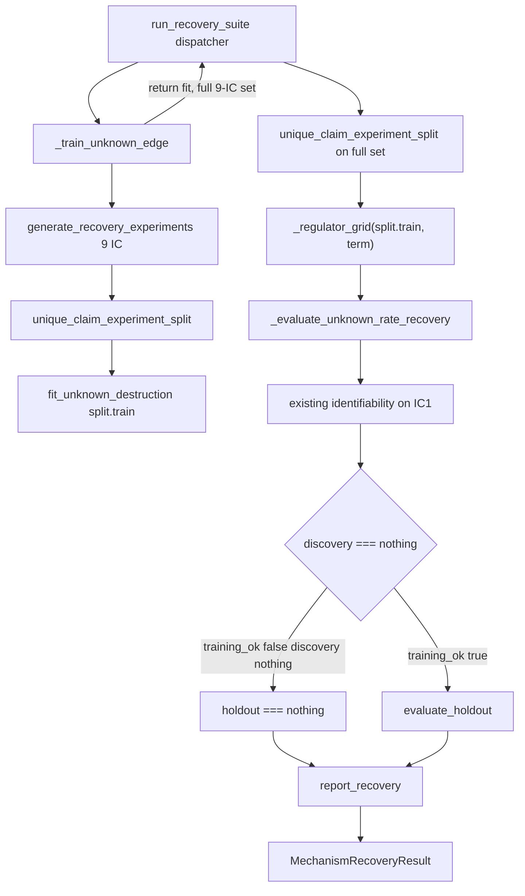
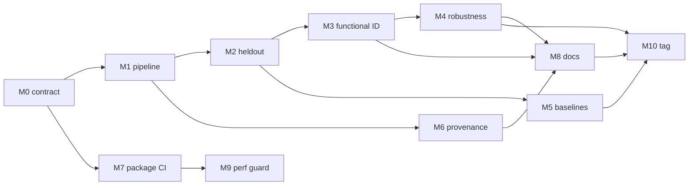

# BioDynaX v1.0 Geliştirme Planı

Bu plan, [docs/research/BIO-DYNAX-VISION.md](docs/research/BIO-DYNAX-VISION.md) ve [docs/research/FORENSIC-AUDIT.md](docs/research/FORENSIC-AUDIT.md) ile **gerçek kaynak ağacını** yan yana okuyarak yazıldı. Adli denetim büyük ölçüde doğru; birkaç yerde abartılı veya yanlış teşhis var. v1.0, Mechanism Repair motoru değildir. Hedef: bilinen graf + tam bir bilinmeyen yıkım + çoklu deney + mekanistik kurtarma + identifiability + bilimsel doğrulama + yeniden üretilebilirlik.

## Denetimin koda karşı doğrulanması

Aşağıdaki 12 zayıflık koda karşı kontrol edildi.

- **1. Fonksiyonel identifiability yok — DOĞRU.** [src/Identifiability.jl](src/Identifiability.jl) yalnızca fiziksel parametre Fisher’ı ve `k_prod`↔`D` ölçek kosinüsüdür. `D_1…D_m` karşılaştırması yok. [src/ScientificCore.jl](src/ScientificCore.jl) içindeki `DiscoveryUncertaintyReport` bootstrap terim sıklığıdır; fonksiyonel anlaşma değildir.
- **2. Residual / identifiability held-out değil — DOĞRU.** [src/Recovery.jl](src/Recovery.jl) `ref_exp = first(ude_set.experiments)` kullanır (satır ~1088–1101). Kullanıcı yüzü [examples/unknown_inhibition.jl](examples/unknown_inhibition.jl) de residual/ident’i `first_exp` üzerinde hesaplar. [src/Experiments.jl](src/Experiments.jl) `ExperimentSet` bir listedir; `experiment_batches` yalnızca Adam minibatch’tir. Discovery `validation_fraction` **sütun** bölmesidir, deney split’i değildir.
- **3. Tek tohuma bağımlılık — DOĞRU, nüanslı.** CI kırmızı kapısı seed 103’tür ([test/test_recovery_hard.jl](test/test_recovery_hard.jl)). [benchmark/recovery_seeds.jl](benchmark/recovery_seeds.jl) `--ude` raporu vardır ama kapı değildir ([docs/src/out-of-scope.md](docs/src/out-of-scope.md)).
- **4. Zayıf mekanistik metrikler — DOĞRU.** Kapılar: recall ≥ 0.99 (monomial üyelik), residual ≤ 0.30 (tipik ~0.003), F1 tabanı 0.50, `unidentifiable_edge == true`. Extras’lı `D` residual kapısını geçebilir.
- **5. Sentetik 1D + sahte zaman — DOĞRU, teşhis inceltilmeli.** Unique-claim `discover_unknown_rate` `times = range(0,1)` ve `derivatives = D_nn` verir ([src/Recovery.jl](src/Recovery.jl) ~675–680). Bu bilimsel olarak **fonksiyon regresyonudur**, `ẋ`-SINDy değildir. [src/Discovery.jl](src/Discovery.jl) içinde gerçek yörünge yolu (`_collect_trajectory_data`) vardır; unique-claim onu `D` için kullanmaz. Asıl boşluk sahte zamandan çok **ızgaranın eğitim yörüngesi occupancy’si olmamasıdır**.
- **6. Graph-local eğitilmiş UDE `D` üzerinde değil — DOĞRU.** Ablation analitik Hill + distractor `z` kullanır ([src/Recovery.jl](src/Recovery.jl) ~1142+). [test/test_graph_local_library.jl](test/test_graph_local_library.jl) çoğunlukla kütüphane üyeliği ve kaynak-string kilitleridir.
- **7. Harici baseline eksik — DOĞRU.** [benchmark/external_baseline.md](benchmark/external_baseline.md): DataDrivenSparse resolve olmaz. CI `continue-on-error`. İç kontrol graph vs global F1 eşitlenebilir; kilit kütüphane üyeliğidir.
- **8. Sert kodlu bilimsel alanlar — KISMEN DOĞRU.** `canonical_hill_from_nn = false` **bilinçli kapalı iddiadır**, sahte başarı değildir. `practical_not_structural = true` yöntem sınıfı sabitidir. Asıl sorun: `coefficients_are_biological_constants = !unidentifiable_edge` bağımsız ölçüm değildir; başarı `unidentifiable_edge == true` ister. Fisher aralıkları “credible interval” diye adlandırılır ([src/Identifiability.jl](src/Identifiability.jl) ~120–122) — bu yanlış güven dilidir.
- **9. Yeniden üretilebilirlik zayıf — DOĞRU.** Kök `Manifest.toml` yok (`.gitignore` `Manifest*.toml`). `RunMetadata` ([src/Types.jl](src/Types.jl)) golden path’e bağlanmaz. Benchmark artifact commit edilmez.
- **10. Şişmiş recovery / honesty — DOĞRU VE ALTINDA KALMIŞ.** [src/Recovery.jl](src/Recovery.jl) `run_recovery_suite` ~600 satırlık `Dict{Symbol,Any}` orkestratördür (varsayılan 7 + `:three_state`, `:wrong_graph`, `:identifiability`, `:partial_obs`, `:six_state`, …); RNG için dummy `build_ude_model` çağırır. Honesty yığını ~9k satır / ~19 `*_contract_holds()`; en büyüğü [src/ExperimentCheckpoint.jl](src/ExperimentCheckpoint.jl) (~1571). **Nüans:** [src/HybridCompose.jl](src/HybridCompose.jl) / [src/HybridResidual.jl](src/HybridResidual.jl) ikinci `compose_hybrid_rhs` üretimi değildir — `Recovery.jl` tek production, diğerleri sözleşme/fixture aynasıdır. `sample_learned_function` vs `sample_unknown_destruction` çift yol durur. Gizli `Ref` sayaçları: `COMPILE_NETWORK_COUNTER`, `TRAIN_UNKNOWN_EDGE_COUNTER`.
- **11. v1.0 sözleşmesi yok — DOĞRU.** `docs/src/design/` yok. Vizyon \(\dot x = f_{\mathrm{known}}+D\); kod \(P-D\cdot u\).
- **12. Paket / bilim kapıları ayrı — DOĞRU.** Format dosya listesidir ([.github/workflows/ci.yml](.github/workflows/ci.yml)). `standards` ayrı ve “kırmızı eşiği”dir. Recovery yalnızca Ubuntu × Julia 1.10. Aqua/JET `Project.toml` extras’ta değildir.

**Denetimin abarttığı / v1.0’a taşınmaması gerekenler**

- Yaş laboratuvar verisi v1.0 bilimsel bloğu değildir; sentetik metodoloji araştırma-grade olabilir. Yokluk kilidi kalsın.
- Derleyiciyi vizyon denklemine uydurmak. v1.0 \(P-D\cdot u\)’yu sözleşmeye yazar; IR’ı yeniden yazmaz.
- Sahte zamanı “yanlış bilim” sayıp implicit SINDy’yi `D(z)\dot x-N=0` yörünge formuna zorlamak. Unique-claim hedefi `D(z)` fonksiyonudur; `ẋ` değildir. API kokusu + ızgara occupancy sorunu vardır, formül hatası zorunlu değildir.
- `UnknownMechanism` tipi. Delik zaten `NeuralDestructionTerm`’dir ([src/MechanismCompiler.jl](src/MechanismCompiler.jl) ~113–119).
- HybridCompose/HybridResidual’ı “çift residual implementasyonu” diye birleştirmek. Production tek yerdedir; M1 bunları silerek “dedupe” yapmasın.

Kod envanteri (üç keşif taraması) plan kararlarını değiştirmiyor: `IdentifiabilityReport` fonksiyonel ID sayılmaz; `ExperimentSet` split değildir; graph-local kapıları analitik `D` üzerindedir; kök Manifest / persist benchmark yoktur.

## v1.0 bilimsel kimlik (sözleşme taslağı)

Bilinen:

- Kullanıcı grafı (`BiologicalNetwork`) doğru ve tam kabul edilir.
- Bilinen kinetik derlenir; nöral olmaz.
- Tam gözlem (unique-claim); maskeli UDE eğitimi kapalı kalır.

Bilinmeyen:

- Tam bir yıkım hızı \(D(z)\geq 0\), \(\dot u_i = P_i - D_i u_i\).
- Üretim deliği, topoloji keşfi, 2+ delik **iddia dışıdır**. `validate_network` delik saymaz; `assert_single_unknown_destruction` ayrı kapıdır. Bu ayrım korunsun.

Başarı katmanları (karışmayacak):

- **Q1 Predictive fit:** yörünge / hybrid residual (eğitim ve held-out).
- **Q2 Mechanism function:** \(\hat D(z)\) vs \(D_{\mathrm{true}}(z)\) (ızgara + yörünge occupancy + held-out \(r\)).
- **Q3 Scale / parameter practical ID:** `k_prod`↔`D` kolinerliği **beklenen sınırlama** olarak raporlanır; biyolojik sabit iddiası kapalı kalır.
- **Q4 Functional ID:** bağımsız eğitimlerde \(D_i(z)\) anlaşması vs yörünge anlaşması. Sertifika değil, tanı.
- **Q5 Symbolic support:** true-monomial recall; F1 iskelet; kanonik Hill-from-NN kapalı.
- **Q6 Constraints:** \(D\geq 0\), payda işareti, pozitif orthant yapısı (teorem değil).
- **Q7 Held-out generalization:** görülmeyen IC ve \(r\) bölgesi.

**Identifiability reframing (kritik sözleşme kararı):** Bugün unique-claim `unidentifiable_edge == true` **ister** ([src/UniqueClaim.jl](src/UniqueClaim.jl) ~420–423). Bu ölçek belirsizliğini gizlememek için dürüsttür ama “mekanizma belirlendi” ile ters yöndedir. v1.0: ölçek uyarısı **zorunlu rapor** olarak kalır; identifiability **başarısı** fonksiyonel tanı + held-out `D` olur. Eski kapı, yeni katman yeşil olana kadar migration süresince durur; sessizce silinmez.

**Eşik disiplini:** `data_residual = 0.30` körlemesine sıkılaştırılmaz (Kural 0.2). Önce held-out dağılımı ölçülür, gerekçe yazılır, sonra eşik değişirse breaking sayılır.

## En küçük tutarlı “research-grade” küme

v1.0’ı gerçekten araştırma kalitesine taşıyan minimum:

1. Yazılı v1.0 sözleşmesi (\(P-D\cdot u\), Q1–Q7, kapalı iddialar).
2. `run_recovery_suite` ayrışması + tipli recovery sonucu.
3. Ayrı internal `ExperimentSplit` (kilitli 7/2) + held-out residual **ve** `D` hatası. `ExperimentSet` değişmez; train/holdout set’in alanı değildir.
4. Pratik fonksiyonel identifiability tanısı (sertifika değil).
5. Çok tohum başarı oranı (release artifact; her PR’da N×40 dk değil).
6. Graph-local’ın **eğitilmiş** `D` üzerinde tekrarı.
7. Aynı görev, aynı split, aynı metrik baseline (önce iç: saf UDE + ExplicitSTLSQ).
8. Golden-path provenance + research lockfile + persist edilen metrik tablosu.
9. Honesty testlerini bilim testlerinden ayırma; string kilit büyütmeyi durdurma.

Bunun dışı (Bayes, OED, multi-hole, SBML, GPU, LLM, JOSS) research-grade v1.0 için gerekli değildir.

## Tip kararları — yalnızca gerçek sorunu çözüyorsa

- **`MechanismRecoveryResult` — A, evet.** `run_recovery_suite` `Dict{Symbol,Any}` + `build_protocol_result` NamedTuple karışımı Q1–Q7’yi ayıramaz. Tek bilimsel çıktı nesnesi olsun. [src/RecoveryAdmission.jl](src/RecoveryAdmission.jl) `UniqueClaimProtocolRow` yazıcı/parmak izi olarak kalsın.
- **`FunctionalIdentifiabilityDiagnostic` — A, evet.** `IdentifiabilityReport` parametre-only’dir. Yeni nesne: yörünge anlaşması, fonksiyon anlaşmazlığı, tohum listesi, domain tanımı. Adında “certificate” / “structural” olmasın.
- **`ExperimentSplit` — A, evet; `ExperimentSet`’i şişirmeyin.** Yalnızca unexported `unique_claim_experiment_split(set)` ve kilitli 7/2 indeksler. `ExperimentSet` semantiğini bozmayın; set train/holdout sahibi değildir.
- **`RunMetadata` — A, mevcut tipi güçlendirin.** Yeni `Provenance` icat etmeyin. `config::Any`’yi typed/named yapın; golden path’e bağlayın; `data_hash` doldurun.
- **`ValidationReport` — B, ayrı tip değil.** `MechanismRecoveryResult` üzerinde Q-katman görünümü + `format_*`. İkinci paralel bilim nesnesi doğurmayın.
- **`MechanismHypothesis` — D / ertele.** Tek aday + `ImplicitCandidate` + `DiscoveryResult` var. Tam sıralama v1.0 dışı. Şimdi sarmak spekülatif zarafettir.
- **`UnknownMechanism` — D.** `NeuralDestructionTerm` yeterli.
- **`RecoveryOutcome` — B.** `DiscoveryRetcode` / `TrainingRetcode` kalsın. İnce bir birleşik sonuç enum’u (`ScaleNonidentifiable`, `FunctionalDisagreement`, `HoldoutMechanismFailure`, `OptimizationFailure`, …) yalnızca pipeline’ın ürettiği sınıflar için. [src/FailureModes.jl](src/FailureModes.jl) bu iş için yanlış yerdir (honesty string envanteri).

`UDEModel` `Any` sarmalayıcısı ([src/UDE.jl](src/UDE.jl) ~23–37) bilinçlidir (JET UnionAll kaçışı). v1.0’da tam parametrik rewrite **C**; önce golden-path `Any` sızıntısını ölçün, kırılgan rewrite yapmayın.

## A / B / C / D

**A — v1.0 zorunlu**

- `docs/src/design/v1_contract.md` (kod gerçeği: \(P-D\cdot u\), tek yıkım deliği).
- Recovery pipeline ayrışması + `MechanismRecoveryResult`.
- Held-out IC + held-out \(r\) üzerinde residual ve `D` hatası.
- Fonksiyonel identifiability tanısı.
- Ölçek uyarısının “mekanizma belirlendi” olmaktan çıkarılması (migration ile).
- Çok tohum başarı oranı (release/nightly artifact).
- Graph-local’ın eğitilmiş UDE `D` üzerinde gösterimi.
- Aynı-görev iç baseline.
- Golden-path `RunMetadata` + research lock + persist metrik.
- Q-katmanlı test/CI ayrımı; residual eşiğinin gerekçesi (sıkılaştırma kanıta bağlı).
- Kanonik Hill-from-NN kapalı kalır; F1 iskelet kalır.
- Fisher aralıklarını “credible interval” diye sunmama.

**B — v1.0 güçlü öneri**

- Yörünge-örnekli `D` keşfi (ızgaraya ek).
- Extras’ın held-out `D` üzerindeki fonksiyonel etkisi (cebirsel kanonikleştirme değil).
- `RecoveryOutcome` ince enum.
- Honesty → typed field assert migration (string kilit büyütmeyi durdur).
- Format’ı tüm `src/` + `test/`’e yayma; Aqua/JET’i extras’a alma; `standards`’ı bilinçli kırmızı olmaktan çıkarma.
- 0-delikte dummy NN kafasını kaldırma (`n_heads = max(n,1)`).
- Compat’i research lock’ta sıkı tutma; paket compat’i makul bırakma.
- Saf UDE (semboliksiz) vs hibrit residual karşılaştırması.

**C — iyi gelecek iş**

- Çok aday hipotez sıralama / Pareto.
- Cebirsel destek eşdeğerliği / kanonik Hill-from-NN (yeni major kapı).
- Gürültü + örnek yoğunluğu tam zarfı (script’ler var; v1.0’da nokta + bir orta gürültü yeter).
- `UDEModel` somut parametrikleştirme.
- Bayes UQ, ensemble kalibrasyonu.
- MM’de kanonik destek.
- 3/6-durum **eğitilmiş** UDE (analitik prior’ın ötesi).
- Harici DataDrivenSparse, resolve edilirse izole env.

**D — açıkça kapsam dışı**

- Tam hipotez ranking, OED, aktif öğrenme, sıralı mekanizma tamiri.
- Keyfi çok-delik, genel topoloji, genel CRN / SINDy / neural ODE çerçevesi.
- Geniş SBML MathML, GPU eğitim yığını, LLM.
- Yapısal identifiability (StructuralIdentifiability.jl).
- Yaş laboratuvar / lisanslı seri.
- JOSS. General kayıt **maintainer eylemi**, bilimsel v1.0 kabul kriteri değil.
- Vizyon denklemini implementasyona sessizce dayatma.



---

## Milestone 0 — v1.0 bilimsel sözleşmesi (P0, P6 başlangıç)

- **Hedef:** Kodun gerçekten çözdüğü problemi yazmak; vizyon denklemini miras almamak.
- **Bilimsel soru:** “Başarı” Q1–Q7’nin hangisidir? Hangisi kapalıdır?
- **Sorun:** `docs/src/design/` yok. README / [docs/src/stability.md](docs/src/stability.md) / vizyon üç farklı denklem/başarı dili kullanır.
- **Neden önemli:** Sonraki her kapı bu metne bağlanmazsa metrik kayması tekrarlar.
- **Dosyalar:** yeni [docs/src/design/v1_contract.md](docs/src/design/v1_contract.md); çapraz bağ [docs/src/unique-claim.md](docs/src/unique-claim.md), [docs/src/architecture.md](docs/src/architecture.md), [README.md](README.md), [docs/src/out-of-scope.md](docs/src/out-of-scope.md). Kod değişikliği yok veya yalnızca “sözleşme dosyası var / kilit cümleler duruyor” testi.
- **Mimari:** Belge katmanı. `RECOVERY_THRESHOLDS` ve export listesi değişmez.
- **Matematik:** \(\dot u_i=P_i-D_i u_i\); tek `NeuralDestructionTerm`; ölçek kolinerliği beklenen.
- **API:** Yok.
- **Testler:** Sözleşme dosyasının varlığı; yasaklı cümleler (`ẋ = f_known + D` ürün iddiası olarak, “canonical Hill from NN”, “structural identifiability certificate”).
- **Bilimsel doğrulama:** Mevcut kapıların Q-etiketleri (Q1 residual, Q3 edge, Q5 recall).
- **Benchmark:** Yok.
- **Dokümantasyon:** Sözleşmenin kendisi.
- **Kabul:** Bir araştırmacı “ne kurtarıldı?” sorusuna tek sayfada doğru cevap alır; vizyon §3 denklemi ürün iddiası değildir.
- **Riskler:** Honesty string testleri belge cümlelerine bağlı; cümle değişince kırmızı. Önce kilitleri envanterle, sonra yaz.
- **Rollback:** Dosyayı silmek.
- **Ertelenen:** Mechanism Repair döngüsü, OED, multi-hole.

---

## Milestone 1 — Recovery pipeline mimarisini ayrıştır (P1)

### M1 genel bakış

M0 sözleşmesi durur. M1 **yalnızca altyapıdır**. Unique-claim bilimsel semantiği,
eşikler, export listesi, stdout ve \(P-D\cdot u\) değişmez. M2/M3/M4 bilimsel
problemleri M1 içinde çözülmez; bu milestone onları “kanca” diye de eklemez.

Eski M1 tasarımı suite kabuğuna `sample → discover ×2 → evaluate` dizisini
yazıyordu. Onaylı revize mimari bunu **reddeder**. Keşif dizisini suite’e
çekmek, `training_ok == false` iken bile iki `discover_unknown_rate`
çalıştırırdı: RNG, süre, `DiscoveryResult` ve residual semantiği değişirdi.

`run_recovery_suite` **ince gated dispatcher** olarak kalır. Unique-claim
kontrol akışının sahibi `_evaluate_unknown_rate_recovery` olarak kalır.
Suite unique-claim için yalnızca şunu çağırır:

`_train_unknown_edge` → `_evaluate_unknown_rate_recovery` → mevcut ident/rapor yolu

Suite **doğrudan çağırmaz:**

- `sample_destruction`
- `discover_unknown_rate`
- `evaluate_recovery`
- `normalize_destruction_samples`

Aşama fonksiyonları (generate / fit / sample / evaluate / report) unexported
yardımcılardır. Public `discover_unknown_rate` durur; çağrı yeri composer’dır.

### Korunacak bilimsel davranış

M1 boyunca değişmez:

- \(\dot u_i = P_i - D_i u_i\)
- `RECOVERY_THRESHOLDS` sayıları (residual 0.30 körlemesine sıkılaştırılmaz)
- unique-claim kapıları (recall, residual, F1 bandı, `unidentifiable_edge`)
- paylaşılan dummy RNG tüketimi (`consume_shared_suite_rng!`); **per-section
  `MersenneTwister(seed)` yok** — hard job seed 103/113 buna bağlıdır
- training configuration ve warmup (`lock_training_config` +
  `train_experiments_with_warmup`)
- ham + normalize çift keşif (composer içinde, aynı sıra ve argümanlar)
- `training_ok` erken çıkışı: keşif çalışmaz; erken NamedTuple alanları aynıdır
- `first(experiments)` residual semantiği (Q1 hâlâ IC[1])
- stdout bölüm isimleri ve sırası (IDENTIFIABILITY → FIT → DISCOVERY → REPRODUCTION)
- public export listesi / `LOCKED_PUBLIC_EXPORTS`
- dış suite dönüşü `Dict{Symbol,Any}`
- `TRAIN_UNKNOWN_EDGE_COUNTER` yalnızca `_train_unknown_edge` girişinde artar
- `COMPILE_NETWORK_COUNTER` dokunulmaz
- `examples/unknown_inhibition.jl` suite’e bağlanmaz (ayrı public yol)
- HybridCompose / HybridResidual / IdentifiabilityProduct taşınmaz, birleştirilmez
- `sample_learned_function` unique-claim yoluna alınmaz
- `canonical_hill_from_nn === false` durur

### Kesinlikle M1 dışında (M2 / M3 / M4 kapsamı)

M1 bunları implemente etmez ve “hazır kanca” diye dondurmaz:

- `ExperimentSplit`, held-out residual, held-out \(D\) (M2)
- fonksiyonel identifiability / Q4 tanı (M3)
- uncertainty, hypothesis ranking
- domain occupancy / yörünge-örnekli `D` (M4)
- yeni discovery algoritması
- yeni public API
- threshold değişikliği
- \(P-Du\) rewrite; `UDEModel` redesign
- graph-local trained-UDE bilim iddiası
- multi-hole inference
- honesty yığınını silme; HybridCompose birleştirme
- dummy RNG kaldırma; per-section RNG
- suite gövdesine keşif dizisi yazma
- yeni genel `occursin("function …")` kaynak-string envanteri
- yeni örnekleme struct’ı / `MechanismRecoveryResult` üzerinde `samples` alanı
  (örnekleme çıktısı mevcut `(R, D, term)` kalır)

M2/M3 işlevi **yoktur**. M1-era sözleşme anı: o sırada
`v1_contract.md` Q4/Q7 “not implemented” der. M2 sonra Q7’yi
raporlanan, kapı olmayan held-out kanıt olarak ekler; Q4 not
implemented kalır.

### Mevcut gerçek durum

M0 tamamlandı.

`src/Recovery.jl` hâlâ büyük recovery orchestration katmanıdır.
`run_recovery_suite` gated `Dict{Symbol,Any}` dispatcher’dır. Unique-claim
eğitimi yalnızca `:ude_discovery` ve `:mm_unknown` section’larındadır.

**M1-A tamamlandı (tarihsel):**

- internal / unexported `MechanismRecoveryResult`
- `getindex` / `haskey` / `keys` uyumu (`hasproperty`)
- public export değişmedi

**M1-B tamamlandı (tarihsel):**

- `generate_recovery_experiments`
- `consume_shared_suite_rng!`
- `fit_unknown_destruction`
- `_train_unknown_edge` compatibility wrapper
- TrainingReuse warmup kilidi `fit_unknown_destruction` gövdesine retarget edildi

**M1-C tamamlandı (tarihsel):**

- `sample_destruction`, `evaluate_recovery`, `report_recovery`
- composer `_evaluate_unknown_rate_recovery` kontrol akışının sahibi
- unique-claim suite gövdesi `report_recovery` ile `MechanismRecoveryResult` yazar

**M1-D tamamlandı:**

- pipeline / denominator / recovery / unique-claim / `runtests.jl`
- architecture + training-reuse docs
- hard recovery seed 103 / 113 / MM
- `benchmark/recovery_suite.jl` dört stdout bloğu
- scientific / software audit: Q1 hâlâ IC[1]; M2/M3 yok

Bugünkü unique-claim kabuğu (kaynak sırası):

1. `admit_recovery_suite_network` + `consume_shared_suite_rng!` + `build_ude_model`
2. `_train_unknown_edge`
3. `only_unknown_destruction` + `first(experiments)` residual kapanışı + `_regulator_grid`
4. `_evaluate_unknown_rate_recovery(...)` — **tek orkestrasyon çağrısı**
5. `report_production_destruction_tradeoff` on `first(experiments)` (eğitim/keşif
   başarısız olsa da)
6. `report_recovery` → `report[:ude_discovery]` / `report[:mm_unknown]`

Composer bugün şunların **sahibidir:** grid örnekleme, `training_ok`, erken
NamedTuple (`discovery = nothing`, residual `Inf`; erken yolda
`extras_denominator` alanı yoktur), sahte `times = range(0,1)`,
`unique_claim_discovery_config()`, ham + normalize `discover_unknown_rate`,
kapı sonrası `evaluate_recovery`, mevcut NamedTuple alan listesi.

### Hedef mimari

`run_recovery_suite` ince gated dispatcher kalır. Unique-claim section gövdesi
keşif dizisini **yazmaz**. `_evaluate_unknown_rate_recovery` Recovery.jl’de
kalır ve kontrol akışının sahibidir: örnekleme, `training_ok`, erken çıkış,
ham keşif, `normalize_destruction_samples`, normalize keşif, metrik sırası.



Hedef unique-claim kabuğu (semantik bugünküyle aynı; 6. adım M1-C’de tiplenir):

1. `admit_recovery_suite_network` + dummy RNG consume + `build_ude_model`
2. `_train_unknown_edge` (sayaç + needle)
3. `only_unknown_destruction` + `first(experiments)` residual kapanışı + `_regulator_grid`
4. `_evaluate_unknown_rate_recovery(...)` — **tek orkestrasyon çağrısı**
5. `report_production_destruction_tradeoff` on `first(experiments)`
6. `report_recovery` → `report[:ude_discovery]` / `report[:mm_unknown]`

`report_recovery` yasak listede değildir; ident/rapor yolunun typed adımıdır.
Composer `::MechanismRecoveryResult` yazmaz (late-bind; NamedTuple evaled döner).

Fikstür-özel mantık (Hill/MM truth, 9 IC, `fill_value=0.3`, graph-prior, ablation)
suite / Recovery.jl gövdesinde kalır. Aşama fonksiyonları fikstür alabilir, içermez.
`build_*_network` taşınmaz. Diğer 14 section çıkarılmaz.

### M1-A — `MechanismRecoveryResult` temeli (tamamlandı)

Tarihsel iş; yeniden açılmaz.

- [src/RecoveryPipeline.jl](src/RecoveryPipeline.jl): yalnızca internal
  `MechanismRecoveryResult` + `getindex` / `haskey` / `keys`
- Include: Recovery.jl / TrainingReuse.jl sonrası, RecoverySuiteSkip.jl öncesi
- Recovery.jl imzalarına `::MechanismRecoveryResult` yazılmaz (late-bind)
- Public export / `LOCKED_PUBLIC_EXPORTS` değişmedi
- `haskey` / `hasproperty` **alanın varlığıdır**, değerin anlamlı olduğu
  anlamına gelmez (`discovery` / `protocol_result` / `locked_kpis` `nothing`
  olabilir)

Mevcut alanlar (property erişimi): `nn_correlation`, `nn_rate_rmse`, `success`,
`retcode`, `message`, `support_f1`, `support_recall`, `discovered_rate_rmse`,
`data_residual`, `denominator_violations`, `normalized_support_f1`,
`normalized_support_recall`, `extras`, `extras_denominator`, `discovery`,
`term`, `identifiability`, `locked_kpis`, `protocol_result`, isteğe `model`,
`params`, `experiments::ExperimentSet`.

`protocol_result` + `PROTOCOL_RESULT_FIELDS` sırası değişmedi.
`experiments` M2 split’i değildir.

### M1-B — generate / shared RNG / fit (tamamlandı)

Tarihsel iş; yeniden açılmaz.

- `generate_recovery_experiments(rng, truth_net, truth_params; tspan, n_points,
  noise_σ, initial_conditions = _unknown_edge_ics())` → `ExperimentSet`.
  `unique_claim_experiment_set` ile birleşmez. Holdout / split yok.
- `consume_shared_suite_rng!(rng, truth_net)` aynı atılan
  `build_ude_model(rng, truth_net)` tüketimi. Per-section seed yoktur.
- `fit_unknown_destruction(...)` → mevcut `TrainingResult`. Yeni optimizer /
  loss / `UDEModel` redesign yok.
- `_train_unknown_edge` Recovery.jl’de kalır; sarmalayıcı:

```julia
function _train_unknown_edge(...)
    _note_train_unknown_edge()
    set = generate_recovery_experiments(...)
    fit = fit_unknown_destruction(...)
    return fit, set
end
```

- Suite generate/fit’i doğrudan çağırmaz; yalnızca `_train_unknown_edge` çağırır.
- Tek honesty retarget: `train_unknown_edge_reuses_warmup_source`
  (`TrainingReuse.jl`) `train_experiments_with_warmup` + `lock_training_config`
  aramasını `fit_unknown_destruction` gövdesine taşıdı. Yeni
  `occursin("function …")` eklenmedi.

### M1-C — sample / evaluate / report + composer kablolama (tamamlandı)

Yalnızca üç unexported yardımcı ve mevcut unique-claim yoluna bağlama.
Bilimsel semantik değişmez.

**`sample_destruction(model, params, term; r_range)` → `(R, D, term)`**

- İnce sarmalayıcı; mevcut `sample_unknown_destruction_grid` yolu.
- `fill_value` varsayılanı `0.3` olduğu gibi geçer.
- `sample_learned_function` yok. Yeni struct / `r_range` dondurma / occupancy yok.
  Örnekleme temsili yalnızca `(R, D, term)`.
- **Yalnızca** `_evaluate_unknown_rate_recovery` çağırır.
- İsim: [src/HybridCompose.jl](src/HybridCompose.jl)
  `sample_destruction_matches_identity_row` ile önek çakışması; kaynak
  taramalarında tam isim kullan.

**`evaluate_recovery` yalnızca metrik**

- Sahip olmaz: `discover_unknown_rate`, `training_ok`, erken çıkış, `times`,
  `unique_claim_discovery_config`, `normalize_destruction_samples`, residual
  kapanışı inşası.
- Girdi: `R`, `D` matrisleri, iki `DiscoveryResult`, truth rate/support,
  residual kapanışı.
- Çıktı: mevcut eval alanlarının metrik altkümesi (`support_f1` / recall,
  `discovered_rate_rmse`, `data_residual`, `denominator_violations`, `extras`,
  `extras_denominator`, normalize F1/recall).
- Yalnızca composer, kapı geçildikten sonra çağırır.
- Held-out residual, held-out `D`, Q4 yoktur.

**`report_recovery(evaled, ident; model, params, experiments)` → internal
`MechanismRecoveryResult`**

- Suite, composer’dan sonra mevcut ident yolunu çağırır; sonra `report_recovery`.
- `locked_ude_kpis` + `build_protocol_result` **her zaman** doldurulur
  (`nothing` bırakılmaz). `canonical_hill_from_nn === false` /
  `PROTOCOL_RESULT_FIELDS` sırası korunur.
- Format fonksiyonları Recovery.jl / UniqueClaim.jl’de kalır.
- Yeni alan yok (`holdout`, `functional_identifiability`, `uncertainty`,
  `hypothesis`, occupancy metadata).

**`haskey` / `nothing` tuzağı:** `haskey(result, :discovery)` keşif çalıştı
demez. Keşif: `result.discovery !== nothing`. Protokol:
`hasproperty(...) && value !== nothing`. Erken `evaled` NamedTuple
`extras_denominator` **taşımaz**.

**Composer kontrol akışı sahibi kalır** ([src/Recovery.jl](src/Recovery.jl)
`_evaluate_unknown_rate_recovery`):

1. `sample_destruction` → `(R, D, term)`
2. `nn_corr` / `nn_rmse`; `training_ok` (eşik sayıları aynı)
3. `!training_ok` → **bugünkü erken NamedTuple birebir** (`success=false`,
   `retcode=DiscoveryFailed`, `support_*=0`, residual `Inf`,
   `discovery=nothing`, …). Bu yolda `discover_unknown_rate` ve
   `evaluate_recovery` **yoktur**. Erken NamedTuple’ta `extras_denominator`
   alanı yoktur.
4. `training_ok` → `times`, `unique_claim_discovery_config()`, ham
   `discover_unknown_rate`, `normalize_destruction_samples`, ikinci keşif
5. `evaluate_recovery` yalnızca kapı sonrası
6. Mevcut alan listesi NamedTuple

Ham + normalize keşif **composer’da** kalır. Suite gövdesine
`discover_unknown_rate(` yazılmaz (`:competitive_unknown` needle’ı ayrı ve
değişmez). `first(experiments)` residual kapanışı suite’te kalır; composer’a
`data_residual_fn` olarak geçer.

**Payda kaynak sözleşmesi (M1-C kilitleri):**

- `function ude_extras_denominator_row` tanımı [src/Recovery.jl](src/Recovery.jl)
  içinde kalır (`ude_extras_denominator_source_holds`).
- Taşınan çağrı yeri (`extras_denominator = ude_extras_denominator_row(`)
  ayrı izlenir: [test/test_denominator_domain.jl](test/test_denominator_domain.jl).
  `evaluate_recovery` çıkarımı bu satırı Recovery.jl’den alırsa iğne
  `RecoveryPipeline.jl` / `evaluate_recovery` gövdesine retarget edilir.
- `recovery_jl_source_path_for_denominator()` küresel olarak Pipeline’a
  çevrilmez.
- Yeni genel kaynak-string envanteri eklenmez.
- [src/DenominatorDomain.jl](src/DenominatorDomain.jl)
  `extras_path_calls_split_source_holds` /
  `ude_path_field_source_holds` iğneleri `evaluate_recovery` gövdesine
  retarget edilir (M1-B TrainingReuse kalıbı). Yeni `occursin("function …")`
  yoktur.

### M1-D — final doğrulama (tamamlandı)

M1-C kablolamasından sonra, bilimsel iddia değiştirilmeden:

- Fast: [test/test_recovery_pipeline.jl](test/test_recovery_pipeline.jl) —
  `(R, D, term)` 3-tuple; composer erken çıkış (`discovery === nothing`,
  residual `Inf`, keşif yok); `evaluate_recovery` metrik-only; `haskey` /
  `nothing`; unexported; suite gövdesinde `sample_destruction(` /
  `evaluate_recovery(` / `discover_unknown_rate(` yok; mevcut honesty / v1
  contract / skip / TrainingReuse / DenominatorDomain yeşil
- Docs: [docs/src/architecture.md](docs/src/architecture.md) dört cümle —
  suite = gated dispatcher; unique-claim =
  `_train_unknown_edge` → composer → ident → `report_recovery`; composer =
  örnekle → kapı → (erken | çift keşif → metrik); Q1 hâlâ IC[1]. Landing
  yasaklı cümlelere ve skip kilit cümlesine dokunma. Suite’in keşif dizisini
  yaptığını söyleme.
- Hard recovery: [test/test_recovery_hard.jl](test/test_recovery_hard.jl)
  seed 103 Hill (recall / residual 0.30 / `unidentifiable_edge` /
  F1 ∈ [0.50, 0.99) / extras); σ=0.02 seed 113; MM `nn_rmse` + residual
  (Hill recall yok). Kapılar değişmez.
- Benchmark: [benchmark/recovery_suite.jl](benchmark/recovery_suite.jl) aynı
  section adları ve dört stdout bloğu. Script semantiği değişmez.
- Scientific audit: Q1–Q7 iddiası kaymadı mı; held-out / fonksiyonel ID
  “implemented” sanılmadı mı; eşikler aynı mı.
- Software audit: export, Dict dış kabuk, skip needle, dummy RNG, include
  sırası, honesty envanteri şişmedi mi.

Fast testler unique-claim UDE eğitmez; erken çıkış eğitilmemiş modelle sınanır.

### Honesty / kaynak-sözleşme kuralları

- [`recovery_suite_section_body`](src/RecoverySuiteSkip.jl) suite gövdesini
  parse eder. Needle’lar literal kalır: `_train_unknown_edge`,
  `admit_recovery_suite_network(:ude_discovery|:mm_unknown)`,
  `UNIQUE_CLAIM_PROTOCOL.tspan/n_points`, `family = :mm`.
- `_train_unknown_edge` tanımı Recovery.jl içinde kalır.
- Yeni genel `occursin("function …")` envanteri eklenmez. Aynı PR’da honesty
  silinmez.
- [`sample_unknown_destruction_source_holds`](src/HybridCompose.jl)
  `sample_unknown_destruction` tanımında kalır; `sample_destruction`
  sarmalayıcısı onu taşımaz.
- Skip `discovers` bayrağı `discover_unknown_rate(` / `discover_equations(`
  arar; unique-claim section’a bunları eklemek skip matrisini bozar.
- M1-B TrainingReuse retarget’i durur; geri alınmaz.
- M1-C payda çağrı-yeri retarget’i yukarıdaki kilitlere uyar.

### Kabul

M1 ancak M1-A…M1-D birlikte yeşil olduğunda biter. M1-A/B tek başına M1
değildir.

- Unique-claim aşamaları suite dışında çağrılabilir; suite yine de
  unique-claim için composer’ı kullanır
- `run_recovery_suite` gated `Dict{Symbol,Any}` dispatcher
- `:ude_discovery` / `:mm_unknown` kaynakta `_evaluate_unknown_rate_recovery`
  çağırır; suite gövdesinde `sample_destruction`, `discover_unknown_rate`,
  `evaluate_recovery`, `normalize_destruction_samples` yoktur
- `training_ok == false` yolunda keşif çalışmaz; alanlar bugünkü erken
  dönüşle aynıdır
- Çift keşif (ham + normalize) composer içindedir
- `first(experiments)` residual semantiği aynıdır
- Seed 103 kapıları yeşil; stdout blok adları aynı
- Dummy RNG belgelenmiş ve semantik duruyor
- Skip sayacı + needle matrix yeşil; yeni genel `occursin("function …")` yok
- `function ude_extras_denominator_row` Recovery.jl’de; taşınan çağrı yeri
  `test_denominator_domain.jl` ile izlenir
- Public export ve `RECOVERY_THRESHOLDS` bit-eşit
- `MechanismRecoveryResult` mevcut alan erişimini bozmaz
- M2/M3/M4 tipleri, held-out metrikleri, occupancy ve yeni keşif algoritması yok

### Rollback

Suite kabuğunu mevcut `_train_unknown_edge` + `_evaluate_unknown_rate_recovery`
+ NamedTuple splat’e döndür. Composer’ı tekrar inline
`sample_unknown_destruction_grid` + satır içi metrik + çift
`discover_unknown_rate` yap. `_train_unknown_edge` içine generate/fit’i geri
yapıştırma — M1-B sarmalayıcısı durabilir; M1-C geri alınırken üç yardımcı
ve composer/suite kablolaması kalkar. DenominatorDomain / 
`test_denominator_domain.jl` iğnelerini Recovery.jl composer çağrı yerine
al. Dict / stdout / export / eşikler gerilemez.

---

## Milestone 2 — Held-out çoklu-deney doğrulama (P0, P2)

**Durum (M2-H sonrası): completed.** M2-A…M2-H uygulanmıştır. Q7
held-out generalization **raporlanan kanıttır, kapı değildir**.
Tercih edilen güncel sözleşme cümlesi: “Q7 is reported held-out
generalization evidence, not an additional success gate.” Q4
fonksiyonel identifiability **not implemented** kalır. M3 / M4 ve
sonraki milestone’lar pending / future work’tür; implemented değildir.
v1.0 kesilmez. M2-H dokümantasyon revizyonu mevcut yüzeyi bu Q4/Q7
sözleşmesine hizalar; M0/M1 “Q7 not implemented” metni tarihsel
anıttır, silinmez.

Aşağıdaki “Mevcut pre-M2 davranış” alt başlığı tarihsel ön-M2
kaydıdır; silinmez. Onaylı semantik bu bölümün geri kalanında ve
[M2-HELDOUT-IMPLEMENTATION-PLAN.md](M2-HELDOUT-IMPLEMENTATION-PLAN.md)
içindedir.

### M2 genel bakış

M0 sözleşmesi ve M1 pipeline ayrışması durur. M2 **yalnızca dürüst Q7
kanıtı** ekler: görülmeyen IC residual’ı ve görülmeyen-IC occupancy
üzerinde \(D\) hatası. Bilimsel hedef (Q1 ile Q7’yi ayırmak) doğrudur.
Onaylı bilimsel tasarım **yeniden çizilmez**.

Bu revizyonun kabul eşiği metinsel yasak değildir. Bir yanlış gövde
yazılı teste yeşil kalabiliyorsa plan yanlıştır. Her sızıntı kuralı
aşağıdaki test kataloğunda, o yanlışı kırmızıya düşüren bir davranış
**ve** dar production çağrı sözleşmesine bağlanır.

**Uzunluk-yalnız testler yetersizdir.** `length == 7` / `length == 2`
kanıtı, nesne kimliği, fit girdisi, domain, generate veya metrik
koordinatını kanıtlamaz.

M2 şunları **yapmaz:**

- `ExperimentSet`’e `train` / `holdout` alanı eklemek
- `data_residual`’ı yeniden adlandırmak veya silmek
- 0.30 eşiğini holdout’a kopyalamak veya sıkılaştırmak
- holdout metriklerini `UNIQUE_CLAIM_PROTOCOL`, `PROTOCOL_RESULT_FIELDS`
  veya `unique_claim_kpis_hold` kapısına sokmak
- ikinci bir recovery pipeline / orkestratör
- M3 fonksiyonel identifiability
- M4 yörünge-örnekli keşif
- belirsizlik veya hipotez sıralama
- `DestructionSamples` yaratmak
- mevcut keşif algoritmasını değiştirmek
- public API eklemek

`run_recovery_suite` gated dispatcher kalır.
`_evaluate_unknown_rate_recovery` M1 composer / kontrol-akışı sahibidir.
`ExperimentSplit` / `HoldoutEvidence` / `split` / `holdout` almaz.
`holdout=` / `split=` anahtarı **yoktur**. Holdout metriği / Q7
hesaplamaz. `evaluate_recovery` M1’in metrik-only yardımcısı kalır;
holdout mantığının sahibi olmaz.

Holdout için dar, unexported `evaluate_holdout` eklenir.

**Tek onaylı üretim yolu** (ikinci yorum yoktur):

`run_recovery_suite`
→ `_train_unknown_edge`
→ `_evaluate_unknown_rate_recovery`
→ mevcut identifiability
→ `evaluate_holdout`
→ `report_recovery`

`evaluate_holdout` şuralarda **değildir**:

- `_evaluate_unknown_rate_recovery` gövdesi
- `report_recovery` gövdesi
- herhangi bir residual kapanışı
- başka bir M2 yardımcısı
- gizli `_ensure_holdout` sarmalayıcısı
- çoğaltılmış ikinci çağrı

Üretim kaynak sözleşmesi (L-SITE):

- `:ude_discovery` section gövdesinde `evaluate_holdout(` **tam 1**
- `:mm_unknown` section gövdesinde `evaluate_holdout(` **tam 1**
- [src/Recovery.jl](src/Recovery.jl) içinde `evaluate_holdout(` **tam 2**
  (tanım bu dosyada yoktur; iki occurrence iki unique-claim çağrısıdır)
- [src/RecoveryPipeline.jl](src/RecoveryPipeline.jl) içinde
  `evaluate_holdout(` **tam 1** ve bu occurrence **tanımdır**

Göreli sıra her unique-claim section’da zorunludur:

mevcut ident çağrısı
→ `evaluate_holdout(...)`
→ `report_recovery(...)`

`report_recovery` **önceden hesaplanmış** holdout sonucunu alır.
`report_recovery` holdout **hesaplamaz**. `report_recovery` içinde
`evaluate_holdout` çağıran bir gövde L-SITE kırmızısıdır.

### Korunacak M1 kilitleri

M2 boyunca bit-eşit veya semantik-eşit durur:

- \(P-D\cdot u\)
- `ExperimentSet` public / mevcut semantiği; `holdout` / `train` alanı
  **yoktur** (`!hasfield(ExperimentSet, :holdout)` kiliti kalkmaz)
- `run_recovery_suite` gated dispatcher
- `_evaluate_unknown_rate_recovery` M1 composer
- `report_recovery` typed reporting
- `data_residual` anlamı: IC[1] hybrid residual
- `first(experiments)` legacy yolu: warmup, Q1 / `data_residual`,
  Q3 Fisher / kosinüs, stdout FIT, RecoverySuiteSkip
  `ref_exp = first(ude_set.experiments)` iğnesi
- `RECOVERY_THRESHOLDS` sayıları (`data_residual = 0.30` değişmez)
- `PROTOCOL_RESULT_FIELDS` sırası ve üyeleri
- stdout IDENTIFIABILITY → FIT → DISCOVERY → REPRODUCTION
- `LOCKED_PUBLIC_EXPORTS`; varsayılan **yeni public export yok**
- dummy RNG (`consume_shared_suite_rng!`); per-section seed yok
- mevcut discovery algoritması
- M1 erken-dönüş semantiği
- M1 public API
- `UNIQUE_CLAIM_PROTOCOL` NamedTuple’ı (yeni alan yok; `n_ics = 9`)
- `evaluate_recovery` metrik-only (keşif, `training_ok`, times, holdout yok)
- `TRAIN_UNKNOWN_EDGE_COUNTER` yalnızca `_train_unknown_edge` girişinde
- `_train_unknown_edge` dış dönüş şekli `(fit, set)` — `set` tam 9 IC
- ham + normalize çift keşif composer içinde, aynı sıra
- `canonical_hill_from_nn === false`
- HybridCompose / HybridResidual birleştirilmez
- `examples/unknown_inhibition.jl` suite’e bağlanmak zorunda değildir

### Mevcut pre-M2 davranış

**Tarihsel ön-M2 kayıt.** M1 tamamlanmıştı; M2 kodu yoktu. M2-H
sonrası bu alt başlık provenance için durur; canlı durum yukarıdaki
M2-H tamamlanma notudur.

`ExperimentSet` paylaşılan durum boyutlu bir `Experiment` listesidir.
Bir deney = bir IC yörüngesi. Alt küme API’si yoktur. İki üretim yolu
birleşmez:

| Yol | Kim kullanır | 9 IC | parmak izi |
|---|---|---|---|
| `generate_recovery_experiments` → `generate_experiment_set` | suite / `_train_unknown_edge` | evet | hayır |
| `unique_claim_experiment_set` | örnek, honesty, HybridResidual | evet (smoke: 1) | evet |

Bugünkü unique-claim eğitim yolu:

```
generate 9 IC
  → fit_unknown_destruction(set)          # 9 IC kayıpta
      → warmup = first(set.experiments)   # IC[1]
      → train_experiments(set)            # Adam: 9 minibatch
  → r_range = _regulator_grid(ude_set, term)    # 9 IC extrema + %10 şişirme
  → composer: sample → training_ok → (erken | çift keşif → evaluate_recovery)
  → data_residual = hybrid residual on first(experiments)   # IC[1]
  → ident = report_production_destruction_tradeoff(ref_exp) # IC[1]
  → report_recovery(evaled, ident)
```

`experiment_batches` Adam minibatch’idir; discovery
`validation_fraction` ızgara **sütun** dilimidir;
`extras_denominator.train/val` da sütun dilimidir. Hiçbiri deney
split’i değildir.

`generate_data` `σ=0` iken bile `randn` tüketir. 9 IC’yi tek seferde
üretmek seed 113 gürültü akışını sabitler.

M1 testleri bilinçli olarak yasaklar: `ExperimentSplit` tanımlı değildir;
`MechanismRecoveryResult` üzerinde `:holdout`, `:data_residual_holdout`,
`:d_rmse_holdout` yoktur. `v1_contract.md` Q7 “not implemented” der.

### Bilimsel sorun

Q7 henüz yoktur. Unique-claim 9 IC üretir ve 9’unda eğitir; residual ve
ident yalnızca IC[1] üzerindedir. Diğer 8 IC kayıptadır ama Q1 kapısına
girmez. `_regulator_grid` tüm setin regülatör extrema’sını kullanır;
keşif, `training_ok` ve `discovered_rate_rmse` bu tam-set ızgarasındadır.

extras’lı \(\hat D\) eğitim IC[1] residual 0.30’u kolay geçebilir. Bu
“mekanizma kurtarıldı” değildir ve “görülmeyen IC’de yaşar” değildir.
9’da eğitip 8–9’u sonradan holdout yazmak da Q7 değildir (sahte holdout).

### Hedef tasarım

Onaylı seçenek **B:** aynı 9 IC’yi tek RNG yolunda üret, önceden kilitli
indekslerle böl, **yalnızca train’de fit et**. Holdout yörüngeleri üretilir
ama `train_experiments` / warmup / BFGS / keşif onları görmez.

`ExperimentSet` değişmez. İnce, **internal** `ExperimentSplit`
`ExperimentSet` dışında yaşar; tercih edilen yer
[src/RecoveryPipeline.jl](src/RecoveryPipeline.jl) (`Experiments.jl`
değil — set yeniden tasarımı gibi görünmesin).

`ExperimentSplit` ikinci üretilmiş bir veri seti değildir. Aynı 9
`Experiment` nesnesinin kilitli indeksle **görünüm / referans
bölmesidir**. Train ve holdout `ExperimentSet` alanları değildir; set
bu alt kümelerin sahibi değildir. Split metadata’ya gizlenmez.

`HoldoutEvidence` zorunludur; NamedTuple / düz MRR alanı değildir.
Occupancy / uncertainty / hypothesis / fonksiyonel-identifiability
çerçevesi değildir.

`MechanismRecoveryResult` yalnızca şu M2-özel iç alanları kazanabilir
(mevcut M1 alanlarından sonra, `experiments`’ın ardından):

- `split::Union{Nothing,ExperimentSplit}`
- `holdout::Union{Nothing,HoldoutEvidence}`

Kazanamayacağı alanlar: `functional_identifiability`, `uncertainty`,
`hypothesis`, occupancy çerçevesi, Q4 yapıları, `q4` / `q7` catch-all,
`train_experiments` / `all_experiments` çoğaltması, genel validation
kabı.

`UNIQUE_CLAIM_PROTOCOL`’a split alanı eklenmez (parmak izi yüzeyi).

M2’ye özel unexported yardımcılar (yeni ızgara / occupancy / keşif
API’si değildir; kilitli formülü testin production’dan bağımsız
yeniden yazmasını yasaklar):

| Yardımcı | Girdi | Çıktı | Gerekçe |
|---|---|---|---|
| `_holdout_observed_regulators` | `holdout::ExperimentSet`, `term` | `r_holdout` vektörü | Occupancy koordinatı tek yerde |
| `_unique_claim_external_regulator_band` | `train::ExperimentSet`, `term` | `r_band_external` (`range`) | Kilitli dış bant tek yerde |
| `_finite_rate_rel_rmse` | `estimate`, `truth` | `Float64` | Sonlu / `Inf` kuralı tek yerde |
| `_mean_hybrid_residual` | deneyler + nöral `D_hat_fn` | `Float64` | `(ρ_1+…+ρ_n)/n` ve `Inf` kuralı tek yerde |

`evaluate_holdout` bu dört yardımcıyı **çağırır**. Test, aynı
formülü test dosyasında kopyalamaz; production fonksiyonunu çağırır.

### ExperimentSplit — kesin alan yüzeyi

Yer: [src/RecoveryPipeline.jl](src/RecoveryPipeline.jl). Unexported.

```julia
struct ExperimentSplit
    train_indices::NTuple{7,Int}
    holdout_indices::NTuple{2,Int}
    train::ExperimentSet
    holdout::ExperimentSet
end
```

`fieldnames(ExperimentSplit)` / `propertynames` **tam olarak**:

`(:train_indices, :holdout_indices, :train, :holdout)`

Ek alan varsa L-FIELDS kırmızı olur.

Sabitler splitter yanında durur; `UNIQUE_CLAIM_PROTOCOL` içine girmez:

- `UNIQUE_CLAIM_TRAIN_INDICES = (1, 2, 3, 4, 5, 6, 7)`
- `UNIQUE_CLAIM_HOLDOUT_INDICES = (8, 9)`

Tek üretici: unexported
`unique_claim_experiment_split(set::ExperimentSet) → ExperimentSplit`.
`length(set) == 9` zorunludur; aksi `ArgumentError`. Genel public
splitter API (`split_experiments` dahil) eklenmez.

Her üretilen split için **bit-eşit** kilit:

```
split.train_indices === UNIQUE_CLAIM_TRAIN_INDICES === (1, 2, 3, 4, 5, 6, 7)
split.holdout_indices === UNIQUE_CLAIM_HOLDOUT_INDICES === (8, 9)
```

Nesne-kimliği sözleşmesi (değer eşitliği / uzunluk **yetmez**;
yeniden kurulum / ikinci generate yasak):

```
split.train !== set
split.holdout !== set
length(split.train) == 7
length(split.holdout) == 2
split.train[i] === set.experiments[split.train_indices[i]]     # i = 1:7
split.holdout[i] === set.experiments[split.holdout_indices[i]] # i = 1:2
```

`ExperimentSet` `getindex` `experiments[i]` olduğu için bu,
`split.train[i] === set[UNIQUE_CLAIM_TRAIN_INDICES[i]]` ile aynıdır.
IC[1] kiliti bunun özel halidir:

```
split.train[1] === set.experiments[1] === first(set)
1 ∈ split.train_indices
```

`split.train` / `split.holdout` constructor’ı mevcut `ExperimentSet(...)`
ile, **aynı** `Experiment` nesnelerini (`set.experiments[i]`) sırayı
koruyarak sarar. `Experiment(...)` ile kopya, `generate_data` /
`generate_recovery_experiments` / `generate_experiment_set` ile ikinci
üretim **yoktur**. `observations` matrisleri orijinal nesnelerdir
(`split.holdout[1].observations === set.experiments[8].observations`).

Orijinal `set` bütünlüğü:

- `length(set) == 9` split’ten önce ve sonra
- `set.experiments[i] ===` split öncesi aynı 9 nesne, aynı sıra
- `set.experiments` vektör kimliği aynı kalır (yeni vektör atanamaz)
- public alanlar yalnızca `experiments`, `state_names`, `units`,
  `metadata` — `!hasfield(ExperimentSet, :train)` ve
  `!hasfield(ExperimentSet, :holdout)` kalkmaz
- `set.metadata` mutasyona uğramaz; `:train`, `:holdout`, `:split`,
  `:train_indices`, `:holdout_indices` anahtarı **yoktur**
- `split.train.metadata !== set.metadata` ve
  `split.holdout.metadata !== set.metadata` (yeni `Dict`; orijinal
  dict paylaşılmaz)

M2 üretim yolunda orijinal `ExperimentSet` deney koleksiyonu
(`set.experiments`) üzerinde şu mutasyonlar **yoktur**:

- `splice!`
- `deleteat!`
- `pop!`
- `push!`
- `insert!`
- `append!`
- `resize!`
- `setindex!` (indeksli atama `set.experiments[i] = …` dahil)
- `replace!`
- mevcut `Experiment` nesnesini yenisiyle değiştirmek
- holdout’u yeniden `generate_*` etmek
- split verisini `metadata` içine gizlemek

Anlık görüntü (sayı / kimlik / sıra / metadata / public alanlar)
eşitliği **yetmez**: `pop!` / `insert!` / `resize!` / restore geçici
mutasyonu son görüntüyü koruyabilir. before/after equality is
insufficient by itself because temporary mutation followed by
restoration can leave the final state unchanged.

Boşluğu kapatan sözleşme giriş-noktası-yalnız gövde taraması
**değildir**. L-SET-INTACT geçişli saflık sözleşmesidir: iki M2
giriş noktasından (`unique_claim_experiment_split`,
`evaluate_holdout`) erişilebilir yerel M2 split / evaluation
yardımcı çağrı grafını inceler. Depo-geneli mutator yasağı
**yoktur**. Depo-geneli AST taraması **yoktur**. Yeni bir vektörü
comprehension / indeksleme ile kurmak yasak değildir; orijinal
`ExperimentSet` / orijinal `set.experiments` üzerinde mutasyon
yasaktır. Yardımcı dolayımı kaçış kapağı **değildir**.

`!hasfield(ExperimentSet, :holdout)` **tek başına yetersizdir**.

### HoldoutEvidence — kesin alan yüzeyi

Yer: [src/RecoveryPipeline.jl](src/RecoveryPipeline.jl). Unexported.
Çağrıldığında `evaluate_holdout` **her zaman** bu tipi döner; `nothing`
dönmez.

```julia
struct HoldoutEvidence
    data_residual_train::Float64
    data_residual_holdout::Float64
    d_rmse_holdout::Float64
    d_rmse_holdout_domain::Float64
end
```

`fieldnames(HoldoutEvidence)` / `propertynames` **tam olarak**:

`(:data_residual_train, :data_residual_holdout, :d_rmse_holdout, :d_rmse_holdout_domain)`

`length(fieldnames(HoldoutEvidence)) == 4`. Ek alan L-FIELDS’i kırmızı
yapar.

Yasak alanlar (M3/M4 kaçakları):

- `restart_agreement`, `functional_rmse`, `pairwise` D anlaşması
- `uncertainty`, `hypothesis`, occupancy çerçevesi
- fonksiyonel-identifiability alanları
- per-IC vektörleri, `samples`, `domain`, `q4`, `q7`

`haskey(result, :holdout)` MRR alanının **varlığıdır**. Q7 kanıtı
üretildi demek için `result.holdout !== nothing`.

### MechanismRecoveryResult — minimal M2 uzantısı

Yalnızca iki yeni alan, kesin tipler:

```
split::Union{Nothing,ExperimentSplit} = nothing
holdout::Union{Nothing,HoldoutEvidence} = nothing
```

M1 alan listesi durur. M2 ekleri **yalnızca** bu ikisidir:

```
fieldnames(MechanismRecoveryResult) ==
    (M1_FIELDS..., :split, :holdout)
```

`M1_FIELDS` M1 tamamlanmış listedir:

`(:nn_correlation, :nn_rate_rmse, :success, :retcode, :message,
 :support_f1, :support_recall, :discovered_rate_rmse, :data_residual,
 :denominator_violations, :normalized_support_f1,
 :normalized_support_recall, :extras, :extras_denominator, :discovery,
 :term, :identifiability, :locked_kpis, :protocol_result, :model,
 :params, :experiments)`

Genel validation kabı eklenmez. `report_recovery` imzası:

```
report_recovery(evaled, ident; model, params, experiments,
                split = nothing, holdout = nothing)
```

`report_recovery` `evaluate_holdout` **çağırmaz**. `_ensure_holdout`
**yoktur**. `HoldoutEvidence` **üretmez**. Verilen `split` / `holdout`
değerlerini olduğu gibi yazar.

```
report_recovery(..., holdout = nothing)  ⇒  result.holdout === nothing
```

`holdout = nothing` Q7 kanıtı imal etmez. KPI / `protocol_result` /
stdout hâlâ IC[1] `data_residual` okur. `unique_claim_kpis_hold` M1
unexported kapısıdır; holdout okumaz; silinmez; yeni M2 kapısı olmaz.

### Tam 7/2 split

Seed’den bağımsız, veriden optimize edilmeyen, peek yasaklı protokol.
İndeksler yukarıdaki `UNIQUE_CLAIM_*_INDICES` sabitleridir.

Bu depoda deney indeksi ve IC aynı nesnedir. Sütun /
`validation_fraction` / minibatch split’i değildir.

İndeks 1 **zorunlu train’dedir**, çünkü IC[1] şunlara bağlıdır:

- warmup (`train_experiments_with_warmup` → `first(split.train)` = IC[1])
- legacy `data_residual` / Q1 / stdout FIT
- Q3 identifiability (`report_production_destruction_tradeoff`)

Son iki satır konumsal holdout’tur; regülatör ekstremasına göre
seçilmez. `_unknown_edge_ics()` satır 8–9 (`[0.20, 0.50]`,
`[1.50, 1.20]`) \(R_0\in\{0.50, 1.20\}\) train kutusunun **içinde**
kalabilir. Bu yüzden IC-holdout ≠ domain-holdout. Production 9-IC
tablosu domain-sızıntı testini **taşıyamaz**; sentinel fikstür
zorunludur.

```
train ∩ holdout = ∅
train ∪ holdout = 1:9
```

6/3 **yoktur**. İndeksler fail olursa gevşetilmez, veriden yeniden
seçilmez.

### Sızıntı kuralları

Aşağıdaki yasaklar tek başına “must not leak” cümlesi değildir. Her
satırın öldürücü testi “Test kataloğu”ndadır.

| Yasak gövde | Öldüren test |
|---|---|
| Yanlış 7 IC; indeks doğru ama nesne yanlış | L-SPLIT-ID |
| Holdout `Experiment(...)` / değer-eşit kopya (splitter) | L-SPLIT-ID |
| `return fit, generate_recovery_experiments(...)` / ikinci generate / gizli `_regen` / section-split-eval generate | L-RNG |
| `set.experiments` splice / delete / pop / insert / resize / restore; `_carve_and_restore!` / `_split_impl` / `_prepare!` / `_partition!` / `_prepare_holdout` / `_temporary_partition` dolayımı | L-SET-INTACT |
| Train/holdout `set.metadata` içinde | L-SET-META, L-SPLIT-META |
| `fit_unknown_destruction(..., set)` | L-FIT-A |
| `fit(..., split.train)` sonra `train_experiments_with_warmup(..., set, ...)` | L-FIT-A |
| `fit(..., split.train)` sonra `_polish_full(..., set, ...)` | L-FIT-A |
| Suite’te `_train_unknown_edge` sonrası tam-set `train_experiments*` | L-FIT-A |
| `length(fit_set)==7` ama IC 2–8 | L-FIT-B |
| `_regulator_grid(ude_set, term)` / `_regulator_grid(set, term)` | L-DOM-A, L-DOM-B |
| `r_range` overwrite / `union` / holdout extrema / inline tam-set | L-DOM-A, L-DOM-B |
| `discover_equations(R_holdout, holdout_times, ...)` `evaluate_holdout` içinde veya ondan erişilebilir yerel yardımcıda | L-DISC-A |
| `evaluate_holdout` → `_peek_holdout` → `discover_equations` | L-DISC-A |
| `evaluate_holdout` → `helper` → `discover_unknown_destruction` | L-DISC-A |
| `_evaluate_unknown_rate_recovery(...; holdout = split.holdout)` / `split = split` | L-DISC-B-1 |
| `data_residual_fn = d_hat -> something_using(split.holdout)` | L-DISC-B-1 |
| Composer → `_composer_helper` → `discover_unknown_rate(... split.holdout.observations ...)` | L-DISC-B-2 |
| Composer → `_helper` → `discover_equations(holdout.times, holdout.derivatives, ...)` | L-DISC-B-2 |
| Composer → `helper` → `discover_unknown_destruction(...)` | L-DISC-B-2 |
| Composer keşfine holdout `times` / türev / occupancy (doğrudan veya yardımcı) | L-DISC-B-2, L-DISC-B-3 |
| Holdout extrema dış bandı tanımlar / birleşir | L-BAND |
| Dış bant `range(a,b)` train’den bağımsız sabit | L-BAND |
| `d_rmse_holdout` train ızgarası / sembolik `D` / sahte keşif | L-D-OCC, L-OVERFIT |
| `data_residual = data_residual_train` | L-RES-LEGACY |
| `data_residual_holdout = data_residual_fn(d_hat)` IC[1] üzerinde | L-RES-HOLD |
| Holdout residual RMS / concat | L-RES-HOLD |
| Holdout residual > 0.30 iken Q7 yok sayılır | L-GATE |
| `evaluate_holdout` içinde `ρh > 0.30` ⇒ `Inf` | L-GATE |
| `evaluate_holdout` composer / `report_recovery` / residual kapanışı içinde | L-SITE |
| `report_recovery` → `_ensure_holdout` → `evaluate_holdout` | L-SITE |
| `_peek_holdout!` / `discover_equations(...holdout...)` / `discover_unknown_destruction(` değerlendirme yolunda | L-DISC-A |
| `if evaled.success == false; holdout = nothing` | L-EARLY |
| `if !evaled.success; holdout = nothing` | L-EARLY |
| `if !evaled.discovery.success; holdout = nothing` | L-EARLY |
| `if !evaled.discovery.success; return HoldoutEvidence(Inf, Inf, Inf, Inf)` | L-EARLY |
| Test `ev.d_rmse_*` okumadan `_finite_rate_rel_rmse` hesaplar | L-D-OCC, L-OVERFIT |
| `normalize_destruction_samples` / `equation_to_function` holdout \(D\) | L-D-OCC, L-OVERFIT |

Holdout verisi keşfe, `training_ok` kararına, optimizer’a, train
regülatör domain’ine ve dış değerlendirme bandına **girmez**.

**Split-provenance testleri tek başına YETERSİZDİR.** Örtüşmezlik,
birleşim ve `1 ∈ train` kanıtı, production fit’in veya production
domain’in train-only olduğunu kanıtlamaz.

### Kilitli unique-claim kontrol sırası

Unique-claim suite yolu (`:ude_discovery` ve `:mm_unknown`) için **tek**
sahiplik ve **tek** çağrı yeri vardır. İkinci yorum yoktur.

```
run_recovery_suite
    ↓
_train_unknown_edge
    ↓
_evaluate_unknown_rate_recovery
    ↓
mevcut identifiability değerlendirmesi
    ↓
evaluate_holdout
    ↓
report_recovery
```

Sıra sabittir:

composer → ident → evaluate_holdout → report_recovery

`:ude_discovery` ve `:mm_unknown` **aynı** diziyi kullanır. Bu tek
yorumun iki section kopyasıdır; iki sahiplik değildir.

Yasak yerleşimler (L-SITE kırmızı olur):

- `evaluate_holdout` `_evaluate_unknown_rate_recovery` gövdesinde
- `evaluate_holdout` `report_recovery` gövdesinde
- `evaluate_holdout` başka bir yardımcıda çoğaltılmış
- `evaluate_holdout` `data_residual_fn` kapanışının içinde
- `evaluate_holdout` `_ensure_holdout` içinde
- ident’den önce
- `report_recovery`’den sonra
- Recovery.jl’de 2’den fazla `evaluate_holdout(`
- RecoveryPipeline.jl’de tanımdan başka `evaluate_holdout(`

`_evaluate_unknown_rate_recovery` M1 composer / kontrol-akışı sahibidir.
Public / private imza ve sahiplik M2 için **genişlemez**. Composer
Q7 sahibi **değil**.

- `ExperimentSplit` **almaz**.
- `HoldoutEvidence` **almaz**.
- `split` / `holdout` **almaz**.
- `holdout=` / `split=` anahtarı **yoktur** (L-DISC-B-1).
- Holdout metriği **hesaplamaz**.
- İmza M1’deki gibi kalır: konumsal `ude_model`, `ude_params`,
  `term`, `truth_rate`; anahtar `order`, `family`, `noise_σ`,
  `r_range`, `data_residual_fn`. Split / holdout nesnesi almaz.
- İç dizisi değişmez: `sample_destruction` → `training_ok` →
  (`training_ok == false` ise M1 erken NamedTuple;
  `training_ok == true` ise ham+normalize dummy-time keşif →
  `evaluate_recovery`).
- M2 holdout değerlendirmesi composer’dan **sonra** ve mevcut
  identifiability çağrısından **sonra** olur. Tek geçerli kenar:
  `ident → evaluate_holdout → report_recovery`. `composer → holdout`
  yasaktır.

M1 identifiability çağrısı suite’te **mevcut yerinde** kalır
(composer’dan sonra, `report_recovery`’den önce):
`report_production_destruction_tradeoff` on `first(experiments)` (IC[1]).
`evaluate_holdout` bu hesabı değiştirmez, `ident` nesnesini almaz,
mutasyona uğratmaz, ikinci bir Fisher üretmez.

`evaluate_holdout` unique-claim suite yolunun **tek** yeni
orkestrasyon adımıdır. Suite, holdout değerlendirmesinin **tek**
orkestratörüdür. İkinci recovery orkestratörü yoktur.

`training_ok == false` iken (`evaled.discovery === nothing`, M1 kodlaması)
aynı suite adımı `evaluate_holdout`’u **çağırmaz** ve
`holdout === nothing` atar. Bu atlama ikinci bir çağrı yeri değildir.

### Veri akışı

```
generate_recovery_experiments                 # 9 IC, tek RNG
  → unique_claim_experiment_split(set)        # kilitli 7/2; _train_unknown_edge içinde
  → fit_unknown_destruction(..., split.train)
  → return (fit, full 9-IC set)
  → suite: unique_claim_experiment_split(ude_set)   # aynı kilitli indeksler
  → _regulator_grid(split.train, term)        # keşif + training_ok domain
  → composer: sample → training_ok
        → training_ok false: M1 erken NamedTuple
        → training_ok true: M1 dummy-time çift keşif → evaluate_recovery
  → ident on first(experiments)               # IC[1]; holdout Fisher yok
  → evaluate_holdout                          # A atlar; B ve C çağırır
  → report_recovery(..., split, holdout)
```

`_train_unknown_edge` içinde **tek** fitting girdisi vardır.
`fit_unknown_destruction` imzası değişmez. Bu çağrıdan **sonra** tam-set
veya holdout fitting **yoktur**. Unique-claim section gövdesinde de
sonradan tam-set fitting **yoktur**.

```julia
function _train_unknown_edge(...)
    _note_train_unknown_edge()
    set = generate_recovery_experiments(...)
    split = unique_claim_experiment_split(set)
    fit = fit_unknown_destruction(..., split.train)  # TEK fitting girdisi
    return fit, set   # set = tam 9; aynı generate nesnesi; 3-tuple yok
end
```

`_train_unknown_edge` generate sayısı **tam 1**
(`generate_recovery_experiments(`). Dönüş **yalnız**
`return fit, set`. İkinci generate L-RNG kırmızısıdır
(Y-RNG-1…Y-RNG-7).

Warmup `first(split.train) === set.experiments[1]`. Adam 7 minibatch.
7-IC fit ≠ 9-IC ağırlık; bu Q7 bedelidir.

Yasak gövdeler (L-FIT-A / L-FIT-B kırmızı olur):

```julia
# Y1 — tam-set fit
split = unique_claim_experiment_split(set)
fit = fit_unknown_destruction(..., set)

# Y2 — önce train, sonra tam set (önceki denetimin kaçış yolu)
split = unique_claim_experiment_split(set)
fit = fit_unknown_destruction(..., split.train)
fit = train_experiments_with_warmup(..., set, ude_model, ...)

# Y2-POLISH — onaylı fit doğru, gizli tam-set cilası
fit = fit_unknown_destruction(..., split.train)
fit = _polish_full(..., set, ...)

# Y2-SUITE — _train_unknown_edge doğru, suite ikinci eğitmen
ude_fit, ude_set = _train_unknown_edge(...)
ude_fit = train_experiments_with_warmup(ude_fit.params, ude_set, ude_model; ...)

# Y3 — length==7 ama yanlış nesneler
fit = fit_unknown_destruction(..., wrong_seven)
```

`_train_unknown_edge` gövdesinde `fit_unknown_destruction` **tam bir
kez** geçer ve deney argümanı token’ı `split.train` olur. Aynı gövdede
sonradan `train_experiments_with_warmup`, `train_experiments(`,
`_polish_full`, ikinci `fit_unknown_destruction` veya eşdeğer gizli
eğitmen **yoktur**.
`fit_unknown_destruction` **içindeki** mevcut
`train_experiments_with_warmup(ude_init, set, ...)` **tek onaylı
eğitmen yoludur**; o `set` parametresi production’da `split.train`
bağlanır. Bu, depo-geneli `train_experiments*` yokluğu **değildir**.

Unique-claim `:ude_discovery` / `:mm_unknown` section gövdesinde
`train_ude(`, `train_experiments(`, `train_experiments_with_warmup`,
`fit_unknown_destruction(`, `_polish_full(` **yoktur**.
`_train_unknown_edge` döndükten sonra unique-claim section tam 9
deney üzerinde eşdeğer ikinci eğitim geçişi **yapmaz**.
`_train_unknown_edge` kendisi gizli ikinci fit **yapmaz**.

Suite aynı kilitli `unique_claim_experiment_split(ude_set)` çağrısını
tekrarlar (indeks sapması yok). Suite gövdesine
`sample_destruction` / `discover_unknown_rate` / `evaluate_recovery` /
`normalize_destruction_samples` yazılmaz.

Unique-claim suite kabuğu (her iki section, aynı sıra):

```julia
ude_fit, ude_set = _train_unknown_edge(...)
term = only_unknown_destruction(ude_model)
ref_exp = first(ude_set.experiments)
split = unique_claim_experiment_split(ude_set)
evaled = _evaluate_unknown_rate_recovery(
    ude_model, ude_fit.params, term, truth_rate;
    r_range = _regulator_grid(split.train, term),
    data_residual_fn = d_hat -> hybrid_data_residual(..., ref_exp, ...))
ident = report_production_destruction_tradeoff(
    ude_model, ude_fit.params, ref_exp.observations, ref_exp.times,
    ref_exp.u0, (first(ref_exp.times), last(ref_exp.times));
    term = term, verbose = false)
if evaled.discovery === nothing
    holdout = nothing
else
    holdout = evaluate_holdout(
        split, evaled, ude_model, ude_fit.params, term, truth_rate)
end
# TEK karar kuralı. success alanı yok. _ensure_holdout yok.
# report_recovery holdout hesaplamaz.
report[:ude_discovery] = report_recovery(
    evaled, ident;
    model = ude_model, params = ude_fit.params, experiments = ude_set,
    split = split, holdout = holdout)
```

Production keşif / `training_ok` domain’i **yalnızca** şu token’dır.
Ara değişken yok. Sonradan `r_range` ataması yok. Unique-claim
section gövdesinde `r_range =` tam **bir** kez; sağ taraf
**birebir** `_regulator_grid(split.train, term)`:

```julia
r_range = _regulator_grid(split.train, term)
```

`_evaluate_unknown_rate_recovery` çağrısının `r_range` anahtar
argümanı **birebir** `_regulator_grid(split.train, term)` olur.
Production path sonra başka domain ile değiştirmez. Domain
`ude_set` / `set` / `holdout` / `union(...)` / holdout extrema /
tam-set extrema’dan **türemez**.

M2 suite çağrısı **yalnız** mevcut M1 anahtarlarını kullanır
(`order`, `family`, `noise_σ`, `data_residual_fn`, `r_range`).
`holdout=` / `split=` / `ExperimentSplit` / `HoldoutEvidence`
L-DISC-B-1 kırmızısıdır. Residual kapanışı holdout yakalamaz
(L-DISC-B-1). Composer keşif grafı geçişli L-DISC-B-2’dir.

Yasak domain gövdeleri (L-DOM-A / L-DOM-B kırmızı olur):

```julia
# Y4 — tam set
r_range = _regulator_grid(ude_set, term)

# Y4b — set
r_range = _regulator_grid(set, term)

# Y5 — holdout extrema birleşimi
r_train = _regulator_grid(split.train, term)
r_holdout = _regulator_grid(split.holdout, term)
r_range = union(r_train, r_holdout)

# Y6 — token doğru, sonra overwrite / set
r_range = _regulator_grid(split.train, term)
r_range = _regulator_grid(set, term)

# Y6b — token doğru, sonra union
r_range = _regulator_grid(split.train, term)
r_range = union(r_range, holdout_range)

# Y6c — token doğru, sonra holdout extrema
r_range = _regulator_grid(split.train, term)
r_range = range(min(...holdout...), max(...holdout...))

# Y6d — token doğru, sonra inline tam-set / holdout extrema
r_range = _regulator_grid(split.train, term)
lo, hi = extrema(vcat((e.observations[term.regulator, :]
                       for e in split.holdout)...))
r_range = range(min(first(r_range), lo), max(last(r_range), hi); length = 80)
```

`evaluate_holdout(split, evaled, model, params, term, truth_rate) →
HoldoutEvidence`. Çağrıldığında her zaman `HoldoutEvidence` döner;
`nothing` dönmez. Erken yolda suite fonksiyonu çağırmaz.
`ident` almaz. `evaled` / `ident` mutasyona uğratmaz.
Holdout değerlendirmesi keşif **aşaması değildir**.

`evaluate_holdout` keşif **aşaması değildir**. `evaled` alır ama
`evaled.discovery`, `evaled.success` veya sembolik `d_hat` holdout
metrik girdisi **değildir**. Q5 (`support_recall`, sembolik keşif)
Q7’yi kapılamaz.

L-SET-INTACT: `evaluate_holdout` ikinci giriş noktasıdır. Ondan
erişilebilir yerel yardımcılar (`_prepare_holdout`,
`_temporary_partition` dahil) orijinal `ExperimentSet` /
`set.experiments` üzerinde yasaklı mutator kullanamaz.
Giriş-noktası-yalnız gövde taraması **yetersizdir**. Depo-geneli
mutator yasağı **yoktur**.

`evaluate_holdout` gövdesinde **ve** ondan erişilebilir yerel
yardımcı çağrı grafında şu token’lar **yoktur**:

- `discover_unknown_rate(`
- `discover_unknown(`
- `discover_equations(`
- `discover_unknown_destruction(`
- depoda halihazırda bulunan herhangi bir diğer sembolik keşif
  yardımcısı
- `_peek_holdout`
- `normalize_destruction_samples(`
- `equation_to_function(`
- `sample_learned_function(`
- `evaluate_recovery(`
- `_ensure_holdout`
- `evaled.success` / `discovery.success` kapısı
- `RECOVERY_THRESHOLDS` holdout karşılaştırması
- holdout metriği `> 0.30` / `<= 0.30` kapısı

Bu, depo-geneli keşif yasağı **değildir**. Unique-claim composer’ın
mevcut M1 dummy-time çift keşif yolu durur.

`fill_value = 0.3` (`sample_unknown_destruction_grid`, M1) durur;
bu 0.30 residual kapısı **değildir**.

`D_hat` yolu **yalnızca** mevcut nöral
`sample_unknown_destruction_grid` / `sample_unknown_destruction` /
`_destruction_contribution` yoludur. Sembolik `D` rekonstrüksiyonu
yoktur. Keyfi NN ızgarası yoktur
(`range(0.05, 2.0; length=80)` dahil). Onaylı protokolle ilgisiz
sabit ızgara yoktur.

Holdout `observations` / `times` / türevleri keşif argümanı
**değildir** (L-DISC-B-1/2/3; unique-claim composer keşif grafı
geçişlidir). Bu, depo-geneli keşif yasağı **değildir**.
`evaluate_recovery` imzası ve gövdesi holdout almaz.

`Identifiability.jl` ve `DataGen.jl` M2-min’de değişmez.
`Experiments.jl` `ExperimentSet` tanımı değişmez.
`_regulator_grid` gövdesi M1 formülüdür: yalnız argüman
`set.experiments` extrema’sı + %10 şişirme; cache / global extrema /
holdout closure **yoktur**.



Bu diyagram tek sıradır: composer → ident → evaluate_holdout →
report_recovery. `gate` ikinci sahiplik değildir; aynı suite adımının
tek karar kuralıdır. `training_ok == false` iken `evaluate_holdout`
çağrılmaz ve `holdout === nothing` atar. `evaluate_holdout` şu
gövdelerden çıkmaz: composer, `report_recovery`, residual kapanışı,
`_ensure_holdout`.

### Sonuç alanları

Mevcut M1 alanları durur. `data_residual` **silinmez ve yeniden
adlandırılmaz**; anlamı IC[1] hybrid residual’dır.

Yeni Q7 sayıları `HoldoutEvidence` üzerindedir, protokol kapısında
değildir:

| Alan | Anlam | Kapı? |
|---|---|---|
| `data_residual` | IC[1] hybrid residual (legacy Q1; sembolik `d_hat`) | evet, 0.30 |
| `data_residual_train` | train IC ortalama hybrid residual (`D_hat`) | hayır |
| `data_residual_holdout` | holdout IC ortalama hybrid residual (`D_hat`) | hayır |
| `d_rmse_holdout` | holdout-IC gözlenen \(r\) üzerinde `D_hat` vs `D_true` | hayır |
| `d_rmse_holdout_domain` | kilitli dış \(r\) bandında `D_hat` vs `D_true` | hayır |
| `discovered_rate_rmse` | train-ızgara Q2 (artık tam-set değil) | hayır |
| `extras_denominator.train/val` | ızgara sütun dilimi | Q7 değil |

`protocol_result` / `locked_kpis` / `unique_claim_kpis_hold` IC[1]
`data_residual` okumaya devam eder. Holdout bu yüzeye girmez.

`haskey(result, :holdout)` alanın **varlığıdır**. Q7 kanıtı üretildi
demek için `result.holdout !== nothing`.

### Train / holdout metrik semantiği

Keşif **yalnızca train ızgarası** ve **yalnızca composer** içindedir.
Mevcut dummy-time (`times = range(0,1)`) + `discover_unknown_rate`
algoritması durur. M2 yörünge-örnekli keşif (M4) **açmaz**.
`evaluate_holdout` keşif **değildir**; değerlendirme metriği üretir.

Holdout \(D\) metrikleri **yalnızca değerlendirme metrikleridir**.
Keşif girdisi, NN ızgarası, occupancy modeli veya sahte dummy-time
keşif veri seti **değildir**.

`D_hat` bu bölümde **eğitilmiş nöral yıkımdır**
(`sample_unknown_destruction` / `_destruction_contribution`). Sembolik
`equation_to_function` **değildir**.

Üç ayrı \(D\) hatası karışmaz:

1. **Train ızgara Q2 (composer):** `nn_rate_rmse` /
   `discovered_rate_rmse`. Domain =
   `_regulator_grid(split.train, term)`, `fill_value=0.3`.
2. **`d_rmse_holdout`:** holdout yörüngelerinde **gözlenen**
   regülatör değerlerinde `D_hat` vs `D_true`.
3. **`d_rmse_holdout_domain`:** aşağıdaki kilitli dış \(r\) bandında
   `D_hat` vs `D_true`. Holdout extrema bandı tanımlamaz.

Minimum dürüst Q7 kanıtı (kapı değil): `data_residual_holdout` ve
`d_rmse_holdout`. Domain hatası ayrıca belgelenir.

#### Per-experiment residual ve agregasyon

`D_hat_fn(rvec)` eğitilmiş nöral yıkımdır (regülatör vektörü).
Tek deney residual’ı, mevcut `hybrid_data_residual` imzasıdır
(onaylı M2 değerlendirme yolu; nöral `D`):

```
ρ_i = hybrid_data_residual(
    model, params, term, D_hat_fn,
    exp.u0, (first(exp.times), last(exp.times)),
    exp.times, exp.observations;
    mask = exp.mask)
```

`exp` deney \(i\)’dir. Başarısız solve → `ρ_i === Inf` (mevcut M1
`hybrid_data_residual`).

Agregasyon **aritmetik ortalamadır**. RMS yoktur. Birleşik vektör
yoktur. Sıra kilitli indekstir.

```
data_residual_train   = (ρ_1 + ρ_2 + ρ_3 + ρ_4 + ρ_5 + ρ_6 + ρ_7) / 7
data_residual_holdout = (ρ_8 + ρ_9) / 2
```

Herhangi bir `ρ_i === Inf` ise ilgili agrega `Inf`.

`evaluate_holdout` bu iki sayıyı `_mean_hybrid_residual` ile üretir
(`split.train.experiments` → train; `split.holdout.experiments` →
holdout). Test, RMS / concat / medyan / ağırlıklı ortalama
formülünü test dosyasında “doğru” diye yeniden yazmaz; production
agregayı `(ρ_8 + ρ_9) / 2` ile karşılaştırır.

Legacy `data_residual` **değişmez**, **yeniden adlandırılmaz**,
`data_residual_train` ile **değiştirilmez**, holdout ortalaması
**değildir**:

```
data_residual = data_residual_fn(d_hat_symbolic)   # yalnız IC[1]
```

`data_residual_fn` suite kapanışı M1’deki gibi
`ref_exp = first(ude_set.experiments)` kullanır. `evaluate_holdout`
bu kapanışı çağırmaz.

Yanlış gövdeler (L-RES-LEGACY / L-RES-HOLD kırmızı olur):

```
data_residual = data_residual_train
data_residual_holdout = data_residual_fn(d_hat)   # IC[1]
data_residual_holdout = sqrt((ρ_8^2 + ρ_9^2) / 2)   # RMS
data_residual_holdout = ρ_8                         # tek IC
data_residual_holdout = median(ρ_8, ρ_9)
data_residual_holdout = w8 * ρ_8 + w9 * ρ_9         # ağırlıklı
```

#### `d_rmse_holdout` — kesin formül

`d_rmse_holdout` =
\(\hat D\)’nin holdout yörüngelerinde **fiilen gözlenen** regülatör
değerlerinde değerlendirilmesi; `D_true` ile **aynı** koordinatlarda
karşılaştırılması.

Nokta kurulumu, sıra, düzleştirme:

```
r_holdout = _holdout_observed_regulators(split.holdout, term)
# =
# vcat(
#     split.holdout[1].observations[term.regulator, :],
#     split.holdout[2].observations[term.regulator, :],
# )
```

Sıra: önce deney 8’in tüm zaman sütunları, sonra deney 9’un tüm
zaman sütunları; her deneyde sütun sırası korunur. Düzleştirme:
`vec` / `vcat` tek 1-D `Float64` vektör.

`evaluate_holdout` `D_hat`’i mevcut grid kuralıyla bu koordinatlarda
örnekler (`fill_value = 0.3`); \(r\) noktaları ızgara **değil**
`r_holdout` vektörüdür:

```
(R, D_hat_vals, _) = sample_unknown_destruction_grid(
    model, params, term; r_range = r_holdout, fill_value = 0.3)
d_rmse_holdout = _finite_rate_rel_rmse(D_hat_vals, truth_rate(vec(R)))
```

`_finite_rate_rel_rmse` normalizasyonu mevcut `rate_rel_rmse`
kuralıdır; ek `normalize_destruction_samples` **yoktur**:

```
scale = max(sqrt(mean(abs2, truth_vec)), eps(Float64))
rate_rel_rmse = sqrt(mean(abs2, estimate − truth)) / scale
```

`estimate` veya `truth` içinde sonlu olmayan bir değer varsa metrik
`Inf`. Boş `r_holdout` programlama hatasıdır (2 IC × `n_points` > 0).

`d_rmse_holdout` şunlar **değildir:**

- train ızgarası
- tam-set ızgarası
- keyfi NN ızgarası (`range(0.05, 2.0; length=80)` dahil)
- sembolik `equation_to_function` fit’i
- yeni keşfedilmiş occupancy modeli
- sahte dummy-time keşif veri seti
- `discover_equations` çıktısı

#### `d_rmse_holdout_domain` — kesin formül

`d_rmse_holdout_domain` =
\(\hat D\)’nin **kilitli dış train-türevli bantta** değerlendirilmesi;
`D_true` ile **aynı** bantta karşılaştırılması.

Örnekleme noktaları **yalnızca** kilitli dış banttır
(`collect(r_band_external)`, 80 nokta, `range` sırası). Holdout
gözlemi bu koordinatlara girmez.

```
r_band_external = _unique_claim_external_regulator_band(split.train, term)
(R, D_hat_vals, _) = sample_unknown_destruction_grid(
    model, params, term; r_range = r_band_external, fill_value = 0.3)
d_rmse_holdout_domain = _finite_rate_rel_rmse(D_hat_vals, truth_rate(vec(R)))
```

`d_rmse_holdout_domain` hesabına **fiilen geçen** koordinatlar bu
`r_band_external` değerleridir. Test, bandı test dosyasında formülden
bağımsız yeniden türetmez; production yardımcısının çıktısını ve
`evaluate_holdout`’un bu yardımcıyı `r_range` olarak kullanmasını
zorlar.

Aynı `_finite_rate_rel_rmse` normalizasyonu; aynı sonlu-değer kuralı.

### Kilitli dış r-bandı formülü

M2 iki domain’i karıştırmaz:

1. **Holdout-IC yörünge domain’i:** holdout yörüngelerinde fiilen
   gözlenen regülatör değerleri (`r_holdout` yukarıda). Yalnız
   `d_rmse_holdout` örneklemesidir.
2. **Dış regülatör domain’i:** aşağıdaki **tek** deterministik,
   önceden kilitli bant. Yalnız train niceliklerinden türetilir.
   Yalnız `d_rmse_holdout_domain` örneklemesidir.

Yasak: holdout extrema’nın dış bandı tanımlaması; holdout
değerlerinin dış banda `union` edilmesi; sonradan domain seçimi;
tam-set extrema’nın metadata / cache’den okunması. Genel domain
çerçevesi eklenmez.

Bu formül M2 protokolünün parçasıdır. Sonuçlara bakılarak türetilmez,
sonra sıkılaştırılmaz. Holdout gözlemine **hiç** bağlı değildir.

Train-domain extrema, `_regulator_grid` ile aynı indirgeme ve yalnız
`split.train` üzerindendir:

```
r_train = vcat(exp.observations[term.regulator, :]
               for exp in split.train.experiments)
r_lo_train, r_hi_train = extrema(r_train)
span_train = max(r_hi_train - r_lo_train, 0.1)
```

**Tek** kilitli dış bant (alt sınır, üst sınır, nokta sayısı):

```
r_lo_external = r_hi_train + 0.15 * span_train
r_hi_external = r_hi_train + 0.35 * span_train
n_external    = 80
r_band_external = range(r_lo_external, r_hi_external; length = n_external)
```

Sabitler: `0.15`, `0.35`, `length = 80`, `min_span = 0.1`.
Sıra: `range` artan sırası. Koordinatlar: `collect(r_band_external)`
— 80 `Float64`. Holdout incelenmez. Post-hoc sıkılaştırma yoktur.

Bu formül **gizlenmiş sabit aralık değildir**.
`range(1.65, 1.85; length = 80)` veya herhangi bir
`range(a, b; length = 80)` train niceliğinden bağımsız gövde
**yasaktır**. Train extrema değişince üretim bandı değişmek
**zorundadır**. Holdout extrema değişince üretim bandı değişmemek
**zorundadır**. Yalnız holdout-değişmezliği testi yetersizdir
(L-BAND).

`_unique_claim_external_regulator_band(split.train, term)` bu formülü
uygular. `split.holdout` bu fonksiyona **argüman olarak girmez**.
`evaluate_holdout` bandı `split.train`’den bu fonksiyonla hesaplar.
Production `d_rmse_holdout_domain` ızgarası, testin formülü yeniden
yazması değil, `evaluate_holdout` sırasında
`sample_unknown_destruction_grid`’e fiilen geçen `r_range`’dir.

Production keşif / `training_ok` ızgarası ayrıdır ve mevcut yardımcıdır:

```
r_range_train = _regulator_grid(split.train, term)
```

Bu, mevcut `_regulator_grid` formülüdür (train extrema + %10 şişirme,
`max(0.05, lo - 0.1 * span)` … `hi + 0.1 * span`, `length=80`).
Yeni ızgara formülü değildir. Tam 9-IC sete uygulanmaz.

### Eşik politikası

- `RECOVERY_THRESHOLDS`, `UNIQUE_CLAIM_PROTOCOL`,
  `PROTOCOL_RESULT_FIELDS` korunur.
- Mevcut 0.30 **yalnızca** legacy M1 / IC[1] `data_residual` kapısıdır.
- Yeni holdout kapısı **yoktur**. Şunlarla holdout kapılanmaz:
  `0.30`, `nn_rate_rmse`, `support_recall`, herhangi bir
  `RECOVERY_THRESHOLDS` alanı.
- Mevcut M1 `unique_claim_kpis_hold` durur; holdout okumaz; yeni
  holdout kapısı **eklenmez**.
- M2 yeni holdout eşiği **uydurmaz**.
- L-GATE: `data_residual_holdout > 0.30` **üretim** `evaluate_holdout`
  yolundan gelir; sentetik `HoldoutEvidence` enjeksiyonu tek koruma
  **değildir**. `holdout !== nothing` kalır; `Inf`-as-failure yoktur;
  `success = false` yapılmaz; M1 IC[1] `data_residual <= 0.30` kapısı
  değişmez. `unique_claim_kpis_hold` mevcut M1 fonksiyonudur; holdout
  okumaz. Metin `"0.30"` depo genelinde yasak **değildir**.
- Hard job fail olursa split gevşetilmez, 0.30 düşürülmez, zor tohum
  silinmez.

### Uyumluluk politikası

“Seed 103 legacy” = aynı tohum, aynı 9-IC tablo, aynı generate RNG,
aynı kapı **sayıları**, aynı `data_residual` **anlamı** (IC[1]).
Aynı UDE ağırlıkları **değildir**. 7 IC fit ≠ 9 IC fit; Adam 7
minibatch’tir. Bu Q7’nin bedelidir. 9’da eğitip sayıları korumak
legacy’yi sahte Q7 ile takas eder — yasaktır.

`_train_unknown_edge` 3-tuple’a **dönmez**. `fit_unknown_destruction`
imzası değişmez; yalnızca `split.train` alır.

Public export eklenmez. L-API: aşağıdaki isimlerin **hiçbiri**
`names(BioDynaX)` içinde değildir ve **hiçbiri**
`LOCKED_PUBLIC_EXPORTS`’a eklenmez. Kilidi güncelleyip export etmek
yasaktır.

- `ExperimentSplit`
- `HoldoutEvidence`
- `evaluate_holdout`
- `unique_claim_experiment_split`
- `UNIQUE_CLAIM_TRAIN_INDICES`
- `UNIQUE_CLAIM_HOLDOUT_INDICES`
- `_holdout_observed_regulators`
- `_unique_claim_external_regulator_band`
- `_finite_rate_rel_rmse`
- `_mean_hybrid_residual`
- M2’ye özel diğer yardımcılar

`examples/unknown_inhibition.jl` ilk dilimde 9-IC train legacy
kalabilir. Suite ile sapma belgelenir; sessizce “holdout var” denmez.
`UNIQUE_CLAIM_EXAMPLE_MUST_CONTAIN` iğneleri (`_regulator_grid`,
`first` residual) durur.

### RNG sözleşmesi

M1 dummy / paylaşılan RNG durur. Per-section `MersenneTwister` yok.
Yeni RNG soyutlaması **yoktur**. Depo-geneli RNG yasağı **yoktur**.
Depo-geneli `generate_*` yasağı **yoktur**.

Bu dar unique-claim production-path sözleşmesidir (L-RNG).
Onaylı bilimsel tasarım yeniden çizilmez.

Onaylı yol (dokuz deney **tam bir kez**, split’ten **önce**):

```
generate_recovery_experiments(...)
    ↓
unique_claim_experiment_split(set)
    ↓
fit_unknown_destruction(..., split.train)
    ↓
evaluation
```

`_train_unknown_edge` beklenen generate sayısı: **tam 1**.
`_train_unknown_edge` beklenen dönüş: **`return fit, set`**
(`set` = o tek generate’in `ExperimentSet`’i; 3-tuple yok).

**L-RNG kaynak sözleşmesi** (yalnız unique-claim production path):

1. `_train_unknown_edge` içinde `generate_recovery_experiments(`
   **tam bir** kez.
2. `_train_unknown_edge` dönüşü: `return fit, set`.
3. `_train_unknown_edge` içinde yok: ikinci
   `generate_recovery_experiments(`, `generate_experiment_set(`,
   `generate_data(`.
4. `_train_unknown_edge` sonrası unique-claim production path
   ek deney / veri üretmez.
5. `unique_claim_experiment_split` üretmez.
6. `evaluate_holdout` üretmez.
7. `:ude_discovery` ve `:mm_unknown` section gövdeleri üretmez.

Yasak gövde (L-RNG kırmızı; Y-RNG-1):

```julia
function _train_unknown_edge(...)
    set = generate_recovery_experiments(...)
    split = unique_claim_experiment_split(set)
    fit = fit_unknown_destruction(..., split.train)
    return fit, generate_recovery_experiments(...)
end
```

Eşdeğerleri de kırmızı (Y-RNG-2…Y-RNG-7): `generate_experiment_set(...)`,
`generate_data(...)`, başka bir data-generation yardımcısı, yerel
`_regen` / `_fresh_set` / `_second_draw` dolayımı, section /
splitter / `evaluate_holdout` içi ikinci generate.

`generate_recovery_experiments` tanımı içindeki
`generate_experiment_set(` M1 iç yoludur; ikinci üretim **değildir**.
`unique_claim_experiment_set`, örnek, honesty, DataGen meşrudur.

İkinci generate paylaşılan suite RNG durumunu ilerletir.
`generate_data` `σ=0` iken bile `randn` tüketir. Bu hem ikinci
set’in gürültü çekimini hem de sonraki dummy
`consume_shared_suite_rng!` / diğer section davranışını kaydırır.
Holdout, üretilmiş dokuz deneyin **referans** bölmesidir
(`split.holdout[i] === set.experiments[UNIQUE_CLAIM_HOLDOUT_INDICES[i]]`).
RNG yeniden tasarlanmaz. Mevcut dummy consume durur.

### Erken dönüş — tek temsil ve karar tablosu

Q7 holdout yokluğunun **tek** temsili:

```
holdout === nothing
```

`Inf`, eksik `HoldoutEvidence`’ın ikinci temsili **değildir**.
`holdout === nothing` iken Q7 skalerleri `Inf` diye yazılmaz.
`holdout === nothing` ile “Q7 skalerleri `Inf`” yan yana sunulmaz.

M1 erken eğitim yolu korunur:

```
discovery === nothing
data_residual === Inf
```

Üç durum **ayrı** durur. Case B, case A’ya çökertilmez. Case B sessizce
sahte holdout kanıtı uydurmaz.

Case B politikası **kilitli bilimsel karardır** (sessiz varsayılan
değildir): `training_ok == true` iken holdout öngörü / mekanizma
değerlendirmesi sembolik keşiften **bağımsızdır**.
`discover_unknown_rate` başarısı **gerekmez**. Q7, Q5’ten ayrı kalır.
M1 composer / kontrol-akışı değişmez.

Aşağıdaki gövde **yasaktır** ve L-EARLY kırmızısıdır:

```
if !discovery.success
    holdout = nothing
end

if evaled.discovery === nothing || evaled.success == false
    holdout = nothing
end

if !evaled.success
    holdout = nothing
end

if !evaled.discovery.success
    return HoldoutEvidence(Inf, Inf, Inf, Inf)
end
```

`success` alanı yeni M2 kapısı **değildir**. Holdout kararı `success`
okumaz. `evaled.success` / `evaled.discovery.success` örtük Q7
kapısı **değildir**.

`evaled.discovery === nothing` M1’de `training_ok == false`
kodlamasıdır. Suite kararı bu M1 sinyalini kullanır; bu “keşif
başarısız diye Q7 atla” değildir.

| | A | B | C |
|---|---|---|---|
| `training_ok` | `false` | `true` | `true` |
| `discovery` | `=== nothing` | `!== nothing`, `success == false` | `!== nothing`, `success == true` |
| composer | M1 erken NamedTuple; keşif yok; `data_residual === Inf`; `extras_denominator` yok | dummy-time çift keşif + `evaluate_recovery` | aynı + başarılı aday |
| `data_residual` | `Inf` (M1; değişmez) | `evaluate_recovery` çıktısı (keşif fail ise M1’de `Inf` olabilir) | IC[1] hybrid, sembolik `d_hat` |
| ident | mevcut yerinde, IC[1] | mevcut yerinde, IC[1] | mevcut yerinde, IC[1] |
| `evaluate_holdout` | **çağrılmaz** | **çağrılır** | **çağrılır** |
| `holdout` | `=== nothing` | `HoldoutEvidence` (`!== nothing`) | `HoldoutEvidence` (`!== nothing`) |
| Q7 `D` / residual | yok | nöral `D_hat`; keşif gerekmez | nöral `D_hat`; keşif gerekmez |

`evaled.success == false` tek başına atlama koşulu **değildir**
(A ile B’yi çökertir).

### Q5 / Q7 ayrımı

`evaluate_holdout` sembolik keşif başarısına **bağımlı değildir**.

| Kanıt | Soru | Kaynak |
|---|---|---|
| `data_residual` (legacy IC[1]) | Q1 kapısı | M1 `evaluate_recovery` + `data_residual_fn` |
| `data_residual_holdout`, `d_rmse_holdout`, `d_rmse_holdout_domain` | Q1 / Q2 / Q7 | nöral `D_hat`; `evaluate_holdout` |
| `support_recall`, sembolik keşif, `discovered_rate_rmse` | Q5 | composer dummy-time keşif |

Yasak:

- keşif başarısız ⇒ Q7 baskılama (`holdout = nothing` veya `Inf`-kapı)
- keşif sonucu ⇒ holdout metrik girdisi (sembolik `d_hat`, aday, extras)
- sembolik rekonstrüksiyon ⇒ holdout \(D\) değerlendirmesi
- Q5 `support_recall` ⇒ Q7 kapısı

Aynı `model` / `params` / `split` / `truth_rate` ile Case B ve
Case C `evaluate_holdout` çağrıları **aynı** dört Q7 skalerini
döner (keşif nesnesi metrik girdisi değildir).

Suite’in tek karar kuralı (ident’den sonra, `report_recovery`’den önce):

```
if evaled.discovery === nothing
    holdout = nothing          # evaluate_holdout çağrılmaz
else
    holdout = evaluate_holdout(
        split, evaled, ude_model, ude_fit.params, term, truth_rate)
end
```

Composer erken çıkış alan listesine Q4 / occupancy / holdout kapısı
eklenmez.

### Test kataloğu

Split-provenance (örtüşmezlik / birleşim / `1 ∈ train`) tek başına
**YETERSİZDİR**. **Uzunluk-yalnız testler yetersizdir.** L-RNG
splitter birim testi **değildir**; observation `==` yetmez.
Aşağıdaki her test, named yanlış gövdeyi kırmızıya düşürmek
zorundadır. Hızlı testler unique-claim UDE eğitmez.

Kaynak gövdesi çıkarma (yeni genel envanter yoktur; mevcut M1
yardımcıları):

- `_train_unknown_edge` tanımı: `function _train_unknown_edge` …
  sonraki `\nfunction `
- unique-claim section: mevcut `recovery_suite_section_body(:ude_discovery)`
  ve `recovery_suite_section_body(:mm_unknown)`
- `evaluate_holdout` tanımı: `function evaluate_holdout` … sonraki
  `\nfunction `
- `report_recovery` tanımı: `function report_recovery` … sonraki
  `\nfunction `
- `_evaluate_unknown_rate_recovery` tanımı: aynı kalıp
- `unique_claim_experiment_split` tanımı:
  `function unique_claim_experiment_split` … sonraki `\nfunction `

`SENTINEL = 1.0e6` train unique-claim \(r\) kutusunda yoktur.

#### L-SPLIT-ID — nesne kimliği (provenance yetmez)

Fikstür: 9-IC `generate_recovery_experiments` (tek üretim). Split
öncesi `ids = [set.experiments[i] for i in 1:9]` ve her deneye
`metadata[:probe] = i`.

Zorunlu assertler:

```
split.train_indices === (1, 2, 3, 4, 5, 6, 7)
split.holdout_indices === (8, 9)
split.train[i] === set.experiments[i]                      # i=1:7
split.holdout[1] === set.experiments[8]
split.holdout[2] === set.experiments[9]
split.holdout[1].observations === set.experiments[8].observations
[split.train[i].metadata[:probe] for i in 1:7] == 1:7
[split.holdout[i].metadata[:probe] for i in 1:2] == [8, 9]
issetequal(objectid.(ids), objectid.([split.train[i] for i in 1:7]) ∪
                            objectid.([split.holdout[i] for i in 1:2]))
isempty(objectid.([split.train[i] for i in 1:7]) ∩
        objectid.([split.holdout[i] for i in 1:2]))
length(unique(objectid.(ids))) == 9
```

Öldürür: yanlış 7 IC; sayısal indeks doğru ama yanlış `Experiment`;
holdout `Experiment(...)` / `generate_*` kopyası; ikinci üretilmiş
veri seti; değer-eşit kopya (`==` ama `!==`); metadata-gizli
train/holdout.

#### L-SPLIT-META / L-SET-META — metadata kaçak

```
!haskey(set.metadata, :train)
!haskey(set.metadata, :holdout)
!haskey(set.metadata, :split)
!haskey(set.metadata, :train_indices)
!haskey(set.metadata, :holdout_indices)
split.train.metadata !== set.metadata
split.holdout.metadata !== set.metadata
```

Öldürür: train/holdout verisinin `ExperimentSet.metadata`’da saklanması.

#### L-SET-INTACT — set bütünlüğü

İki katman **birlikte** zorunludur. Anlık görüntü kalır. Geçişli
saflık sözleşmesi geçici mutasyonu kapatır.

##### Anlık görüntü (kalır; tek başına yetmez)

M2 **öncesi** (generate sonrası, split öncesi) anlık görüntü:

```
vec_before = set.experiments
ids = [set.experiments[i] for i in 1:9]
names_before = copy(set.state_names)
units_before = copy(set.units)
meta_before = deepcopy(set.metadata)
fp_before = experiment_fingerprint(set)
```

M2 **sonrası** (`unique_claim_experiment_split` + `evaluate_holdout`):

```
set.experiments === vec_before
length(set.experiments) == 9
all(set.experiments[i] === ids[i] for i in 1:9)
set.state_names == names_before
set.units == units_before
set.metadata == meta_before
experiment_fingerprint(set) == fp_before
!hasfield(ExperimentSet, :train)
!hasfield(ExperimentSet, :holdout)
!haskey(set.metadata, :train)
!haskey(set.metadata, :holdout)
```

before/after equality is insufficient by itself because temporary
mutation followed by restoration can leave the final state unchanged.

Anlık görüntü **yetmez**. `pop!` / `insert!` / `resize!` / restore
son görüntüyü koruyabilir. Geçişli saflık sözleşmesi bu boşluğu
kapatır.

##### Geçişli saflık sözleşmesi (AST / çağrı grafı)

Depo-geneli mutator yasağı **yoktur**. Depo-geneli AST taraması
**yoktur**. Yeni genel kaynak-string honesty envanteri **yoktur**.
`push!` token’ının depo-geneli yokluğu **yanlış sözleşmedir**.
Yeni bir vektörü comprehension / indeksleme ile kurmak yasak
değildir. Onaylı M2 yardımcılarının
(`_holdout_observed_regulators`,
`_unique_claim_external_regulator_band`, `_finite_rate_rel_rmse`,
`_mean_hybrid_residual`) yeni yerel sonuç vektörüne yazması bu
sözleşmenin hedefi **değildir**.

Kapsam yalnız M2 split / evaluation çağrı grafıdır.

**Giriş noktaları** (orijinal `ExperimentSet`’i alan veya o seti
bölen / değerlendiren iki M2 fonksiyonu):

1. `unique_claim_experiment_split`
2. `evaluate_holdout`

Sözleşme (dar AST / çağrı-grafı; jenerik kaynak-string envanteri
değil):

1. M2 giriş noktasını tanır
2. Ondan erişilebilir yerel yardımcı çağrılarını statik çözer
3. Bu yardımcı gövdelerini geçişli inceler
4. Orijinal `ExperimentSet` veya onun `set.experiments`
   koleksiyonu üzerinde yasaklı bir mutator varsa kırmızı
5. Bir-düzey veya çok-düzey yardımcı dolayımını reddeder

**Geçişli kapsam.** Her giriş noktasından erişilebilir her yerel
yardımcı ki:

- orijinal `ExperimentSet` alır, **veya**
- orijinal `set.experiments` koleksiyonunu alır, **veya**
- o orijinal seti bölmek / değerlendirmekle yükümlüdür

yasaklı mutator listesine tabidir. Giriş noktası gövdesi temiz
görünüp işi bir yardımcıya devretmek kaçış **değildir**.

**Yasaklı mutatorlar** (orijinal `ExperimentSet` / orijinal
`set.experiments` üzerinde):

- `splice!`
- `deleteat!`
- `pop!`
- `push!`
- `insert!`
- `append!`
- `resize!`
- `setindex!` / `set.experiments[i] = …`
- `replace!`

Şu yardımcılar kaçış kapağı **değildir**:

- `_carve_and_restore!`
- `_split_impl`
- `_prepare!`
- `_partition!`
- `_prepare_holdout`
- `_temporary_partition`

Öldürür: splice/delete/pop/insert/resize/append/setindex/replace/restore;
yeni `Experiment` nesnesi; metadata mutasyonu; `!hasfield` tek
başına yeşil kalan şişirme; giriş-noktası-yalnız taramanın
kaçırdığı yardımcı dolayımı. `!hasfield(ExperimentSet, :holdout)`
**yetersizdir**.

```julia
# L-SET-INTACT kırmızı — giriş noktası temiz, yardımcı kirli
function unique_claim_experiment_split(set::ExperimentSet)
    return _carve_and_restore!(set)
end
function _carve_and_restore!(set)
    held = splice!(set.experiments, 8:9)
    train = ExperimentSet(set.experiments, ...)
    append!(set.experiments, held)
    ...
end

# L-SET-INTACT kırmızı — çok-düzey dolayım
function unique_claim_experiment_split(set::ExperimentSet)
    return _prepare!(set)
end
function _prepare!(set)
    return _partition!(set)
end
function _partition!(set)
    held9 = pop!(set.experiments)
    held8 = pop!(set.experiments)
    train = ExperimentSet(set.experiments, ...)
    insert!(set.experiments, 8, held8)
    insert!(set.experiments, 9, held9)
    ...
end

# L-SET-INTACT kırmızı — evaluate_holdout bir-düzey dolayım
function evaluate_holdout(split, evaled, model, params, term, truth_rate)
    return _prepare_holdout(set, split, evaled, model, params, term, truth_rate)
end
function _prepare_holdout(set, split, ...)
    held = splice!(set.experiments, 8:9)
    ...
    append!(set.experiments, held)
    ...
end

# L-SET-INTACT kırmızı — evaluate_holdout çok-düzey dolayım
function evaluate_holdout(split, evaled, model, params, term, truth_rate)
    return _temporary_partition(set, split, ...)
end
function _temporary_partition(set, split, ...)
    held9 = pop!(set.experiments)
    held8 = pop!(set.experiments)
    insert!(set.experiments, 8, held8)
    insert!(set.experiments, 9, held9)
    ...
end

# L-SET-INTACT kırmızı — giriş noktası gövdesinde restore
held = splice!(set.experiments, 8:9)
train = ExperimentSet(set.experiments, ...)
append!(set.experiments, held)

held9 = pop!(set.experiments); held8 = pop!(set.experiments)
train = ExperimentSet(set.experiments, ...)
insert!(set.experiments, 8, held8); insert!(set.experiments, 9, held9)
```

#### L-RNG — tek üretim (production yolu)

Splitter birim testi **yetmez**. L-SPLIT-ID L-RNG **değildir**.
Observation `==` / `experiment_fingerprint` değer eşitliği
**yetmez**. Depo-geneli `generate_*` yasağı **yoktur**.
Depo-geneli RNG yasağı **yoktur**. Yeni generate çerçevesi /
yeni RNG soyutlaması **yoktur**.

Bu dar unique-claim production-path sözleşmesidir.

Kapsam (yalnız şu siteler):

1. `_train_unknown_edge` gövdesi
2. `_train_unknown_edge`’den erişilebilir yerel yardımcılar
   (dönüş set’ini üreten / tazeleyen)
3. `:ude_discovery` ve `:mm_unknown` section gövdeleri
4. `unique_claim_experiment_split` (+ erişilebilir yerel yardımcılar)
5. `evaluate_holdout` (+ erişilebilir yerel yardımcılar)

`:partial_obs`, `DataGen.jl`, `unique_claim_experiment_set`,
örnekler, honesty — L-RNG hedefi **değildir**.
`generate_recovery_experiments` tanımı içindeki
`generate_experiment_set(` M1 iç yoludur; ikinci üretim
**değildir**.

##### Kaynak sözleşmesi

`_train_unknown_edge` gövdesi:

- `count("generate_recovery_experiments(", body) == 1`
- `generate_experiment_set(` yok
- `generate_data(` yok
- ikinci `generate_recovery_experiments(` yok
- dönüş token’ı birebir `return fit, set`
- `return fit, generate_recovery_experiments` yok
- `return fit, generate_experiment_set` yok
- `return fit, generate_data` yok

`unique_claim_experiment_split` ve ondan erişilebilir yerel
yardımcılar: `generate_recovery_experiments(` /
`generate_experiment_set(` / `generate_data(` yok.

`evaluate_holdout` ve ondan erişilebilir yerel yardımcılar:
aynı generate token’ları yok.

`recovery_suite_section_body(:ude_discovery)` ve
`recovery_suite_section_body(:mm_unknown)`:

- `generate_recovery_experiments(` yok
- `generate_experiment_set(` yok
- `generate_data(` yok

Giriş-noktası-yalnız `count == 1` **yetmez**: `_regen` /
`_fresh_set` / `_second_draw` gövdesindeki ikinci generate
kaçış kapağı **değildir**. Dar geçişli tarama (L-SET-INTACT
tarzı; depo-geneli değil) bu yardımcıları kapsar.

##### Davranışsal provenance (zorunlu; splitter birim testi değil)

UDE eğitimi yok. Production unique-claim yolu **enstrümante**
edilir veya doğrudan çalıştırılır:

```
generate_recovery_experiments   # tek; split’ten önce
  → unique_claim_experiment_split
  → fit_unknown_destruction(..., split.train)
  → (suite) unique_claim_experiment_split(ude_set)
  → evaluate_holdout
```

`_train_unknown_edge` yolu **ve** `_train_unknown_edge` sonrası
unique-claim section yolu (split + evaluate_holdout) birlikte
zorunludur. Yalnız `unique_claim_experiment_split` birim testi
L-RNG **değildir**.

Kanca (yeni soyutlama değil; L-FIT-A trainer kancası gibi):

- `generate_recovery_experiments` giriş / çıkış
- `fit_unknown_destruction` deney girdisi
- `evaluate_holdout` `split.holdout` okuması

Birinci (ve tek) `generate_recovery_experiments` dönüşünde:

```
ids_gen = [set.experiments[i] for i in 1:9]
n_gen == 1
length(unique(objectid.(ids_gen))) == 9
```

`_train_unknown_edge` sonrası:

```
n_gen == 1
ude_fit, ude_set = _train_unknown_edge(...)
all(ude_set.experiments[i] === ids_gen[i] for i in 1:9)
all(fit_set[i] === ids_gen[i] for i in 1:7)
```

Suite split + `evaluate_holdout` sonrası:

```
n_gen == 1
split.train[i] === ids_gen[i]                      # i = 1:7
split.holdout[1] === ids_gen[8]
split.holdout[2] === ids_gen[9]
evaluate_holdout’un okuduğu holdout[i] === ids_gen[7 + i]
```

Aşağıdaki gövde **kırmızı** kalır, `set2` gözlemleri `set1`
ile değer-eşit olsa bile:

```julia
set1 = generate_recovery_experiments(...)
split = unique_claim_experiment_split(set1)
fit = fit_unknown_destruction(..., split.train)
set2 = generate_recovery_experiments(...)
return fit, set2
```

çünkü `set2.experiments[i] !== ids_gen[i]` ve `n_gen == 2`.

`experiment_fingerprint(set1) == experiment_fingerprint(set2)`
veya `set1[i].observations == set2[i].observations` tek başına
yeşil **bırakmaz**.

##### Öldürülen gövdeler

```julia
# Y-RNG-1 — ikinci generate dönüşte
function _train_unknown_edge(...)
    set = generate_recovery_experiments(...)
    split = unique_claim_experiment_split(set)
    fit = fit_unknown_destruction(..., split.train)
    return fit, generate_recovery_experiments(...)
end

# Y-RNG-2 — generate_experiment_set ikinci üretim
function _train_unknown_edge(...)
    set = generate_recovery_experiments(...)
    split = unique_claim_experiment_split(set)
    fit = fit_unknown_destruction(..., split.train)
    return fit, generate_experiment_set(...)
end

# Y-RNG-3 — generate_data ikinci üretim
function _train_unknown_edge(...)
    set = generate_recovery_experiments(...)
    split = unique_claim_experiment_split(set)
    fit = fit_unknown_destruction(..., split.train)
    return fit, generate_data(...)
end

# Y-RNG-4 — yerel yardımcıda gizli ikinci generate
function _train_unknown_edge(...)
    set = generate_recovery_experiments(...)
    split = unique_claim_experiment_split(set)
    fit = fit_unknown_destruction(..., split.train)
    return fit, _regen(...)
end
function _regen(...)
    return generate_recovery_experiments(...)
end

# Y-RNG-5 — section’da ikinci generate
ude_fit, ude_set = _train_unknown_edge(...)
ude_set = generate_recovery_experiments(...)

# Y-RNG-6 — splitter generate
function unique_claim_experiment_split(set)
    holdout = generate_recovery_experiments(...)
    ...
end

# Y-RNG-7 — evaluate_holdout generate
function evaluate_holdout(...)
    fresh = generate_recovery_experiments(...)
    ...
end
```

##### RNG semantiği (korunur; yeniden tasarlanmaz)

- dokuz IC **bir** generate
- mevcut paylaşılan suite RNG
- mevcut dummy `consume_shared_suite_rng!`
- per-section `MersenneTwister` **yok**
- ikinci generate **yok**
- yenilenmiş deneylerin ikinci `randn` çekimi **yok**

`generate_data` `σ=0` iken bile `randn` tüketir. İkinci
`generate_recovery_experiments` paylaşılan RNG durumunu
ilerletir; bu hem ikinci set’in verisini hem de sonraki
dummy consume / diğer section davranışını kaydırır.

#### L-FIT-A — dar production fit sözleşmesi

**Tek onaylı eğitmen yolu** unique-claim için:

```
_train_unknown_edge
  → fit_unknown_destruction(..., split.train)
      → train_experiments_with_warmup(..., split.train, ...)
```

Sonra: tam-set eğitim yok; `train_experiments(` yok;
`train_experiments_with_warmup(..., set, ...)` yok; eşdeğer gizli
eğitmen yok; `_polish_full(..., set, ...)` yok; dokuz deney üzerinde
ikinci optimizer/eğitim geçişi yok.

Bu, depo-geneli `train_experiments*` yokluğu **değildir**.
`:partial_obs`, `Training.jl`, `TrainingReuse.jl`,
`ExperimentCheckpoint.jl` meşru çağrılar içerir.
`count("train_experiments_with_warmup", repo) == 0` **yanlış
sözleşmedir** ve yazılmaz.

Kapsam (dar production-path; genel envanter yok):

1. `_train_unknown_edge` gövdesi
2. `_train_unknown_edge`’in doğrudan M2-yeni yardımcı zinciri
   (`generate_recovery_experiments`, `unique_claim_experiment_split`,
   `fit_unknown_destruction`, `_note_train_unknown_edge` hariç —
   `fit_unknown_destruction` içindeki onaylı warmup durur)
3. `:ude_discovery` ve `:mm_unknown` section gövdeleri

`_train_unknown_edge` gövdesi:

- `fit_unknown_destruction(` tam **bir** kez
- o çağrının deney argümanı token’ı `split.train`
- `fit_unknown_destruction(..., set)` yok
- bu çağrıdan sonra `train_experiments_with_warmup` /
  `train_experiments(` / `_polish_full` / ikinci
  `fit_unknown_destruction` yok

`recovery_suite_section_body(:ude_discovery)` ve
`recovery_suite_section_body(:mm_unknown)`
(`_train_unknown_edge` **döndükten sonra**):

- `train_ude(` yok
- `train_experiments(` yok
- `train_experiments_with_warmup` yok
- `fit_unknown_destruction(` yok
- `_polish_full(` yok
- tam 9 deney üzerinde eşdeğer ikinci eğitim geçişi yok

`_train_unknown_edge` kendisi gizli ikinci fit **yapmaz**
(onaylı `fit_unknown_destruction(..., split.train)` dışında
`train_ude(` / `train_experiments(` /
`train_experiments_with_warmup(..., set, ...)` / `_polish_full`
yoktur).

Davranışsal sentinel (UDE eğitimi yok; trainer kancası):

unique-claim eğitim yolu boyunca `fit_unknown_destruction` /
`train_experiments` / `train_experiments_with_warmup` girişleri
kaydedilir. Tam olarak **bir** fitting işlemi vardır:
`fit_unknown_destruction(..., split.train)` (içindeki warmup bu
tek işlemin parçasıdır; ikinci sayılmaz). Bu kayıttan sonra
`set` (9 IC) veya holdout nesnesi taşıyan trainer girişi **0**’dır.
Holdout `SENTINEL` mutasyonu hiçbir trainer setinde görünmez ve
nihai training sonucunu değiştiremez.

`length(split.train) == 7` tek başına yetmez: ikinci tam-set
eğitmen sonra gelebilir.

Öldürür: Y1 tam-set fit; Y2
`fit_unknown_destruction(..., split.train)` ardından
`train_experiments_with_warmup(..., set, ...)`; Y2-POLISH
`fit_unknown_destruction(..., split.train)` ardından
`_polish_full(..., set, ...)`; Y2-SUITE

```
ude_fit, ude_set = _train_unknown_edge(...)
ude_fit = train_experiments_with_warmup(
    ude_fit.params, ude_set, ude_model; ...)
```

ve gizli yardımcı eşdeğerleri; `train_ude(` unique-claim
section’da; `_train_unknown_edge` içi gizli ikinci fit.

#### L-FIT-B — holdout sentinel, train yolu değişmez

UDE eğitimi yok. 9-IC set + split. Train-side nicelik:

```
q0 = experiment_fingerprint(split.train)
s0 = sum(sum(exp.observations) for exp in split.train)
ids_train = [split.train[i] for i in 1:7]
```

Yalnız holdout `observations` ← `SENTINEL` (train matrislerine
dokunulmaz).

```
experiment_fingerprint(split.train) == q0
sum(sum(exp.observations) for exp in split.train) == s0
all(split.train[i] === ids_train[i] === set.experiments[i] for i in 1:7)
!any(SENTINEL in exp.observations for exp in split.train)
sum(sum(exp.observations) for exp in set) != s0   # sentinel etkilidir
```

Production fit girdisi `fit_set` için (çağrı yakalama; UDE yok):

```
fit_set === split.train
all(fit_set[i] === set.experiments[i] for i in 1:7)
```

`length == 7` tek başına yetmez.

Öldürür: production fit’in `split.holdout` veya tam set tüketmesi
(sentinel train niceliğini değiştirir); yanlış 7’li alt küme
(IC 2–8). Y2 / Y2-POLISH ikinci tam-set fit’i L-FIT-A öldürür;
L-FIT-B yalnız `length==7` iddiasını yeşil bırakmaz. Holdout
mutasyonu L-FIT-A sentinel’inde nihai training sonucunu
değiştiremez.

#### L-DOM-A — dar production domain sözleşmesi

Yalnızca unique-claim `:ude_discovery` / `:mm_unknown` section
gövdeleri (genel envanter yok; depo-geneli `_regulator_grid`
yasağı **yoktur**):

Gerçek production ataması **zorunludur**:

```
r_range = _regulator_grid(split.train, term)
```

- `r_range =` tam **bir** kez
- sağ taraf **birebir** `_regulator_grid(split.train, term)`
- production path sonra başka bir domain ile **değiştirmez**
- production path domain’i şunlardan **türetmez**:
  `ude_set`, `set`, `holdout`, `union(...)`, holdout extrema,
  tam-set extrema
- `r_range` post-hoc overwrite **yoktur**

`_evaluate_unknown_rate_recovery` çağrısının `r_range` anahtar
argümanı **birebir** `_regulator_grid(split.train, term)` olur
(ara değişken yoksa inline aynı token; ara değişken varsa tek
atama yukarıdaki token’dır).

Öldürür:

```
# Y4 — tam set
r_range = _regulator_grid(ude_set, term)

# Y4b — set
r_range = _regulator_grid(set, term)

# Y5 — holdout extrema birleşimi
r_train = _regulator_grid(split.train, term)
r_holdout = _regulator_grid(split.holdout, term)
r_range = union(r_train, r_holdout)

# Y6 — token doğru, sonra overwrite / set
r_range = _regulator_grid(split.train, term)
r_range = _regulator_grid(set, term)

# Y6b — token doğru, sonra union
r_range = _regulator_grid(split.train, term)
r_range = union(r_range, holdout_range)

# Y6c — token doğru, sonra holdout extrema
r_range = _regulator_grid(split.train, term)
r_range = range(min(...holdout...), max(...holdout...))

# Y6d — token doğru, sonra inline tam-set / holdout extrema
r_range = _regulator_grid(split.train, term)
lo, hi = extrema(vcat((e.observations[term.regulator, :]
                       for e in split.holdout)...))
r_range = range(min(first(r_range), lo), max(last(r_range), hi); length = 80)
```

Tek başına `_regulator_grid(ude_set, term)` /
`_regulator_grid(set, term)` literal’inin yokluğu Y6 / Y6b /
Y6c / Y6d’yi öldürmez. `r_range =` sayısı + birebir token +
sonra overwrite yokluğu zorunludur.

#### L-DOM-B — holdout extrema production domain’i değiştiremez

Gerçek IC 8–9 train kutusunda kalabilir; **sentinel fikstür
zorunludur**. Kapsam: M2 unique-claim production
(`:ude_discovery` / `:mm_unknown`).

**Bağımsız `_regulator_grid(split.train, term)` yeniden hesabı
tek başına yetmez.** `_regulator_grid(set, term)` literal
yokluğu tek başına yetmez.

Test **production yolunun tükettiği** keşif domain’ini gözler:
M1 composer’a fiilen forwarded `r_range` anahtar argümanı
**veya** M1 keşif yolunun (`sample_destruction` /
`discover_unknown_rate`) fiilen kullandığı koordinatlar.

1. Unique-claim production path’i çalıştır (section gövdesi
   veya o gövdenin domain + composer adımı). Yakala:
   `r_consumed_0` = composer’a forwarded `r_range` **veya**
   keşif yolunun tükettiği regulator koordinatları.
2. **Yalnız** holdout `observations[term.regulator, :]` ←
   `SENTINEL` (aşırı uç sentinel). Train gözlemleri değişmez.
3. Aynı production path’i tekrar çalıştır. Yakala `r_consumed_1`.
4. `collect(r_consumed_1) == collect(r_consumed_0)` bit-eşit.
5. Tam-set extrema farklı domain üretir; sentinel “tesadüfen
   önemsiz” diye yeşil kalamaz:

```
r_full = _regulator_grid(set, term)
collect(r_full) != collect(r_consumed_1)
```

Production `r_range` L-DOM-A token’ı olduğu için `r_consumed`
o token’ın değeridir. Test token’ı bağımsız yeniden hesaplayıp
“beklenen” diye yazmak yetmez; yakalanan production argüman /
keşif koordinatı zorunludur.

Öldürür: Y5 union; Y6 / Y6b / Y6c / Y6d overwrite; tam-set
extrema cache (`_regulator_grid` her iki argümanda aynı cached
değeri döner); holdout closure; yalnız bağımsız
`_regulator_grid(split.train, term)` karşılaştırması ile yeşil
kalan gövde; yalnız `_regulator_grid(set, term)` yokluğu ile
yeşil kalan overwrite.

#### L-DISC-A — `evaluate_holdout` keşif çağırmaz

Holdout değerlendirmesi keşif **aşaması değildir**.
`discover_unknown_rate(` sayacı `== 2` tek başına yetmez.

Yasak **yalnız** `function evaluate_holdout` gövdesine sınırlı
**değildir**. Yasak, `evaluate_holdout`’tan erişilebilir **yerel
yardımcı çağrı grafının tamamını** kapsar. Depo-geneli keşif
yasağı **yoktur**. Unique-claim composer’ın mevcut M1 dummy-time
çift `discover_unknown_rate` yolu **değişmez**.

Üç katman **birlikte** zorunludur.

**1. Tanım gövdesi + erişilebilir yerel yardımcı grafı**
(`function evaluate_holdout` … sonraki `\nfunction `, dört M2
yardımcısı `_holdout_observed_regulators` /
`_unique_claim_external_regulator_band` / `_finite_rate_rel_rmse` /
`_mean_hybrid_residual`, ve `evaluate_holdout`’tan statik olarak
erişilebilir her yerel yardımcı):

- `discover_unknown_rate(` yok
- `discover_unknown(` yok (bu token `discover_unknown_rate` öneki
  değildir; ayrı çağrı adı olarak yasaktır)
- `discover_equations(` yok
- `discover_unknown_destruction(` yok
- depoda halihazırda bulunan herhangi bir diğer sembolik keşif
  yardımcısı yok
- `_peek_holdout` yok
- `normalize_destruction_samples(` yok
- `equation_to_function(` yok
- `sample_learned_function(` yok
- `evaluate_recovery(` yok
- yeni keşif yolu yok

Giriş-noktası-yalnız gövde taraması **yetersizdir**.
`evaluate_holdout` gövdesi temiz görünüp keşfi bir yardımcıya
devretmek kaçış **değildir**.

**2. RecoveryPipeline.jl dosya sözleşmesi** (evaluate_recovery M1
`equation_to_function` kullanmaya devam eder; keşif çağırmaz):

- `count("discover_equations(", RecoveryPipeline.jl) == 0`
- `count("discover_unknown_rate(", RecoveryPipeline.jl) == 0`
- `count("discover_unknown_destruction(", RecoveryPipeline.jl) == 0`
- `count("_peek_holdout", RecoveryPipeline.jl) == 0`

**3. Canlı yürütme.** Test **mutlaka** `ev = evaluate_holdout(...)`
çağırır. Bu çağrının **gerçek değerlendirme yolunda** aşağıdaki
giriş noktalarının **hiçbirine** girilmez:

- `discover_unknown_rate(`
- `discover_unknown(`
- `discover_equations(`
- `discover_unknown_destruction(`
- depoda halihazırda bulunan herhangi bir diğer sembolik keşif
  yardımcısı

Composer ayrı çalıştırıldığında beklenen iki `discover_unknown_rate`
durur. Holdout `observations` SENTINEL olsa bile keşif holdout’u
görmez.

Öldürür:

```
function evaluate_holdout(...)
    _peek_holdout!(split.holdout, evaled)   # discover_equations / yörünge keşfi
    # nöral metrikler doğru kalsa bile
end

evaluate_holdout(...)
    → _peek_holdout(...)
        → discover_equations(...)

evaluate_holdout(...)
    → helper(...)
        → discover_unknown_destruction(...)

discover_equations(R_holdout, holdout_times, ...)
discover_unknown_rate(R_holdout, holdout_times, ...)
```

Composer’daki iki dummy-time çağrı durur; `evaluate_holdout` ve
onun yerel yardımcı grafı sıfır ekler. L-DISC-A, unique-claim
composer’ın iki keşfi varken bile `_peek_holdout!` /
`discover_equations(...holdout...)` /
`helper → discover_unknown_destruction` gövdesini kırmızıya çeker.

#### L-DISC-B — holdout keşif girdisi değildir (geçişli)

Üç katman **birlikte** zorunludur. Anlık “composer holdout
okumaz” cümlesi yetmez. Geçişli AST / çağrı-grafı sözleşmesi
yardımcı dolayımını kapatır. L-SET-INTACT ile **aynı güç**:
giriş noktası temiz görünüp işi bir yardımcıya devretmek kaçış
**değildir**.

Kapsam: unique-claim composer **keşif çağrı grafı**.
Depo-geneli keşif yasağı **değildir**. Depo-geneli AST taraması
**yoktur**. Yeni genel kaynak-string honesty envanteri **yoktur**.

**Giriş noktası (ENTRY):**

1. `_evaluate_unknown_rate_recovery`

**Keşif-erişilebilir altgraf.** Composer’dan, aşağıdaki
sembolik-keşif giriş noktalarına **kadar ve o çağrılar
sırasında** geçişli erişilebilir her yerel yardımcı:

- `discover_unknown_rate`
- `discover_unknown`
- `discover_equations`
- `discover_unknown_destruction`
- eşdeğer sembolik-keşif giriş noktaları

Onaylı M1 composer **aynı** M1 composer’dır. Public / private
imza ve sahiplik M2 için **genişlemez**. Composer Q7 sahibi
**değil**.

`_evaluate_unknown_rate_recovery` **almaz**:

- `ExperimentSplit`
- `HoldoutEvidence`
- `split`
- `holdout`
- holdout deneyleri
- holdout gözlemleri
- holdout zamanları
- holdout türevleri
- herhangi bir M2 holdout nesnesi

`holdout=` anahtarı **eklenmez**. `split=` anahtarı **eklenmez**.

M2 holdout değerlendirmesi composer’dan **sonra** ve mevcut
identifiability çağrısından **sonra** olur. Tek geçerli kenar:

```
ident → evaluate_holdout → report_recovery
```

Yasak kenar:

```
composer → holdout
```

Onaylı kural (değişmez):

- Mevcut keşif dizisi değişmez: sample learned D →
  `training_ok` → erken dönüş **veya** dummy-time keşif →
  normalizasyon → ikinci keşif → `evaluate_recovery`.
- M2 holdout verisi o keşif dizisine **girmez**.
- M2 composer’ı holdout / occupancy keşif aşamasına **çevirmez**.
- M2 dummy-time fonksiyon-regresyon semantiğini **kaldırmaz**.
- M4 yörünge-occupancy keşfi M2’de **yoktur**.

Üç yol **ayrı** durur:

```
M1 composer keşfi:
    train-derived r_range
    +
    öğrenilmiş D örnekleri
    +
    dummy time
        times = collect(range(0.0, 1.0; length = length(r)))
    +
    unique_claim_discovery_config()
    +
    ikinci keşif için normalize öğrenilmiş D

M2 holdout değerlendirme:
    öğrenilmiş nöral D
    +
    gerçek holdout regülatör koordinatları
    +
    held-out residual
    evaluate_holdout; keşif aşaması değildir

M4 gelecek occupancy keşfi:
    yörünge-occupancy keşfi
    M2’DE UYGULANMAZ
```

L-DISC-B, L-DOM-A/B **değildir**. L-DOM-A/B train-derived
`r_range`’i yönetir:

```
r_range = _regulator_grid(split.train, term)
```

Composer o train-derived `r_range`’i alır. L-DISC-B composer’ın
o `r_range` ve öğrenilmiş D ile **ne yaptığını** yönetir:

```
split.train
    → r_range
    → composer
    → dummy-time keşif
```

**değil:**

```
split.holdout
    → composer
    → keşif
```

Onaylı M1 keşif girdileri **yalnız**:

- `R_grid`
- öğrenilmiş `D_nn`
- `term`
- dummy `times = collect(range(0.0, 1.0; length = length(r)))`
- `unique_claim_discovery_config()`
- ikinci keşif için normalize öğrenilmiş D

Keşif yolu **almaz**:

- `split`
- `split.holdout`
- `holdout`
- `holdout.observations`
- `holdout.times`
- holdout türevleri
- holdout deneyleri içeren herhangi bir `ExperimentSet`

`discover_unknown_rate(` sayacı `== 2` tek başına yetmez. İki
normal keşif çağrısı dururken üçüncü / sızdırılmış holdout
çağrısı kırmızı kalır. `training_ok == false` erken çıkış
L-DISC-B’yi yeşil **bırakamaz**.

Composer gövdesinde `evaluate_holdout` yoktur (L-SITE).
`evaluate_holdout` keşif çağırmaz (L-DISC-A). L-DISC-B, L-DISC-A
değildir: L-DISC-A `evaluate_holdout` → keşif sızıntısıdır;
L-DISC-B composer keşif grafının holdout almasıdır.

##### L-DISC-B-1 — imza / çağrı-yeri sözleşmesi

Kapsam: M2 unique-claim production section gövdeleri
`:ude_discovery` ve `:mm_unknown`. Depo-geneli tarama **yoktur**.

```
ude = recovery_suite_section_body(:ude_discovery)
mm  = recovery_suite_section_body(:mm_unknown)
count("_evaluate_unknown_rate_recovery(", ude) == 1
count("_evaluate_unknown_rate_recovery(", mm) == 1
```

Her çağrı-yeri için **zorunlu**:

- `_evaluate_unknown_rate_recovery` **tam bir** kez
- `holdout=` / `holdout =` anahtarı **yok**
- `split=` / `split =` anahtarı **yok**
- `ExperimentSplit` geçirilmez (konumsal veya anahtar)
- `HoldoutEvidence` geçirilmez (konumsal veya anahtar)
- Yalnız mevcut M1 composer girdileri geçer: konumsal
  `ude_model`, `ude_params`, `term`, `truth_rate`; anahtar
  `order`, `family`, `noise_σ`, `r_range`, `data_residual_fn`
- `r_range` L-DOM-A token’ıdır
- `data_residual_fn` M1 IC[1] kapanışıdır; `split.holdout` /
  `holdout` / deney 8 / deney 9 **yakalamaz**

Yalnız “holdout sızmamalı” cümlesi bu katmanı yeşil
**bırakamaz**. Çağrı-yeri / imza sözleşmesi kırmızı yapmak
zorundadır.

Öldürür (L-DISC-B-1 kırmızı; `r_range` token’ı doğru olsa bile):

```
# WRONG IMPLEMENTATION #1
evaled = _evaluate_unknown_rate_recovery(
    ...;
    r_range = _regulator_grid(split.train, term),
    holdout = split.holdout)

evaled = _evaluate_unknown_rate_recovery(
    ...;
    r_range = _regulator_grid(split.train, term),
    split = split)

# WRONG IMPLEMENTATION #5 — residual kapanışı kaçış değildir
evaled = _evaluate_unknown_rate_recovery(
    ...;
    data_residual_fn = d_hat -> something_using(split.holdout))
```

##### L-DISC-B-2 — geçişli AST / çağrı-grafı sözleşmesi

L-SET-INTACT ile **aynı güçte** geçişlilik. Bir-düzey tarama
**yetersizdir**.

Sözleşme (dar AST / çağrı-grafı; jenerik kaynak-string
envanteri değil):

1. Composer giriş noktasını tanır
   (`_evaluate_unknown_rate_recovery`)
2. Ondan keşif giriş noktalarına kadar erişilebilir yerel
   yardımcı çağrılarını statik çözer
3. Bu yardımcı gövdelerini **geçişli** inceler
4. Yasaklı holdout erişimi / holdout-türevli keşif girdisi
   varsa kırmızı
5. Bir-düzey veya çok-düzey yardımcı dolayımını reddeder

Keşif-erişilebilir her yerel yardımcı için **yasak**:

- `ExperimentSplit` kabul etmek
- `HoldoutEvidence` kabul etmek
- `split` kabul etmek
- `holdout` kabul etmek
- `.holdout` erişmek
- `split.holdout` erişmek
- holdout deney gözlemlerine erişmek
- holdout deney zamanlarına erişmek
- holdout türevlerine erişmek
- keşif için deney 8 veya 9 okumak
- keşfe iletilen holdout-türevli vektör almak
- yukarıdakilerden birini yapan başka bir yardımcıyı çağırmak
- `discover_unknown_rate` / `discover_unknown` /
  `discover_equations` / `discover_unknown_destruction` /
  eşdeğer keşif giriş noktasına holdout-türevli girdi geçirmek
- mevcut M1 dummy-time `discover_unknown_rate` çiftinin
  yerine / yanına `discover_unknown_destruction(` veya
  `discover_equations(` ile holdout keşif yolu açmak

Öldürür (L-DISC-B-2 kırmızı; `evaluate_holdout` keşif
çağırmasa bile; composer gövdesi temiz görünse bile):

```
# WRONG IMPLEMENTATION #2 — bir-düzey yardımcı
_evaluate_unknown_rate_recovery(...)
    → _composer_helper(...)
        → discover_unknown_rate(...,
                                split.holdout.observations, ...)

# WRONG IMPLEMENTATION #3 — holdout times / türev
_evaluate_unknown_rate_recovery(...)
    → _helper(...)
        → discover_equations(
               holdout.times,
               holdout.derivatives,
               ...)

# WRONG IMPLEMENTATION #4 — holdout keşif yolu
_evaluate_unknown_rate_recovery(...)
    → helper(...)
        → discover_unknown_destruction(...)

# WRONG IMPLEMENTATION — çok-düzey dolayım
_evaluate_unknown_rate_recovery(...)
    → _prepare_disc(...)
        → _forward_holdout(...)
            → discover_unknown_rate(... holdout ...)
```

##### L-DISC-B-3 — üretim veri-akışı testi

**Canlı üretim yolu.** Test unique-claim composer’ı
(`_evaluate_unknown_rate_recovery`) gerçek production
`r_range` token’ı ile çalıştırır ve o çağrının keşif
yolunda **fiilen geçen** keşif girdilerini yakalar
(keşif giriş noktalarını enstrümante eder veya production
forwarding’i gözler). `training_ok == true` dalı kullanılır
(ucuz fikstür; tam unique-claim UDE eğitimi yoktur).
Bağımsız paralel formül yeniden hesabı yetmez.

Yakalanan keşif çağrıları (M1 girdileri):

- `times` = mevcut dummy
  `collect(range(0.0, 1.0; length = length(r)))`;
  holdout `times` **değil**
- durum / gözlem / `R` argümanı train-grid `R_grid`;
  holdout `observations` **değil**
- `derivatives` train-grid `D_nn` (veya normalize eşdeğeri);
  holdout türevleri **değil**
- `config` = `unique_claim_discovery_config()`

**Sentinel.** Split **sonrası**, **yalnız** holdout
`observations` / `times` / türevler aşırı uç sentinel
değere mutasyona uğratılır. Train gözlemleri / zamanları
değişmez. Aynı unique-claim composer production path tekrar
çalışır.

Yakalanan gerçek composer keşif girdileri (veya onların
gerçek production sonucu) **bit-eşittir**. Test, keşif
domain’ini / girdilerini bağımsız formülle yeniden
hesaplayıp “beklenen” diye yazarak yeşil **kalamaz**.

L-DOM-B `r_range` tüketimini gözler. L-DISC-B-3 `r_range`
sonrası composer keşif girdilerini (`R_grid`, dummy
`times`, `D_nn` / normalize D, config) gözler. İkisi
karışmaz.

#### L-BAND — dış bant train’den türer, holdout’a bakmaz

Yalnız holdout-değişmezliği **yetersizdir**. Sabit
`range(1.65, 1.85; length = 80)` o testi yeşil bırakır.

Üretim D-domain koordinatları, testin formülü yeniden yazması değil,
`evaluate_holdout` sırasında `sample_unknown_destruction_grid`’e
fiilen geçen `r_range`’dir. Test bu çağrıları yakalar. Domain
çağrısının `r_range`’i = `r_consumed`.

`evaluate_holdout` gövdesinde domain
`sample_unknown_destruction_grid` çağrısının `r_range` argümanı
`_unique_claim_external_regulator_band(split.train, term)` token’ıdır.

**L-BAND-TRAIN** — train extrema değişince üretim koordinatları
değişir (UDE eğitimi yok):

```
# kutu A: train extrema (0.50, 1.50)
ev_A = evaluate_holdout(split_A, evaled, model, params, term, truth_rate)
r_consumed_A = yakalanan domain r_range
collect(r_consumed_A) == collect(range(1.65, 1.85; length = 80))
ev_A.d_rmse_holdout_domain  # üretim dönüşü; bağımsız formül değil

# kutu B: train extrema (1.0, 3.0); holdout aynı
ev_B = evaluate_holdout(split_B, evaled, model, params, term, truth_rate)
r_consumed_B = yakalanan domain r_range
collect(r_consumed_B) == collect(range(3.3, 3.7; length = 80))
r_consumed_B != r_consumed_A
```

Kutu B kilitli çıktısı: `span = 2`,
`r_lo = 3.0 + 0.15 * 2 = 3.3`, `r_hi = 3.0 + 0.35 * 2 = 3.7`.
`range(r_hi + 0.15, r_hi + 0.35)` (span yok) kırmızı olur
(`3.15:3.35 ≠ 3.3:3.7`).

**L-BAND-HOLDOUT** — holdout extrema değişince üretim koordinatları
değişmez:

```
ev_before = evaluate_holdout(...)
r_consumed_before = yakalanan domain r_range
# yalnız holdout extrema ← ±SENTINEL
ev_after = evaluate_holdout(...)
r_consumed_after = yakalanan domain r_range
collect(r_consumed_after) == collect(r_consumed_before)
ev_after.d_rmse_holdout_domain === ev_before.d_rmse_holdout_domain
```

Test `ev.d_rmse_holdout_domain` okumadan “bant değişmedi / değişti”
iddia **edemez**. Test, bandı formülden bağımsız yeniden türetmez;
`r_consumed` üretim yolundan gelir.

Öldürür: holdout extrema bandı; holdout `union`; post-hoc domain;
tam-set extrema metadata / cache; keyfi sabit aralık
(`range(1.65, 1.85)` gizlenmiş sabit dahil); span’sız
`r_hi + 0.15`; yalnız L-BAND-HOLDOUT ile yeşil kalan sabit gövde.

#### L-D-OCC — `d_rmse_holdout` gerçek holdout \(r\)

`evaluate_holdout` gövdesi occupancy
`sample_unknown_destruction_grid` çağrısının `r_range` argümanı
`_holdout_observed_regulators(split.holdout, term)` token’ıdır.

Test **yalnızca** `_finite_rate_rel_rmse(...)`’i bağımsız hesaplayıp
`ev.d_rmse_holdout` okumadan yeşil **kalamaz**.
Yalnız `ev.d_rmse_holdout > 0.5` / `ev.d_rmse_holdout_domain > 0.5`
**yetersizdir**. Bağımsız beklenen RMSE, gerçek `ev.d_rmse_*`
dönüşlerini assert etmeden **yetersizdir**.

Zorunlu canlı bağ:

```
ev = evaluate_holdout(split, evaled, model, params, term, truth_rate)
r_holdout = _holdout_observed_regulators(split.holdout, term)
(R, D_hat_vals, _) = sample_unknown_destruction_grid(
    model, params, term; r_range = r_holdout, fill_value = 0.3)
expected = _finite_rate_rel_rmse(D_hat_vals, truth_rate(vec(R)))
ev.d_rmse_holdout === expected
```

Sentetik holdout: `observations[regulator, :]` tüm sütunlar `1.75`.
L-OVERFIT hata şekli. `ev.d_rmse_holdout > 0.5`. Train ızgarasında
aynı nöral `D_hat` vs `truth_rate` hatası `< 1e-8`.

`expected` **normalize edilmemiş** nöral örneklemedir.
`normalize_destruction_samples` / `equation_to_function` /
`sample_learned_function` / keyfi ızgara **yoktur**.

`evaluate_holdout` içinde **yoktur** (L-DISC-A ile birlikte):

- sembolik \(D\) rekonstrüksiyonu
- `normalize_destruction_samples`
- `discover_unknown_rate` / `discover_equations`
- keyfi sabit ızgara
- holdout \(D\) metrikleri için train-only ızgara

Öldürür: train ızgarası / tam-set ızgarası / keyfi NN ızgarası /
sembolik rekonstrüksiyon / dummy-time keşif / normalize sonrası
dönüş / test-içi paralel formülün `ev.*` yerine geçmesi.

#### L-RES-LEGACY — `data_residual` IC[1] kalır

`data_residual` mevcut legacy IC[1] hesabına eşittir:

```
data_residual == data_residual_fn(d_hat_symbolic)   # yalnız IC[1]
```

Nöral `ρ_1` ile **karşılaştırılmaz**.

```
data_residual != holdout.data_residual_train
```

Yalnız IC[1] gözlemini değiştir → `data_residual` değişir;
`data_residual_holdout` değişmez. IC[1] holdout agregasını
**tanımlamaz**.

Öldürür: `data_residual = data_residual_train`; nöral `ρ_1` ile
legacy alanı eşitlemek.

#### L-RES-HOLD — holdout residual holdout IC

Fikstür: `ρ_8 != ρ_9`, ikisi sonlu. Test **mutlaka**
`ev = evaluate_holdout(...)` çağırır ve dönen alanı okur:

```
ρ_8 != ρ_9
ev.data_residual_holdout === (ρ_8 + ρ_9) / 2
ev.data_residual_train === (ρ_1 + ρ_2 + ρ_3 + ρ_4 + ρ_5 + ρ_6 + ρ_7) / 7
data_residual != data_residual_train
```

`ρ_i` mevcut `hybrid_data_residual` (nöral `D_hat_fn`) ile
hesaplanır. Test RMS / concat / medyan / ağırlıklı ortalama
formülünü “beklenen” diye yazmaz.

Zorunlu dört davranış:

1. `ρ_8 != ρ_9` ⇒ `ev.data_residual_holdout === (ρ_8 + ρ_9) / 2`
2. Yalnız deney 8 gözlemini değiştir ⇒ `ev.data_residual_holdout`
   değişir; legacy `data_residual` değişmez; `ev.data_residual_train`
   değişmez
3. Yalnız deney 1 gözlemini değiştir ⇒ legacy `data_residual`
   değişir; `ev.data_residual_holdout` değişmez; IC[1] holdout
   agregasını **tanımlamaz**
4. Legacy `data_residual` `ev.data_residual_train` ile
   **değiştirilmez**

`data_residual_holdout` IC[1] `data_residual_fn(d_hat)` değildir.

Bir `ρ_i === Inf` ⇒ ilgili agrega `Inf`.

Öldürür: `data_residual_holdout = data_residual_fn(d_hat)` IC[1];
RMS; concat; tek-IC holdout; medyan; ağırlıklı ortalama; train
ortalamasının holdout diye yazılması;
`data_residual = data_residual_train`.

#### L-EARLY — karar tablosu

Tam olarak üç durum; A ile B **çökertilmez**:

```
A: training_ok == false
B: training_ok == true && discovery.success == false
C: training_ok == true && discovery.success == true
```

`nothing` **yalnız A** içindir. Neden: `training_ok == false`
(`evaled.discovery === nothing`, M1 kodlaması) iken
`evaluate_holdout` çağrılmaz; Q7 kanıtı yoktur. B ve C
`nothing` **atamaz**.

Case B politikası **kilitlidir**:

- `evaluate_holdout` çağrılır
- `holdout !== nothing`
- Q7 kanıtı durur
- hiçbir holdout metriği **yalnız** sembolik keşif fail olduğu
  için `Inf` yapılmaz

`evaled.success` veya `evaled.discovery.success` örtük Q7
kapısı **değildir**.

A/B/C production kararı **açıktır**. Tek onaylı `holdout = ...`
bloğu (her unique-claim section; ident → `report_recovery`
arası):

```
if evaled.discovery === nothing
    holdout = nothing
else
    holdout = evaluate_holdout(...)
end
```

Holdout kararı olarak **kullanılmaz**:

```
if !evaled.success
if evaled.success == false
if !evaled.discovery.success
if !discovery.success
```

Üç durum **ayrı** test edilir. Tek `success` koşulu A ile B’yi
çökertemez. String yokluğu tek koruma **değildir**.
Struct örneği tek başına yetmez; production karar / rapor
yolu **çalıştırılır**.

A: canlı `ude_adam = 0` yolu. `training_ok == false` →
`holdout === nothing`, `evaluate_holdout` çağrılmaz,
`discovery === nothing`, legacy `data_residual === Inf`.

B (kilitli politika; Q7-görünür):
`training_ok == true && discovery.success == false`
iken Q7 holdout öngörü / mekanistik değerlendirme **açıktır**.
Q5 keşif başarısı örtük Q7 kapısı **değildir**.

Odaklı Case B fikstürü (tam UDE eğitim işi **yok**):

```
evaled_B.discovery !== nothing
evaled_B.discovery.success == false
evaled_B.success == false
# training_ok == true kodlaması: discovery !== nothing
```

Bu fikstür `training_ok == true && discovery.success == false`
durumuna **ulaşır**. Sonra ilgili production karar / rapor yolu
çalıştırılır (kilitli if/else; section ile bit-eşit).
`evaluate_holdout` **çağrılır**. Yalnız
`HoldoutEvidence(...)` kurmak yetmez.

```
if evaled_B.discovery === nothing
    holdout = nothing
else
    holdout = evaluate_holdout(
        split, evaled_B, model, params, term, truth_rate)
end
holdout !== nothing
ev = holdout
ev.data_residual_train, ev.data_residual_holdout,
ev.d_rmse_holdout, ev.d_rmse_holdout_domain
# dördü HoldoutEvidence sözleşmesine göre tanımlı / sonlu
# (fikstür solve’u başarılı; Inf-as-failure yok;
#  Inf yalnız keşif fail diye yazılmaz)
result = report_recovery(evaled_B, ident; split, holdout = ev)
result.holdout !== nothing
```

Aynı `model` / `params` / `split` / `truth_rate` (aynı öğrenilmiş
`D` / aynı holdout girdileri) ile Case C
`evaled_C` (`discovery.success == true`) için:

```
ev_C = evaluate_holdout(split, evaled_C, model, params, term, truth_rate)
ev.data_residual_train === ev_C.data_residual_train
ev.d_rmse_holdout === ev_C.d_rmse_holdout
ev.d_rmse_holdout_domain === ev_C.d_rmse_holdout_domain
ev.data_residual_holdout === ev_C.data_residual_holdout
```

Neden: holdout değerlendirmesi sembolik keşif başarısından
**bağımsızdır**. Keşif nesnesi metrik girdisi değildir.

`evaluate_holdout` + dört M2 yardımcısı gövdesinde `success` /
`discovery.success` kapısı **yoktur**.

C: `training_ok == true && discovery.success == true` →
`holdout !== nothing`, `HoldoutEvidence` doludur; gerçek Q7 kanıtı
üretilir.

Her unique-claim section gövdesinde ident → `report_recovery`
arasında `holdout =` **yalnız** kilitli if/else’dir. Şu token’lar
holdout atama koşulu olarak **yoktur**:

```
evaled.discovery === nothing || evaled.success == false
!discovery.success
!evaled.discovery.success
evaled.success == false
!evaled.success
evaled.discovery.success
```

Öldürür:

```
if !evaled.discovery.success
    holdout = nothing
end
if !evaled.success
    holdout = nothing
end
if evaled.success == false
    holdout = nothing
end
# evaluate_holdout içinde:
if !evaled.discovery.success
    return HoldoutEvidence(Inf, Inf, Inf, Inf)
end
if evaled.success == false
    return HoldoutEvidence(Inf, Inf, Inf, Inf)
end
```

A’yı `Inf` Q7 skalerleri ile kodlamak; `Inf`’i eksik
`HoldoutEvidence` diye kullanmak; `success`’i yeni M2 kapısı
yapmak; yalnız struct kurup production karar yolunu atlamak.

#### L-GATE — 0.30 holdout kapısı yok

Legacy `data_residual <= 0.30` **değişmez**. Yeni M2 holdout kapısı
şunları kullanamaz: `0.30`, `RECOVERY_THRESHOLDS`, `nn_rate_rmse`,
`support_recall`, `unique_claim_kpis_hold`.

Bu yasak şuralara uygulanır: `run_recovery_suite` unique-claim
karar gövdesi, `evaluate_holdout`, `HoldoutEvidence` üretimi,
`report_recovery`, dört M2 yardımcısı. Metin `"0.30"` depo
genelinde yasak **değildir** (M1 test / doküman / `fill_value = 0.3`).

`unique_claim_kpis_hold` **mevcut M1** unexported fonksiyonudur;
silinmez; holdout okumaz; yeni M2 kapısı olmaz.

Birincil test **üretim** `evaluate_holdout` yoludur. Sentetik
`HoldoutEvidence`’ı `report_recovery`’ye enjekte etmek tek koruma
**değildir**.

Fikstür (UDE eğitimi yok): `ρ_8 != ρ_9`, ikisi sonlu,
`(ρ_8 + ρ_9) / 2 > 0.30`. Legacy `evaled.data_residual ≤ 0.30`.

```
ev = evaluate_holdout(split, evaled, model, params, term, truth_rate)
ev.data_residual_holdout === (ρ_8 + ρ_9) / 2
ev.data_residual_holdout > 0.30
isfinite(ev.data_residual_holdout)
holdout = ev
holdout !== nothing
result = report_recovery(evaled, ident; split, holdout = ev)
result.holdout !== nothing
result.holdout.data_residual_holdout === ev.data_residual_holdout
result.data_residual == evaled.data_residual
result.success == evaled.success
unique_claim_kpis_hold(result.locked_kpis) === true
```

Sonuç raporlanabilir kalır. Test kırmızı olur eğer uygulama
holdout’u `nothing`, `Inf`-as-failure, `success = false` veya
başka bir kapı başarısızlığı yaparsa.

`evaluate_holdout` + dört M2 yardımcısı gövdesinde holdout
metriği ile `0.30` / `RECOVERY_THRESHOLDS` karşılaştırması
**yoktur**.

Öldürür:

```
function evaluate_holdout(...)
    ρh = _mean_hybrid_residual(...)
    ρh > 0.30 && (ρh = Inf)
end

holdout = evaluate_holdout(...)
if holdout.data_residual_holdout > 0.30
    holdout = nothing
end
if holdout.data_residual_holdout > 0.30
    evaled = (; evaled..., success = false)
end
if holdout.data_residual_holdout > RECOVERY_THRESHOLDS.data_residual
    evaled = (; evaled..., success = false)
end
HoldoutEvidence(..., Inf, ...)   # 0.30 kapısının Inf-as-failure temsili
```

ve `nn_rate_rmse` / `support_recall` / herhangi bir
`RECOVERY_THRESHOLDS` alanı / `unique_claim_kpis_hold` ile holdout
kapılamak.

#### L-FIELDS / L-M34 — alan yüzeyi

```
fieldnames(HoldoutEvidence) ==
    (:data_residual_train, :data_residual_holdout,
     :d_rmse_holdout, :d_rmse_holdout_domain)
length(fieldnames(HoldoutEvidence)) == 4
fieldnames(ExperimentSplit) ==
    (:train_indices, :holdout_indices, :train, :holdout)
length(fieldnames(ExperimentSplit)) == 4
fieldnames(MechanismRecoveryResult) == (M1_FIELDS..., :split, :holdout)
```

MRR yeni alanlar yalnız `split`, `holdout`.
`functional_identifiability` / `uncertainty` / `hypothesis` /
occupancy / Q4 tipi / `restart_agreement` / `functional_rmse` yok.

Öldürür: M3/M4 kavramlarının M2’ye kaçması; ekstra alan.

#### L-API — public yüzey

Aşağıdaki isimlerin **hiçbiri** `names(BioDynaX)` içinde değildir
ve **hiçbiri** `LOCKED_PUBLIC_EXPORTS`’a eklenmez.
`LOCKED_PUBLIC_EXPORTS` üye listesi ve uzunluğu pre-M2 ile
**bit-eşittir**. Kilidi genişletip export etmek L-API kırmızısıdır.

```
:ExperimentSplit
:HoldoutEvidence
:evaluate_holdout
:unique_claim_experiment_split
:UNIQUE_CLAIM_TRAIN_INDICES
:UNIQUE_CLAIM_HOLDOUT_INDICES
:_holdout_observed_regulators
:_unique_claim_external_regulator_band
:_finite_rate_rel_rmse
:_mean_hybrid_residual
```

M2’ye özel diğer yardımcılar aynı kurala bağlıdır.

#### L-SITE — tek çağrı yeri ve sıra

Odaklı production-path (genel envanter yok). İkinci sahiplik
yorumu yoktur.

```
ude = recovery_suite_section_body(:ude_discovery)
mm  = recovery_suite_section_body(:mm_unknown)
rec = read("src/Recovery.jl", String)
pipe = read("src/RecoveryPipeline.jl", String)
count("evaluate_holdout(", ude) == 1
count("evaluate_holdout(", mm) == 1
count("evaluate_holdout(", rec) == 2
count("evaluate_holdout(", pipe) == 1
```

Recovery.jl’deki 2 occurrence tanım değildir; biri
`:ude_discovery`, biri `:mm_unknown`. RecoveryPipeline.jl’deki
1 occurrence `function evaluate_holdout` tanımıdır.

Her section’da kaynak sırası:

```
findfirst("report_production_destruction_tradeoff", body) <
findfirst("evaluate_holdout(", body) <
findfirst("report_recovery", body)
```

- `_evaluate_unknown_rate_recovery` gövdesinde `evaluate_holdout` yok
- `report_recovery` gövdesinde `evaluate_holdout` yok
- `report_recovery` gövdesinde `_ensure_holdout` yok
- unique-claim `data_residual_fn` kapanışında `evaluate_holdout` yok
- Recovery.jl ve RecoveryPipeline.jl’de `_ensure_holdout` yok
- `report_recovery(..., holdout = nothing)` ⇒
  `result.holdout === nothing`
- `report_recovery` verilen `holdout`’u yazar; `HoldoutEvidence`
  **üretmez**; `hybrid_data_residual` / `sample_unknown_destruction`
  / `evaluate_holdout` çağırmaz

Öldürür:

```
function report_recovery(..., holdout = nothing)
    holdout = _ensure_holdout(holdout, evaled, ...)
end
```

composer-içi çağrı, kapanış-içi çağrı, çoğaltılmış çağrı,
ident’den önce / rapordan sonra, gizli ikinci `evaluate_holdout`.

#### L-OVERFIT — deterministik ezber counterexample

UDE **eğitimi yoktur**. Test **mutlaka** production
`evaluate_holdout(...)` çağırır ve `ev.d_rmse_holdout` /
`ev.d_rmse_holdout_domain` okur. Test-içi bağımsız
`_finite_rate_rel_rmse(...)` `ev.*` yerine **geçemez**.
Yalnız `ev.d_rmse_* > 0.5` **yetersizdir**. Bağımsız beklenen
RMSE, gerçek `ev.d_rmse_*` dönüşlerini assert etmeden
**yetersizdir**.

```
r_lo_train = 0.50
r_hi_train = 1.50
span_train = max(1.50 - 0.50, 0.1)           # = 1.00
```

Train fikstürü: `split.train` regülatör extrema’sı `0.50` ve `1.50`.
Bu eşitlik **yalnız** ezber hata şeklinin kutu-A oracıdır; formülü
kanıtlamaz. Sabit `range(1.65, 1.85)` L-OVERFIT’i yeşil bırakabilir;
L-BAND-TRAIN öldürür.

Production bant, `evaluate_holdout` sırasında yakalanan domain
`r_consumed`’dır (yardımcıyı bağımsız çağırıp yetinmek yok):

```
ev = evaluate_holdout(...)
r_band_external = yakalanan domain r_range
collect(r_band_external) == collect(range(1.65, 1.85; length = 80))
ev.d_rmse_holdout
ev.d_rmse_holdout_domain
```

Kilitli hata şekli:

```
D_true(r) = 1.0
D_hat(r)  = 1.0 + 2.0 * exp(-((r - 1.75) / 0.05)^2)
r_train_grid = range(0.50, 1.50; length = 80)
```

Gerekçe: ekstra terim train üst kenarında
`2 * exp(-25) ≈ 2.8e-11` (ihmal); dış bant ortasında `2.0`.
Düzgün yumuşak bump.

Fikstür `model` / `params` / `truth_rate` bu hata şeklini
production nöral yolda (`sample_unknown_destruction_grid`,
`fill_value = 0.3`) gerçekleştirir. `truth_rate`’i nöral `D`
eksi bump olarak kurmak, `(D_hat = 1+bump, D_true = 1)` ile aynı
RMSE şeklini ürettiği sürece geçerlidir.

Zorunlu canlı bağ:

```
ev = evaluate_holdout(split, evaled, model, params, term, truth_rate)
(R_h, D_h, _) = sample_unknown_destruction_grid(
    model, params, term; r_range = r_holdout, fill_value = 0.3)
(R_d, D_d, _) = sample_unknown_destruction_grid(
    model, params, term; r_range = r_band_external, fill_value = 0.3)
(R_t, D_t, _) = sample_unknown_destruction_grid(
    model, params, term; r_range = r_train_grid, fill_value = 0.3)
d_train = _finite_rate_rel_rmse(D_t, truth_rate(vec(R_t)))
ev.d_rmse_holdout === _finite_rate_rel_rmse(D_h, truth_rate(vec(R_h)))
ev.d_rmse_holdout_domain === _finite_rate_rel_rmse(D_d, truth_rate(vec(R_d)))
d_train < 1e-8
ev.d_rmse_holdout > 0.5
ev.d_rmse_holdout_domain > 0.5
```

`r_holdout = _holdout_observed_regulators(split.holdout, term)`.
Holdout occupancy: iki sentetik deney, regülatör sütunları `1.75`.

Marj platform gürültüsünün üzerindedir (~7 mertebe).

Öldürür: hatanın train ızgarasında / tam-set ızgarasında /
`range(0.05, 2.0; length=80)` NN ızgarasında (RMSE ≈ 0.35 < 0.5)
ölçülmesi; sembolik rekonstrüksiyon (`D ≈ 1` ⇒ domain hatası ≈ 0);
`normalize_destruction_samples` ile bump’ın silinmesi; test-içi
paralel formülün `ev.d_rmse_holdout` / `ev.d_rmse_holdout_domain`
yerine geçmesi.

Diğer hızlı kilitler:

- `evaluate_recovery` metrik-only; holdout yok
- Suite gövdesinde `sample_destruction` / `evaluate_recovery` /
  `discover_unknown_rate` / `normalize_destruction_samples` yok
- `public_export_list_holds` / `recovery_thresholds_hold` /
  `PROTOCOL_RESULT_FIELDS` sırası
- Skip iğnesi `ref_exp = first(ude_set.experiments)` durur
- Q7: “reported, not a gate”; Q4: “not implemented”
- M1 `!isdefined(ExperimentSplit)` / `:holdout ∉ fields` kilitleri
  **silinmez**, unexported + 7/2 + `holdout !== nothing` vs `haskey`
  olarak retarget edilir

**Hard (seed 103 / 113 / MM):**

- Legacy kapılar aynı: recall ≥ 0.99, `data_residual ≤ 0.30` (IC[1]),
  `unidentifiable_edge`, F1 ∈ [0.50, 0.99), extras.
- Yeni: `holdout !== nothing` iken `data_residual_holdout` ve
  `d_rmse_holdout` sonlu, raporlanır, 0.30 ile kapılanmaz.
- Fit kayabilir; kapı gevşekliği yutabilir. Fail ⇒ indeks oynanmaz.

### Benchmark

[benchmark/recovery_suite.jl](benchmark/recovery_suite.jl) dört stdout
bloğunu ve `format_recovery_protocol` sırasını bozmaz. Script’in kendi
`data_resid=` satırına `holdout_resid=` / `d_rmse_holdout=`
**eklenebilir**; protokol satırına holdout sokulmaz.

[docs/src/benchmarks.md](docs/src/benchmarks.md) holdout sütunlarını
Q7 diye, 0.30 kapısı diye değil yazar. Persist tablo M6’dır; M2 yalnızca
sütun semantiğini tanımlar. Süre: +2 holdout hybrid solve + bir dış
ızgara — eğitime göre ihmal.

### Honesty / kaynak-sözleşme retarget

M1 “M2 yok” kilitleri M2’de **retarget** edilir. Yeni genel
`occursin("function …")` envanteri yoktur. Aynı PR’da honesty silinmez.

İzinli dar çağrı-yeri kilitleri **yalnızca** şu production siteler
(genel honesty / kaynak-string envanteri yok):

- `_train_unknown_edge` + doğrudan M2-yeni yardımcı zinciri + iki
  unique-claim section: tam bir
  `fit_unknown_destruction(..., split.train)`; sonra tam-set /
  holdout fit / `_polish_full` yok; `generate_recovery_experiments(`
  sayısı `== 1`; dönüş `return fit, set` (L-FIT-A, L-RNG).
  Depo-geneli `train_experiments_with_warmup` yokluğu **değildir**.
  Depo-geneli `generate_*` yokluğu **değildir**.
- unique-claim suite: keşif / `training_ok` domain token’ı
  `_regulator_grid(split.train, term)`; `r_range =` bir kez;
  holdout / tam set / `union` yok; `train_experiments*` /
  `fit_unknown_destruction(` / `_polish_full(` yok;
  section gövdesinde `generate_recovery_experiments(` /
  `generate_experiment_set(` / `generate_data(` yok
  (L-FIT-A, L-DOM-A, L-RNG). Depo-geneli `generate_*`
  yokluğu **değildir**.
- `evaluate_holdout` + ondan erişilebilir yerel yardımcı graf:
  `discover_unknown_rate` / `discover_unknown` /
  `discover_equations` / `discover_unknown_destruction` /
  `_peek_holdout` / `normalize_destruction_samples` /
  `equation_to_function` / `sample_learned_function` /
  `success` kapısı yok; dış bant ve occupancy `r_range`
  token’ları yukarıdaki yardımcılar; canlı `ev.d_rmse_*` bağlanır
  (L-DISC-A, L-BAND, L-D-OCC, L-OVERFIT). Depo-geneli keşif
  yasağı **değildir**.
- `_evaluate_unknown_rate_recovery` + keşif-erişilebilir yerel
  yardımcı graf: `holdout=` / `split=` yok; `ExperimentSplit` /
  `HoldoutEvidence` yok; holdout `observations` / `times` /
  türev keşfe geçmez; geçişli tarama (L-SET-INTACT tarzı;
  depo-geneli değil) (L-DISC-B-1, L-DISC-B-2, L-DISC-B-3).
  Depo-geneli keşif yasağı **değildir**.
- unique-claim section: `count("evaluate_holdout(", ude) == 1`,
  `count("evaluate_holdout(", mm) == 1`,
  `count("evaluate_holdout(", Recovery.jl) == 2`,
  `count("evaluate_holdout(", RecoveryPipeline.jl) == 1` (tanım);
  ident → evaluate_holdout → report_recovery sırası;
  `report_recovery(..., holdout = nothing)` ⇒ `holdout === nothing`
  (L-SITE)
- `unique_claim_experiment_split` ve `evaluate_holdout`: L-SET-INTACT
  geçişli saflık — giriş noktasından erişilebilir yerel M2
  yardımcı çağrı grafında orijinal `ExperimentSet` /
  `set.experiments` üzerinde `splice!` / `deleteat!` / `pop!` /
  `push!` / `insert!` / `append!` / `resize!` / `setindex!` /
  `replace!` yok. Giriş-noktası-yalnız gövde taraması **yetersizdir**.
  Depo-geneli mutator yasağı **yoktur**. Depo-geneli AST taraması
  **yoktur**.

`function ude_extras_denominator_row` tanımı Recovery.jl’de kalır.
Mevcut M1 kaynak sözleşmeleri taşınmaz.

**Bilinçli dokunulacak kilitler:**

- [test/test_recovery_pipeline.jl](test/test_recovery_pipeline.jl):
  `ExperimentSplit` yok → unexported + 7/2; holdout alan yok → nested
  `holdout` + `haskey` / `nothing` ayrımı
- [test/test_v1_contract.jl](test/test_v1_contract.jl): Q7 “not
  implemented” → reported / not a gate; `!hasfield(ExperimentSet,
  :holdout)` **durur**
- [docs/src/design/v1_contract.md](docs/src/design/v1_contract.md) ve
  [docs/src/architecture.md](docs/src/architecture.md): Q1 hâlâ IC[1];
  Q7 eklendi (kapı değil); unique-claim sırası
  composer → ident → `evaluate_holdout` → `report_recovery`

**Dokunulmayacak kilitler:**

- `LOCKED_PUBLIC_EXPORTS`, `RECOVERY_THRESHOLDS`,
  `PROTOCOL_RESULT_FIELDS` / print sırası
- Skip: `ref_exp = first(...)`, `_train_unknown_edge`,
  `admit_recovery_suite_network(:ude_discovery|:mm_unknown)`
- TrainingReuse iğnesi `fit_unknown_destruction` gövdesinde kalır
- `UNIQUE_CLAIM_EXAMPLE_MUST_CONTAIN`
- HybridCompose `sample_unknown_destruction` tanımı
- `function ude_extras_denominator_row` Recovery.jl’de
- `UNIQUE_CLAIM_PROTOCOL` alan listesi

Yeni dürüst cümleler (string envanteri değil, sözleşme metni):
“Q7 IC holdout ≠ domain holdout”; “`data_residual` IC[1] kalır”;
“holdout 0.30 kapısı değildir”.
`extras_denominator.train` ≠ Q7 train.

### Uygulama sırası

1. Sözleşme / kilit retarget (Q7 reported; Q4 yok; M1
   `ExperimentSplit` yok testlerini unexported + 7/2 + nesne-kimliği
   kilitlerine çevirme).
2. İndeks sabitleri + `ExperimentSplit` +
   `unique_claim_experiment_split` + dört unexported yardımcı.
   L-SPLIT-ID, L-SPLIT-META, L-SET-INTACT, L-API, L-FIELDS yeşil.
   L-RNG splitter birim testi **değildir**.
3. `_train_unknown_edge`: `generate_recovery_experiments(` **tam 1**;
   tek `fit_unknown_destruction(..., split.train)`; dönüş
   `return fit, set`. Warmup IC[1]. TrainingReuse iğnesi durur.
   L-FIT-A ve L-FIT-B kırmızı Y1/Y2/Y2-POLISH/Y2-SUITE/Y3’ü
   yakalar. `_train_unknown_edge` gizli ikinci fit yapmaz.
   L-RNG kaynak + davranışsal provenance kırmızı Y-RNG-1…Y-RNG-7.
4. Suite: `unique_claim_experiment_split(ude_set)` +
   `_regulator_grid(split.train, term)` token. Composer imzası aynı;
   `ExperimentSplit` almaz. `first` residual kapanışı aynı.
   L-DOM-A ve L-DOM-B kırmızı Y4/Y4b/Y5/Y6/Y6b/Y6c/Y6d’yi
   yakalar. L-DOM-B production tüketimini gözler; bağımsız
   `_regulator_grid(split.train, term)` yeniden hesabı yetmez.
5. Ident yerinde durur. `evaluate_holdout` + `HoldoutEvidence`
   **ident’den sonra**, `report_recovery`’den önce. L-SITE, L-DISC-A,
   L-DISC-B-1/2/3, L-BAND, L-D-OCC, L-RES-LEGACY, L-RES-HOLD,
   L-EARLY, L-GATE. Composer büyümmez. `evaluate_recovery`
   büyümez. `report_recovery` holdout hesaplamaz. Composer
   `holdout=` / `split=` almaz.
6. `report_recovery(..., split, holdout)`. KPI / protokol / stdout
   IC[1] kalır. Legacy kapıya holdout sokulmaz.
   `holdout = nothing` korunur.
7. L-OVERFIT (UDE eğitimsiz; canlı `evaluate_holdout` + `ev.d_rmse_*`).
8. Hard 103 / 113 / MM: legacy kapılar + holdout sonlu/rapor.
   0.30 kopyalanmaz. Fail ⇒ indeks oynanmaz.
9. Benchmark sütunları + architecture / unique-claim / benchmarks
   cümleleri. Örnek: ya aynı split ya açık “henüz 9-IC train”.
10. Yazılım denetimi: export, eşik, Skip, dummy RNG, honesty
    şişmesi, Q4 yok, Q7 kapı değil, L-M34.

M2-A…M2-D diye ayrı public API dilimleri açılmaz; sıra yukarıdaki
dar adımlardır.

### Rollback

`fit_unknown_destruction`’a tam 9-IC seti geri ver.
`_regulator_grid(ude_set, term)` tam sete dönsün. `ExperimentSplit` /
`HoldoutEvidence` / `evaluate_holdout` / `unique_claim_experiment_split`
/ dört M2 yardımcısı kalksın. `MechanismRecoveryResult` `split` /
`holdout` alanlarını bıraksın. M1 “`ExperimentSplit` yok / holdout
alanı yok” kilitleri geri takılsın. `data_residual` adı durur —
`legacy_data_residual` rename **gerekmez ve yapılmaz**. Dict / stdout /
export / `RECOVERY_THRESHOLDS` / `PROTOCOL_RESULT_FIELDS` gerilemez.

### Kabul

M2, yalnızca bir `HoldoutEvidence` struct’ı var diye kabul **edilmez**.
M2 ancak aşağıdaki 18 madde **ve** test kataloğundaki tüm L-*
testleri birlikte yeşil olduğunda kabul edilir:

1. Tam 7/2 split nesne-kimliği ile doğrudur (L-SPLIT-ID).
2. Orijinal `ExperimentSet` 9 deney olarak sağlamdır; geçici
   `pop!` / `insert!` / `resize!` / yardımcı-dolayımlı restore
   yoktur (L-SET-INTACT, L-SET-META).
3. Fit yalnız `split.train` alır; onaylı eğitmen tam bir
   `fit_unknown_destruction(..., split.train)`; sonra tam-set
   fit / `_polish_full` / Y2-SUITE suite ikinci eğitmen yoktur
   (L-FIT-A, L-FIT-B).
4. Train keşif domain’i yalnız `split.train`’e bağlıdır (L-DOM-A,
   L-DOM-B).
5. Holdout keşfe girmez (L-DISC-A, L-DISC-B-1/2/3; composer
   keşif grafı geçişlidir).
6. Dış bant train extrema ile değişir, holdout extrema ile
   değişmez; sabit aralık değildir (L-BAND).
7. Holdout \(D\) metrikleri gerçek holdout / kilitli dış bant
   koordinatlarını kullanır; `ev.d_rmse_*` üretim dönüşüdür
   (L-D-OCC, L-OVERFIT).
8. Holdout residual holdout deneylerinde hesaplanır (L-RES-HOLD).
9. Legacy `data_residual` hâlâ IC[1] demektir (L-RES-LEGACY).
10. Holdout 0.30 kapısı yoktur; üretim `evaluate_holdout` yolu
    `data_residual_holdout > 0.30` iken `holdout !== nothing`
    (L-GATE).
11. Case B Q7 açıktır; keşif fail Q7’yi baskılamaz (L-EARLY).
12. M3 yoktur (L-FIELDS, L-M34).
13. M4 yoktur (L-FIELDS, L-M34, L-DISC-B).
14. Public API genişlemez (L-API).
15. İkinci generate yoktur; aynı dokuz `Experiment` nesnesi
    eğitim ve holdout değerlendirmesinde kullanılır (L-RNG
    kaynak + davranışsal provenance).
16. Deterministik ezber testi kötü genellemeyi yakalar (L-OVERFIT).
17. Tüm sızıntı testleri geçer.
18. `evaluate_holdout` sahipliği ve sırası kilitlidir (L-SITE).

Ek kilitler: `_train_unknown_edge` → `(fit, set)` (tam 9);
`evaluate_recovery` metrik-only; seed 103 legacy kapıları yeşil;
M1 stdout / eşik / protokol davranışı sağlamdır.

### Kesinlikle M2 dışında (M3 / M4 / sonraki)

M2 bunları implemente etmez ve “hazır kanca” diye dondurmaz:

- `FunctionalIdentifiabilityDiagnostic` / Q4 / bağımsız restart
  anlaşması (M3)
- Holdout Fisher / ikinci ident nesnesi (Q3 kapısını kaydırır;
  M2-min’e gerekmez)
- Yörünge-örnekli keşif, dummy-time kaldırma, occupancy’nin keşif
  girdisi olması (M4)
- Uncertainty, bootstrap fonksiyonel UQ, hipotez ranking
- `ExperimentSet` şişirme; public generic splitter API
- İkinci recovery pipeline / ikinci UDE fit
- `data_residual` → `data_residual_train` rename
- `UNIQUE_CLAIM_PROTOCOL` / `PROTOCOL_RESULT_FIELDS` /
  `LOCKED_PUBLIC_EXPORTS` genişletme
- 0.30’u holdout’a kopyalama veya kanıtsız sıkılaştırma
- Zaman penceresi holdout, girdi rejimi, kısmi gözlem UDE
- \(P-D\cdot u\) rewrite; `UDEModel` redesign
- Yeni keşif algoritması
- `examples/unknown_inhibition.jl`’i suite’e bağlamak (zorunlu değil)
- Holdout kanıtını legacy protokol kapısına sokmak

### Master plan hijyeni

M2 dışı bölümler (`Denetimin koda karşı doğrulanması` … M1, M3–M10)
taranmıştır. Onaylı model:

```
ExperimentSet
    ↓
ExperimentSplit
    ├── train   = 1..7
    └── holdout = 8..9
```

`ExperimentSet` train/holdout **sahibi değildir**. `split_experiments`
onaylı / public API **değildir**; yasak genel splitter adıdır.
Onaylı internal üretici yalnız `unique_claim_experiment_split`’tir.
6/3 split yazılı değildir. Holdout’un bağımsız generate
edilebileceği yazılı değildir. `evaluate_holdout` için birden fazla
sahiplik seçeneği yoktur. Composer içinde holdout keşfi yazılı
değildir (L-DISC-B-1/2/3; geçişli yardımcı grafı dahil).
`equation_to_function` /
`normalize_destruction_samples` holdout \(D\) yolu olarak yazılı
değildir. `unique_claim_kpis_hold` holdout kapısı olarak yazılı
değildir; M1 IC[1] kapısı olarak durur. `rate_rel_rmse` holdout
arayüzü olarak yazılı değildir; test `ev.d_rmse_*` okur. Dış bant
`range(a,b)` train’den bağımsız sabit olarak yazılı değildir.

Bayat terim envanteri (M2 bölümü; ACTIVE = onaylı semantik,
WRONG = yasak gövde / reddedilmiş alternatif):

| Terim | M2 satır rolü | Durum |
|---|---|---|
| `split_experiments` | “eklenmez”; hijyen “değildir” | **WRONG** |
| 6/3 | “6/3 yoktur” | **WRONG** |
| `equation_to_function` holdout \(D\) | yasak yol / L-D-OCC / L-OVERFIT / L-DISC-A | **WRONG** |
| `equation_to_function` M1 `evaluate_recovery` | L-DISC-A dosya notu | **ACTIVE M1** — holdout \(D\) değil |
| `normalize_destruction_samples` holdout \(D\) | yasak yol / L-DISC-A / L-D-OCC / L-OVERFIT | **WRONG** |
| `normalize_destruction_samples` composer / suite yasağı | unique-claim section yazılmaz; composer M1 yolu durur | **ACTIVE M1** — holdout değerlendirme değil |
| `unique_claim_kpis_hold` holdout kapısı | “sokmak” yasak; L-GATE | **WRONG** |
| `unique_claim_kpis_hold` M1 IC[1] | L-GATE `=== true`; stdout / locked_kpis | **ACTIVE M1** |
| bağımsız holdout generate | L-RNG Y-RNG-*; hijyen | **WRONG** |
| birden fazla `evaluate_holdout` sahibi | L-SITE; hijyen | **WRONG** |
| composer içinde holdout keşfi | L-DISC-B-1/2/3 | **WRONG** — M1 composer train-grid + dummy time; holdout keşif girdisi değil; geçişli yardımcı grafı dahil |

M0 / M1 / M3–M10 bilimsel içeriği bu revizyonda değiştirilmez.
M1 yolu `evaluate_holdout` içermez (M1 tamamlandı). M3 “train
occupancy ∪ holdout \(r\)” cümlesi M3 tanısıdır, M2 API’si değildir.
M5 “aynı train/holdout” M2 split’ini yeniden kullanır; set alanı
değildir.

---

## Milestone 3 — Pratik fonksiyonel identifiability (P2)

**Durum (M3-H sonrası): completed.** M3-A…M3-H uygulanmıştır. Q4
pratik fonksiyonel-identifiability tanısıdır; kapı değildir;
yapısal identifiability sertifikası değildir. Hold hâlâ Q3+Q1+Q5.
Public export yoktur. Beş-restart araştırma script’i PR kapısı
değildir. M4 occupancy / graph-local eğitilmiş \(D\) future
work’tür. Aşağıdaki LIVE-path sözleşmesi durur; H yeni bilimsel
yol açmaz.

Uygulama kilidi:
[docs/research/M3-FUNCTIONAL-IDENTIFIABILITY-PLAN.md](docs/research/M3-FUNCTIONAL-IDENTIFIABILITY-PLAN.md).
Adversarial denetim mimariyi kabul etti; yazılı test sözleşmesi
hâlâ yardımcı-doğru / `assess`-bypass ile bilimsel olarak yanlış
bir implementasyonu yeşil bırakabildiği için **canlı adversarial
sözleşme** olarak kilitlendi. Bu bölüm o kilidin V1 özetidir.
M0/M1/M2 tarihi değişmez.

M3, M2-G1 bilimsel test barını kullanır. Kritik bir değişmez
yardımcı fonksiyonun doğru olmasından kanıtlanmaz. Canlı
fonksiyon çağrılan fonksiyonun **içinden** gözlenir; test
beklenen değeri bağımsız hesaplar; canlı sonuçla karşılaştırır;
en az bir somut yanlış implementasyon kırmızıya düşer.

Hazır değil kuralı: bir saldırı, yardımcı doğru iken
`assess_functional_identifiability` o yardımcıyı atlayıp veya
sonucu uydurarak yeşil kalabiliyorsa M3 planı hazır değildir.

Zorunlu LIVE-path testler (yardımcı testi değildir):
T-B-P0, T-B-PARAMS, T-B-HP-SENTINEL, T-B-INC-HOLD,
T-B-PRED203, T-B-ZLIVE, T-C-DBIND, T-C-DSOURCE, T-C-TBIND,
T-C-DERIVE-LIVE, T-C-ZERO-LIVE, T-E-WALK, T-G-CALL, T-E-M2HASH.
Her birinin gözlem yeri, bağımsız beklentisi, yanlış
implementasyonu ve kırmızı davranışı M3 planı §39’dadır.

### Hedef ve bilimsel soru

“Yörünge uydu ⇒ \(D\) tek” yanılsamasını ölçmek. Q4: aynı sabit
M2 7/2 verisinde bağımsız \(\hat D_i(z)\) ortak domain’de anlaşır
mı, yoksa yalnızca \(\hat x(t)\) mi anlaşır?

Bu **pratik tanı**dır. Yapısal sertifika, Bayes aralık, Q3 ölçek
uyarısı, Q5 destek veya Q7 kapısı değildir. Tek fit Q4 üretmez.
Q4 `success` / `passed` kapısı yoktur.

Softplus kafa + `softplus(k_prod)` ölçek soğurur; extras `1`,`r`
aynı yörüngeye oturabilir. Geçerli negatif (`trajectory_agree`
iken `function_disagree`) gizlenmez.

### Depo gerçekleri (varsayım değil)

- `sample_unknown_destruction_grid` `(R, D, term)` döner; `D`
  1×N Matrix’tir; Q4 `D = vec(D_matrix)` ister
- `predict_ude` durum × zaman döner ve solver başarısızlığında
  fırlatabilir
- `generate_recovery_experiments` zorunlu `tspan`, `n_points`,
  `noise_σ` ister (`protocol=` geçersiz)
- `term = only_unknown_destruction(model)`
- M2 protokolü: `adam=100`, `bfgs=50`, `tspan=(0.0, 8.0)`,
  `n_points=50`, `seed=103`
- restart bağımsızlığı `build_ude_model(MersenneTwister(seed),
  ude_net)` **init**’indedir; fit `seed` keyword’ü kanıt değildir
- mevcut `FIT_UNKNOWN_DESTRUCTION_OBSERVER` yalnız
  `ExperimentSet` görür; M3 ayrı fit-giriş gözlemi ister
  (tohum sırası, `p0` izi, set kimliği / uzunluğu, eğitim
  kwargs)
- mevcut sample casusu yalnız `r_range` görür; M3 sample
  sonuç + kullanılan `params` izini de ister
- `predict_ude` casusu dönen `X`’i kaydetmek zorundadır;
  yalnız girdi `params` yörünge bağını kanıtlamaz
- unexported tip `isdefined`’i true yapar; M2
  `!isdefined(..., :FunctionalIdentifiabilityDiagnostic)`
  `FunctionalIdentifiabilityDiagnostic ∉ names(BioDynaX)` olur
  (`!isdefined` Q4 yokluğu için yasaktır)

### Mimari

Yeni ince unexported `src/FunctionalIdentifiability.jl`.
`include` `RecoveryPipeline.jl` sonrası. Export yok.
`Identifiability.jl` Q3 parametre tanısı kalır; kullanıcı dili
“credible interval” → **asymptotic Fisher interval** /
**nominal coverage**. `parameter_credible_intervals` kullanıcı
metni retarget edilir; ad kırılmak zorunda değildir.

Tek Q4 sahibi: `assess_functional_identifiability`.
Q1, Q3, Q5, Q7, `run_recovery_suite`, `evaluate_holdout`,
`report_recovery` sahibi değildir.
`FunctionalIdentifiability.jl` ve `assess`’ten erişilebilir
yerel yardımcılar (M2-G1 geçişli çağrı-grafı, T-E-WALK)
çağırmaz / yol vermez:
`discover_unknown_rate`, `discover_equations`,
`discover_unknown_destruction`, `run_recovery_suite`,
`_train_unknown_edge`, `_evaluate_unknown_rate_recovery`,
`evaluate_holdout`, `report_recovery`, `_regulator_grid`,
`_unique_claim_external_regulator_band`, `range(0.05, 2.0`,
`range(0.0, 1.0`. Gizli yardımcı kaçış değildir.

```
unique_claim_experiment_split
    ↓
domain.z = vcat(r_train, r_holdout)     # bir kez, restart’tan önce
    ↓
her seed ∈ (201, 202, 203, 204, 205)   # tam bir deneme; retry yok
    build_ude_model(MersenneTwister(seed), ude_net)
    fit_unknown_destruction(..., split.train)   # tam 7 IC, bir fit
    sample_unknown_destruction_grid(; r_range = domain.z)
    predict_ude  (try/catch; dönen X kaydedilir; tek hata tanıyı düşürmez)
    ↓
binomial(n_successful, 2) çift; seed_i < seed_j
    ↓
FunctionalIdentifiabilityDiagnostic   # bayraklar canlı pairs’ten türetilir
```

Birincil M2 seed-103 fit restart listesinde değildir.
Q4 tanısı `MechanismRecoveryResult` alanı değildir.

### Kilitli sabitler

```
FUNCTIONAL_ID_RESTART_SEEDS === (201, 202, 203, 204, 205)
FUNCTIONAL_ID_REPORTING_CUTOFFS === (
    min_successful_restarts = 3,
    n_attempted_restarts = 5,
    traj_agree_rel_rmse = 0.05,
    d_disagree_scale_norm_rel_rmse = 0.20)
```

Kesitler **raporlama kuralıdır**, kapı değildir;
`RECOVERY_THRESHOLDS` değildir.
`FunctionalIdentifiability.jl` `RECOVERY_THRESHOLDS` okumaz.
`length(restart_seeds) != 5` ⇒ `ArgumentError` (sessiz incomplete
değil). `103` fonksiyonel-ID restart’ı değildir.

```
n_attempted == 5
n_successful == count(included)
n_failed == n_attempted - n_successful
complete === (n_attempted == 5 && n_successful >= 3)
```

Tohum başına tam bir deneme. Yeniden deneme yok.
Gizli üç-restart kısaltması yoktur. Tohum 103 `201..205`
etiketi altında kullanılmaz.

### Domain (canlı `z`, öz-bildirim değil)

Train gözlemleri önce, holdout sonra, orijinal sıra, tekrarlar
korunur. `sort` / `unique` / extrema / adaptif / post-hoc
kırpma / restart’a özel domain / restart sonuçlarından domain /
`params` veya \(D\) anlaşmazlığından domain yok. Domain
restart sonuçlarından bağımsız kurulur.

Sentinel split regülatör gözlemleri `[0.1, 0.5, 0.1, 0.8]`.
Test bağımsız `z_expected = vcat(r_train, r_holdout)` kurar.
Canlı yolda **her** `sample_unknown_destruction_grid` için
`r_range == z_expected` ve `diagnostic.domain.z == z_expected`.
`construction = ...` alanı kanıt değildir.

Yasak: `range(0.05, 2.0`, `range(0.0, 1.0`, `_regulator_grid`,
`_unique_claim_external_regulator_band`, sabit 80-nokta ızgara.

Domain `build_ude_model` / `fit` / `sample_*` / `predict_ude` /
çift inşasından **önce** kurulur. İki veya beş başarılı restart
aynı `z` kullanır. Tüm çift metrikleri aynı `domain.z` üzerindedir.

### Canlı \(D\) ve LS şekil

Canlı Q4 pairwise metrikleri gerçek
`sample_unknown_destruction_grid` çıktısına bağlıdır
(T-C-DBIND, T-C-DSOURCE). `D = vec(D)` (1×N Matrix). Test
metrikleri canlı sample çıktısından bağımsız yeniden hesaplar.

Birincil Q4 \(D\) **değildir:** `equation_to_function`,
`normalize_destruction_samples`, sembolik \(D\), normalize \(D\),
truth \(D\), keyfi \(D\), sabit kodlanmış çift, örneklemeden
önce hesaplanmış metrik. Canlı `assess` truth \(D\) kabul etmez.

LS: \(\alpha = \langle D_i, D_j\rangle / \langle D_j, D_j\rangle\).
`D1=[1,2,3]`, `D2=[2,4,9]` ⇒ \(\alpha=37/101\).
Ters payda `dot(D1,D2)/dot(D1,D1)` ve max-abs reddedilir.
`D_j == 0` ⇒ `α` ve metrik `NaN`; çift silinmez.
Yardımcı `D_j=0` testi yetmez; T-C-ZERO-LIVE canlı `assess`
çiftinde `D_j = [0,…,0]` ister. `eps` / `α=1` / çifti düşmek
/ sonlu başarılı işaretlemek kırmızıdır.

### Türetilmiş bayraklar (canlı `assess`, kurucu değil)

`FunctionalIdentifiabilityDiagnostic` bağımsız verilmiş
`function_disagree` / `trajectory_agree` / `status` kabul
etmez. `assess` bu alanları keyword olarak almaz.
T-C-DERIVE-LIVE bunları kurucu üzerinden değil, canlı
`assess` dönüşünün `pairs` alanından yeniden türetir:

```
function_disagree === (
    complete &&
    n_successful >= 2 &&
    median(d_rmse_scale_normalized) >= 0.20)
```

(incomplete / yorumlanamaz hâl hariç). Yörünge bunu belirleyemez.
`trajectory_agree` belgelenmiş `0.05` kesiti ve canlı çift
metriklerindendir. `status` complete / yörünge / fonksiyon
kurallarındandır.

Red: `function_disagree = false` iken canlı pair median ≥ 0.20;
`function_disagree = trajectory_agree`;
`status = :structurally_identifiable`.

Canlı A/B/C fikstürü **`assess` üzerinden** zorunludur
(yalnız `assemble` yetmez):

A: yörünge yakın, \(D\) yakın ⇒ `function_disagree=false`.
B: yörünge yakın, \(D\) uzak ⇒ `function_disagree=true`,
`trajectory_agree_function_disagree=true`.
C: yörünge uzak, \(D\) uzak ⇒ `trajectory_agree=false`,
`function_disagree=true`.

### Restart politikası, `p0` ve params→D (T-B-P0, T-B-PARAMS)

Her restart `split.train` (protokolde tam 7, orijinal nesneler).
Fit-giriş casusu (fonksiyon içi) her restart için kaydeder:
tohum sırası, gerçek `p0` sayısal parmak izi, gerçek
`ExperimentSet` kimliği / uzunluğu, gerçek `adam` / `bfgs` /
`frozen_phys` / `phys_init`.

```
live_p0_fingerprint[k] ==
    fingerprint(build_ude_model(
        MersenneTwister(FUNCTIONAL_ID_RESTART_SEEDS[k]),
        ude_net)[2].nn)
```

Tohum etiketi yeterli değildir. `p0` testi tek başına yetmez.

İkinci LIVE bağ (T-B-PARAMS): her restart `k` için gerçek
`TrainingResult.params`, canlı sampler’ın kullandığı `params`
izi ve bağımsız
`sample_unknown_destruction_grid(..., fit_result[k].params;
 r_range = z_expected)` yeniden örneği.

```
live_sample_params_fingerprint[k] ==
    fingerprint(fit_result[k].params.nn)
live_D[k] == independently_sampled_D[k]
```

Beş sayısal olarak farklı final params ⇒
`length(unique(live_D_fingerprints)) == n_successful`.
`===` nesne kimliği tek kanıt değildir.

Red: bir gerçek fit + final params beş kez kopya/`deepcopy`;
aynı params nesnesi beş etiket altında; farklı fit, aynı
sampled params; farklı fit, paylaşılan sampler params;
tek paylaşılan `p0`; sabit RNG; 103 init’in `201..205`
altında reuse.

### Holdout yasağı (T-B-HP-SENTINEL, T-B-INC-HOLD)

Holdout şunları **seçemez:** Adam / BFGS / optimizer /
`frozen_phys` / `phys_init` / restart dahil etme / restart
dışlama / tohum seçimi / restart seçimi / en-iyi-restart /
domain seçimi / çift filtreleme / başka eğitim kararı.

Holdout değerlendirmesi (`evaluate_holdout` veya holdout
residual) beş restart eğitim kararı — dahil etme
elverişliliği dahil — belirlendikten **sonra** olabilir.
`assess` yolunda `evaluate_holdout` yoktur. Beş fit
kararından önce holdout residual yoktur.

Beş restart a-priori donmuş protokolü görür:

```
fit_config[k] == (100, 50, Symbol[], nothing)
```

T-B-HP-SENTINEL: holdout `adam = 50`’yi optimal yapar;
canlı fit yine `adam = 100` alır. Kaynakta `for adam in`
yokluğu yeterli değildir; gizli yardımcı da kırmızıdır.

T-B-INC-HOLD: sonlu \(D\), sonlu yörünge, kasten kötü
holdout metriği ⇒ `included == true`.
Red: `included = holdout_error < threshold` veya eşdeğeri.
Holdout kasten kötü olmak zorundadır.

`TrainingRetcode.NotConverged` + sonlu \(D\) + sonlu yörünge
otomatik dışlama **değildir**.

`included=false` ⇒ `failure_reason != :none` ve `message != ""`.
Mesajlar tutulur.

### `predict_ude` yalıtımı ve canlı `X` bağ (T-B-PRED203, T-C-TBIND)

M3-yerel casus canlı `predict_ude` çağrılarını fonksiyon
içinden gözler ve **dönen `X`**’i kaydeder. Yalnız girdi
`params` kaydı yetersizdir. Zincir
`assess → build_ude_model → fit → sample_* → predict_ude`
canlı yolda kanıtlanır. Yardımcı çağrısı yetmez.

T-C-TBIND: her dahil restart’ın canlı `X`’inden bağımsız
yörünge metriği `pair.traj_rmse_*` ile eşleşir.
Red: uydurma / truth’tan / başka restart’tan kopya / sabit
yörünge metriği.

Tohum 203 için ayrılmış fikstür: `predict_ude` gerçekten
fırlatır ⇒ `assess` fırlatmaz / abort etmez;
203 `restarts` içindedir; `included==false`,
`failure_reason==:predict_threw`, `message != ""`;
diğerleri devam; `n_attempted==5`; retry yok.
Yasak: tüm Q4 abort; fırlatmayı sonlu çıktıya çevirmek;
restart silme; 203 retry; sahte sonlu yörünge.

### Status ve alanlar

Yalnız:
`:incomplete`, `:traj_disagree`, `:scale_ambiguity`,
`:function_agree`, `:trajectory_agree_function_disagree`.

Yasak semantik: `:structurally_identifiable`,
`:functionally_identifiable`, `:certified`, `:verified`.

Dört struct’ın `fieldnames` listesi M3 planında kilitlidir.
`success` / `passed` / `identifiable` / `payload` / `Any` kova
yoktur. `training_retcode::Union{TrainingRetcode,Nothing}`.

`assess` `truth_rate` / `D_true` / `truth_support` almaz.
M4 occupancy veya sembolik keşif Q4 girdisi değildir.

Formatter her restart’ı, her sırasız çifti, çift ölçek-norm
\(D\) ve yörünge metriklerini, başarısızlıkları, nedenleri,
mesajları, medyanları, status ve complete basar.
Yalnız-medyan özet ve yüksek hatalı başarılı çift filtresi
yasaktır.

### Dilimler

| Dilim | İş |
|---|---|
| M3-A | saf domain + metrik + türetilmiş bayrak + `∉ names` |
| M3-B | taze init + T-B-P0/PARAMS + LIVE `z` + HP/inclusion sentinel + 203 |
| M3-C | muhasebe + LIVE \(D\)/`X` bağ + derive-live A/B/C + zero-live |
| M3-D | tam format (çiftler + başarısız mesaj) |
| M3-E | T-E-WALK + T-E-M2HASH + adversarial kapanış |
| M3-F | Fisher dili |
| M3-G | `benchmark/functional_identifiability.jl` gerçek `assess` CALL |
| M3-H | sözleşme / landing retarget |

Her dilimin dosya, sorumluluk, dışlama, test, rollback, kabul
ve bağımlılığı M3 planındadır.

### Test barı ve M2 bütünlüğü

Kritik her kilit: canlı fonksiyon-içi gözlem + bağımsız
beklenti + karşılaştırma + somut kırmızı gövde.
Yardımcı-only, yorum, string-presence ve öz-bildirim yetersizdir.

PR: casus + sahte `TrainingResult`. Beş gerçek UDE
`runtests.jl` / hard job / PR recovery / PR test’e **eklenmez**.
Gerçek koşu benchmark / nightly’dedir.

`benchmark/functional_identifiability.jl` `assess`’i **çağırır**
ve dönen tanıyı kullanır. T-G-CALL gerçek gözlemci / çağrı
sayacı ister. Red: doğrudan tanı kurmak; sahte nesne; yalnız
yorum; kullanılmayan referans; çalışmayan sarmalayıcı.
String `contains` yetmez. M3 benchmark gerçektir.

M2 testleri korunur (T-E-M2HASH canlı dosya gözlemi):
M2-G1, M2-G2, L-SPLIT-ID, L-SET-INTACT,
L-FIT-A / L-FIT-B, L-RNG, L-DOM-A / L-DOM-B, L-D-OCC,
L-OVERFIT, L-RES-HOLD / L-RES-LEGACY, L-DISC-A,
L-DISC-B-1/2/3, L-EARLY, L-GATE, L-SITE, L-API, L-M34.
`isdefined` ile zayıflatılmaz. Silinmez. Gevşetilmez.

```
FunctionalIdentifiabilityDiagnostic ∉ names(BioDynaX)
functional_identifiability ∉ fieldnames(MechanismRecoveryResult)
```

M2 7/2, train-only fit, holdout \(D\), dış bant, aritmetik
residual, IC[1] `data_residual`, Q7 kapı değil, `0.30`
semantiği, `evaluate_holdout` sahipliği, stdout blokları
değişmez.

### Kabul

A–H + §39 on dört LIVE-path testi + bağımsız `p0` izi +
params→sampler→\(D\) bağ + LIVE `z`/`D`/`X` + canlı `pairs`’ten
türetilmiş bayraklar + `assess` üzerinden A/B/C + zero-live +
gerçek `assess` CALL sayacı + holdout HP/inclusion sentinel +
T-E-WALK + T-E-M2HASH + hold / thresholds / export değişmemiş +
“functionally identifiable” / “certificate” / “Bayesian
credible” yok. Birim test yeşili yetmez. Yardımcı yeşili,
`assess` uydurmasını örtmez.

### Rollback

`FunctionalIdentifiability.jl` include’unu, M3 dikişlerini ve
test/script’i kaldır; Q3-only ürüne dön. M2 observer imzaları
durur. `fit_unknown_destruction` imzası tercihen değişmez.

### Ertelenen

Bayes fonksiyonel UQ, yapısal ID, global rank, M4 occupancy
keşif, M5 baseline, public Q4 API, her PR’da 5× UDE, Q4’ün
unique-claim hold’a girmesi.

---

## Milestone 4 — Kurtarma kanıtını sağlamlaştır (P3)

**Durum (M4-A1 sonrası): M4-0 completed (yalnız belgeleme).**
**M4-A1: implemented runtime.** `TrajectoryOccupancy`, observed-state
occupancy construction ve `sample_destruction_occupancy` vardır.
**M4-A2: live separation/contract tests**
(`test/test_m4_a2_separation.jl`; production wiring değildir).
**M4-B: pending. M4-C: pending.** Eğitilmiş graph-local ve çok-tohum artifact henüz
yoktur. `sample_destruction_occupancy` için production caller
eklenmez.

M4 occupancy ek bir örnekleme/değerlendirme bağlamıdır; Q4 veya
M1/Q5 composer yerine geçmez. Üç bağlı ama ayrı iş (A/B/C) tek
“başarı hikayesi” yazılmadan bitmez.

### M4-0 — Kapsam ve semantik sınır (tamamlandı)

Amaç: sonraki M4 dilimleri M2 veya M3 semantiğini sessizce
değiştiremesin. Sözleşme:
[docs/src/design/v1_contract.md](docs/src/design/v1_contract.md)
ve [docs/src/out-of-scope.md](docs/src/out-of-scope.md).

Kilit cümle: M4 occupancy ek bir örnekleme/değerlendirme
bağlamıdır; Q4 veya M1/M2 composer yerine geçmez.
occupancy ≠ M1 discovery grid; occupancy ≠ M2 holdout
evaluator; occupancy ≠ M3 Q4 domain.

#### M3 / Q4

- `functional_identifiability_domain` onaylı M3 alanıdır
  (train-sonra-holdout gözlenen regülatör `z`;
  `construction === :train_obs_union_holdout_obs`).
- Q4 pratik fonksiyonel-identifiability tanısıdır.
- Q4 occupancy tabanlı değildir.
- Q4 başarı kapısı değildir.
- Q4 yapısal identifiability değildir.
- Q4 M4 yörünge occupancy kullanmaz.

#### M1 / Q5 composer

- `_evaluate_unknown_rate_recovery` değişmez.
- Train-türevli `_regulator_grid` durur.
- Dummy-time keşif durur.
- M4 occupancy composer’ın yerine geçmez.

#### M2

- 7/2 train/holdout değişmez.
- `evaluate_holdout` dört skaler `HoldoutEvidence` kalır.
- Holdout 0.30 kapısı değildir.
- Occupancy `HoldoutEvidence`’a eklenmez.

#### Tohum listeleri (üç liste, karışmaz)

Mevcut M2/M3 tohum sabitleri değiştirilmez. Listeler birbirinin
yerine kullanılamaz.

```
UNIQUE_CLAIM_PROTOCOL.seed          = 103
FUNCTIONAL_ID_RESTART_SEEDS         = (201, 202, 203, 204, 205)
ROBUSTNESS_SEEDS                    = (103, 107, 111, 113, 127)
```

`ROBUSTNESS_SEEDS` belgelenmiş M4-C listesidir. M4-0 bir Julia
sabiti, export veya çok-tohum ürün iddiası eklemez.

#### Korunan kilitler

M4 şunları değiştirmez:

- `RECOVERY_THRESHOLDS`
- `FUNCTIONAL_ID_REPORTING_CUTOFFS`
- `LOCKED_PUBLIC_EXPORTS`
- `canonical_hill_from_nn == false`
- `unique_claim_kpis_hold`

### M4-A2 — Canlı ayrım kilidi (live separation/contract tests)

**Bu dilim production wiring değildir.** M4-A2, A1 occupancy
runtime’ının M1 / M2 / M3 yollarının yerine geçmediğini
`test/test_m4_a2_separation.jl` içindeki **canlı adversarial
test** ile kilitler. Production semantiği değişmez.

Yasak (bu dilim ve hemen sonraki test uygulaması):

- `src/` production semantiği
- `src/`’e production observer / occupancy caller eklemek
- `TrajectoryOccupancy.jl`
- M1 composer (`_unique_claim_rate_recovery` /
  `_evaluate_unknown_rate_recovery`)
- `discover_unknown_rate` gövdesi
- `evaluate_holdout`
- `FunctionalIdentifiability.jl` semantiği
- A1 test dosyası (`test/test_trajectory_occupancy.jl`) —
  **READ-ONLY**
- A1 test ID’lerini yeniden adlandırmak, silmek, zayıflatmak
  veya A2’de yeniden kullanmak
- M4-B, M4-C

A1 `T-A-M1` dummy-evaled erken dönüş **A2 kabulü değildir**.
A2, gerçek üretim çağrı yerini gözler.

#### M4-A1 / M4-A2 ayrımı

**M4-A1 (tamamlandı; implemented runtime):**

- `TrajectoryOccupancy`
- observed-state occupancy construction
  (`collect_observed_occupancy`)
- occupancy sampling helper (`sample_destruction_occupancy`)
- production caller **yok**
- public export **yok**
- `MechanismRecoveryResult` occupancy alanı **yok**

**M4-A2 (bu dilim; live separation/contract tests):**

Canlı adversarial ayrım testleri. Occupancy şunların **yerine
geçmez:**

1. M1 unique-claim keşif alanı / dummy-time yolu
2. M2 holdout değerlendirici / holdout \(D\) örnekleme yolu
3. M3 Q4 fonksiyonel-identifiability alanı

Korunan cümleler (retarget edilmez):

- occupancy ≠ M1 discovery grid
- occupancy ≠ M2 holdout evaluator
- occupancy ≠ M3 Q4 domain
- Q4 ≠ occupancy
- M4-A `MechanismRecoveryResult`’a occupancy eklemez
- public export yoktur

M4-A2 `sample_destruction_occupancy` için production caller
**eklemez**. Occupancy ürün kablolaması yoktur.

**M4-B: pending. M4-C: pending.**

#### A1 test ID’leri READ-ONLY; A2 ID’leri ayrıdır

A1 dosyası M4-A2 için **READ-ONLY**’dir. A1 ID’leri değişmez,
silinmez, zayıflatılmaz ve A2’de **yeniden kullanılmaz**.

A1 ID’leri (dokunulmaz; tam liste A1 dosyasındadır):
`T-A-API`, `T-A-SRC`, `T-A-XNEQ`, `T-A-PROV`, `T-A-SPLIT`,
`T-A-LEN`, `T-A-R`, `T-A-Q4SEP`, `T-A-SAMP`, `T-A-DTRUTH`,
`T-A-M1`, `T-A-TIME`, `T-A-M2`, `T-A-RES`, `T-A-INTACT`,
`T-A-VECTOR`.

A2 ID’leri (yalnız bunlar; A1 ile çakışmaz):

- `T-A2-M1`
- `T-A2-M1-TIME`
- `T-A2-Q4`
- `T-A2-Q4SEP`
- `T-A2-M2`
- `T-A2-M2-D`

**A1 `T-A-Q4SEP` occupancy sampling’i test eder** (occupancy
yolunun `occupancy.X` ile `sample_unknown_destruction` çağırdığı).
**A2 `T-A2-Q4SEP` Q4’ün occupancy’den ayrıldığını test eder.**
Bunlar **ters yönlü** testlerdir ve **birlikte durmak
zorundadır**. A2, A1 `T-A-Q4SEP`’i “Q4 ayrımı”na çevirmez.

#### İki fikstür — ölçek karışmaz

İki ayrı fikstür vardır. A2 M1 / Q4 iddiaları A1 küçük
composer fikstürüne yazılamaz.

**A1 küçük composer fikstürü** (`_m4a_composer_set` / eşdeğeri):

```
n_points              = 5
train occupancy       = 35 sütun
holdout occupancy     = 10 sütun
Q4 domain             = 45 nokta
```

**A2 protokol fikstürü** (`UNIQUE_CLAIM_PROTOCOL`):

```
n_ics                 = UNIQUE_CLAIM_PROTOCOL.n_ics          # 9
n_points              = UNIQUE_CLAIM_PROTOCOL.n_points       # 50
train indices         = UNIQUE_CLAIM_TRAIN_INDICES           # 1..7
holdout indices       = UNIQUE_CLAIM_HOLDOUT_INDICES         # 8..9
train occupancy       = 7 * n_points                        # 350
holdout occupancy     = 2 * n_points                        # 100
Q4 domain             = 9 * n_points                        # 450
```

`T-A2-M1`, `T-A2-M1-TIME`, `T-A2-Q4` ve `T-A2-Q4SEP` **zorunlu
olarak protokol fikstürünü** kullanır.

Bağımsız boyut oracles (yakalanan değerden türetilmez):

```
n_ics     = UNIQUE_CLAIM_PROTOCOL.n_ics
n_points  = UNIQUE_CLAIM_PROTOCOL.n_points
n_train   = length(UNIQUE_CLAIM_TRAIN_INDICES)      # 7
n_hold    = length(UNIQUE_CLAIM_HOLDOUT_INDICES)    # 2
train_occ_cols = n_train * n_points                 # 350
hold_occ_cols  = n_hold * n_points                  # 100
q4_len         = (n_train + n_hold) * n_points      # 450
```

**Yasak:** A1 5-nokta fikstürü üzerinde
`length(domain.z) != 450` gibi bir A2 M1 assert’i yazmak.
O assert A1 ölçeğinde (`domain.z` uzunluğu 45) yanlış
nedenle yeşil kalır ve protokol Q4 sızıntısını kaçırır.

#### Provenance: sayısal eşitlik ≠ semantik kimlik

**SAYISAL EŞİTLİK** (kanıt değildir):

```
occupancy.X[term.regulator, :] == r_holdout_expected
```

holdout occupancy regülatör satırı ile
`_holdout_observed_regulators(split.holdout, term)` aynı
sayısal değerleri içerebilir. Bu yüzden

```
captured_r == occupancy.X[term.regulator, :]
```

semantik ayırıcı **değildir**. Sayısal eşitsizlik provenance
kanıtı **olarak iddia edilemez**.

**SEMANTİK KİMLİK** (zorunlu kanıt):

M2 production sampler’ın gerçekten `occupancy.X` alıp
almadığı, canlı `sample_unknown_destruction` `X` argümanından
sınıflandırılır.

Kanıt, canlı örneklenen `X`’in şekli / içeriği /
sınıflandırmasıdır; `r_range` ile occupancy satırı arasındaki
sayısal `==` / `!=` değildir.

`src/`’e production observer eklenmez. Mevcut test-yanı
`with_sample_unknown_destruction_observer` /
`with_sample_unknown_destruction_grid_observer` /
`with_sample_unknown_destruction_result_observer`
altyapısı kullanılır.

#### Canlı `X` sınıflandırıcısı (test-yanı; src yok)

Her canlı `sample_unknown_destruction` çağrısının yakalanan
`X`’i bağımsız olarak şu sınıflara ayrılır. Sınıf, casustan
kopyalanan bir etiketten değil, `X` içeriğinden türetilir.

**Fill-ızgara** (M1 / M2 / Q4 production grid `X`):

- taze fill-ızgara temsili (`fill(fill_value, nstates, length(r))`
  + regülatör satırı `r`)
- `size(X, 1) == nstates`
- `size(X, 2) == length(r_range)`
- tüm regülatör-dışı satırlar **tam** `0.3`
- `X[term.regulator, :] == collect(r_range)`
- `X !== occupancy.X` ve `X != occupancy.X`
- `X != hcat(train_occ.X, hold_occ.X)`
- `X != reshape(domain.z, 1, :)`
- `X` türev / predicted yörünge matrisi değil
  (`predict_ude` / `estimate_derivatives` çıktısı değil)

**Occupancy-sınıflı** (gizli occupancy hesabı):

- `X === occupancy.X` veya `X == occupancy.X`
  (train veya holdout occupancy)
- veya `X == hcat(train_occ.X, hold_occ.X)`
- veya `sample_destruction_occupancy` yolunun `X`’i

Bağımsız sayaçlar (tek log’u iki kez okumak yetmez):

```
production_grid_calls
    = sample_unknown_destruction_grid casus ateş sayısı
      (yalnız production kapsamında)

occupancy_classified_sample_calls
    = sample_unknown_destruction casusunda occupancy-sınıflı
      X sayısı (yalnız production kapsamında)
```

Bağımsız replay oracle **ayrı logging scope** kullanır.
Replay çağrıları `production_grid_calls` /
`occupancy_classified_sample_calls` içine **girmez**.

#### Canlı-yol kuralı

`T-A2-M1`, `T-A2-M1-TIME`, `T-A2-Q4`, `T-A2-Q4SEP`,
`T-A2-M2`, `T-A2-M2-D` **gerçek production çağrı yerini**
gözler. Yalnız şunlara dayanmak yasaktır:

- kaynak-string / `occursin`
- constructor / alan listesi
- dummy evaled erken dönüş
- `_evaluate_unknown_rate_recovery`’yi uydurma veri ile
  doğrudan çağırmak (composer’ı atlamak)
- testin kendi ürettiği beklenen değeri kendisiyle
  karşılaştırması (`expected = ev.d_rmse_*`)
- üretim skalerini expected değişkenine kopyalamak
- ikinci bir `evaluate_holdout`’u oracle saymak
- ölü / çağrılmayan yardımcı
- `src/`’e yeni observer eklemek

Mevcut casuslar kullanılır
(`with_sample_unknown_destruction_grid_observer`,
`with_sample_unknown_destruction_observer`,
`with_sample_unknown_destruction_result_observer`,
`with_discover_unknown_rate_observer`,
`with_evaluate_unknown_rate_recovery_range_observer`,
`with_evaluate_holdout_observer`,
`with_fit_unknown_destruction_observer`).

Range / holdout casusu **kayıt eder, üretimi yerine geçmez:**
range casusu dummy evaled döndürmez; holdout casusu
`HoldoutEvidence` döndürmez. Grid casusu dönüşü değiştirmez.
`discover_unknown_rate` casusu kayıttan sonra dummy discovery
döndürebilir; `discover_unknown_rate` **değiştirilmez**.

Bar: M2-G1. Her test: gerçek çağrı yeri + casus ateşler +
bağımsız beklenti + yanlış gövde + o gövdeyi kırmızı yapan
assert.

#### T-A2-M1 — canlı M1 composer / domain kilidi

Zorunlu fikstür: **A2 protokol fikstürü**
(`UNIQUE_CLAIM_PROTOCOL`). A1 5-nokta composer fikstürü
yasaktır.

Zorunlu canlı yol (uydurma `_evaluate_unknown_rate_recovery`
çağrısı yetmez):

```
_unique_claim_rate_recovery
    → _evaluate_unknown_rate_recovery
    → sample_unknown_destruction_grid(...; r_range)
```

Grid casusu **gerçek çağrıdan önce** kurulur. Casus
**ateşlemek zorundadır**. Ateş etmezse test kırmızıdır
(ölü yardımcı / dummy-evaled kısa devre / kaynak-only).

Range casusu kullanılırsa `nothing` döner. Dummy evaled
dönüş **tek kanıt değildir** ve grid’i atlatmak için
kullanılamaz.

Bağımsız beklenti (casustan ve `domain.z` uzunluğundan
türetilmez):

```
expected_r = collect(_regulator_grid(split.train, term))
z_expected = vcat(r_train_obs, r_holdout_obs)   # protokol; 450
fixed      = collect(range(0.05, 2.0; length = 80))
train_occ  = collect_observed_occupancy(split, :train_observed_states)
hold_occ   = collect_observed_occupancy(split, :holdout_observed_states)
```

`length(expected_r) == 80` mevcut `_regulator_grid`
`npoints` sözleşmesidir. `length(z_expected) == 450`
`UNIQUE_CLAIM_PROTOCOL`’dan bağımsız kurulur
(`(7+2)*50`). A1 fikstüründe `45` ile karşılaştırılmaz.

Zorunlu kanıt:

- grid casusu ateş sayısı `≥ 1`
- yakalanan `r_range == expected_r`
- `collect(r_range) != z_expected`
- `collect(r_range) != fixed`
- `r_range` `occupancy.X` değil
- `r_range` occupancy regülatör satırı değil
- canlı grid `X` fill-ızgara sınıflıdır:
  `X[regulator, :] == expected_r`
  `X[nonregulator, :] == 0.3`
  `X !== train_occ.X`, `X != train_occ.X`
  `X !== hold_occ.X`, `X != hold_occ.X`
  `X != hcat(train_occ.X, hold_occ.X)`
  `X != reshape(z_expected, 1, :)`
- `occupancy_classified_sample_calls == 0`

Test, M1 `r_range` şu ikamelerle değiştirilirse kırmızı
kalır:

- `occupancy.X`
- occupancy regülatör satırı
- Q4 `domain.z`
- `range(0.05, 2.0; length = 80)`

#### T-A2-M1-TIME — canlı M1 dummy-time kilidi

Zorunlu fikstür: **A2 protokol fikstürü**.
`discover_unknown_rate` **değiştirilmez**.

Zorunlu canlı yol:

```
_unique_claim_rate_recovery
    → _evaluate_unknown_rate_recovery
    → sample_unknown_destruction_grid
    → discover_unknown_rate(R_grid, times, D_nn; ...)
```

`training_ok` açılmalıdır (eşleşen truth / mevcut A1
`_m4a_matching_truth` eşdeğeri). Dummy-time kanıtı erken
`training_ok == false` dönüşünden önce durmaz.

`with_discover_unknown_rate_observer` gerçek çağrıdan önce
kurulur. Yalnız kaynak-string (`occursin("times = collect...")`)
yetmez.

Bağımsız beklenti:

```
expected_r = collect(_regulator_grid(split.train, term))
dummy      = collect(range(0.0, 1.0; length = length(expected_r)))
train_occ  = collect_observed_occupancy(split, :train_observed_states)
hold_occ   = collect_observed_occupancy(split, :holdout_observed_states)
```

Zorunlu kanıt:

- yakalanan discovery çağrı sayısı `≥ 1`
- `captured.times == dummy`
- `captured.times != train_occ.times`
- `captured.times != hold_occ.times`
- `occupancy_classified_sample_calls == 0`

#### T-A2-Q4 — canlı Q4 ızgara / alan kilidi

Zorunlu fikstür: **A2 protokol fikstürü**.

Zorunlu canlı yol:

```
fit_functional_identifiability_restart
    → sample_unknown_destruction_grid(
           r_range = domain.z,
           fill_value = domain.fill_value)
```

Çağrı yeri: `fit_functional_identifiability_restart` (testin
kendi `sample_*` kopyası değil). PR bütçesi için mevcut
`with_fit_unknown_destruction_observer` + geçerli
`TrainingResult` (M3 PR kalıbı) fiti kısaltabilir; restart
gövdesi canlı `sample_unknown_destruction_grid`’e **girmek
zorundadır**. Occupancy nesnesi Q4 production yoluna
sokulmaz.

Grid casusu gerçek çağrıdan önce kurulur ve **ateşler**.

Bağımsız beklenti (`UNIQUE_CLAIM_PROTOCOL`’dan; casustan
değil):

```
z_expected = vcat(r_train_obs, r_holdout_obs)   # sıra, tekrarlar
length(z_expected) == 450                       # 7×50 + 2×50
domain.z == z_expected
domain.fill_value == 0.3
domain.construction === :train_obs_union_holdout_obs
```

Zorunlu kanıt:

- `captured_r == domain.z == z_expected`
- `length(domain.z) == 450`
- `domain.fill_value == 0.3`
- canlı grid `X` fill-ızgara sınıflıdır:
  `X[regulator, :] == domain.z == z_expected`
  `X[nonregulator, :] == 0.3`
  `X` occupancy.X değil
  `X != hcat(train_occ.X, hold_occ.X)`
  `X != reshape(domain.z, 1, :)`
- `occupancy_classified_sample_calls == 0`

#### T-A2-Q4SEP — canlı Q4 ↔ occupancy ayrımı + sentinel

A1 `T-A-Q4SEP` **değişmez** (occupancy sampling).
`T-A2-Q4SEP` onun tersidir: Q4 occupancy okumaz.

`T-A2-Q4` canlı yolunu protokol fikstürü ile koşar, sonra
occupancy mutasyon sentineli uygular:

1. `train_occ` ve `hold_occ` oluştur.
2. `train_occ.X` ve `hold_occ.X`’i sentinel değerle
   **yerinde** boz (regülatör ve regülatör-dışı satırlar
   tanınabilir unique sentinel).
3. Canlı Q4 örnekleme yolunu **yeniden** çalıştır
   (`fit_functional_identifiability_restart` → grid).
4. Yakalanan Q4 `r_range` ve grid `X` bağımsız domain
   beklentisine **tam eşit** kalır:
   `captured_r == z_expected`
   `X[regulator, :] == z_expected`
   `X[nonregulator, :] == 0.3`
   `X != train_occ.X` (sentinel sonrası)
   `X != hold_occ.X`
   `X != hcat(train_occ.X, hold_occ.X)`

Bu, Q4’ün occupancy okumadığını kanıtlar. Occupancy
sızıntısı sentinel’i `r_range` veya `X`’e taşır ve test
kırmızı kalır.

`occupancy_classified_sample_calls == 0` her iki canlı
koşuda da durur.

#### T-A2-M2 — canlı M2 holdout yolu + `X` sınıflandırması

İkinci bir sahte değerlendirici yazılmaz. Gerçek
`evaluate_holdout` çalışır.

Zorunlu canlı yol:

```
evaluate_holdout
    → holdout observed regulator coordinates
    → sample_unknown_destruction_grid   # 1. production grid
    → train-derived external band
    → sample_unknown_destruction_grid   # 2. production grid
    → four HoldoutEvidence scalars
```

Holdout casusu kayıt eder, `HoldoutEvidence` **döndürmez**.
`evaluate_holdout` çağrı sayısı `== 1`.

İki gerçek M2 grid çağrısının her biri için, production
grid sampler’ın canlı `sample_unknown_destruction` `X`
argümanı yakalanır (mevcut test-yanı observer; `src/`’e
observer eklenmez).

Bağımsız beklenti (occupancy’den ve casustan kopyalanmaz):

```
r_holdout_expected = vcat(
    split.holdout[1].observations[term.regulator, :],
    split.holdout[2].observations[term.regulator, :])
r_band_expected = collect(
    _unique_claim_external_regulator_band(split.train, term))
```

**Açık uyarı:** `hold_occ.X[term.regulator, :]` ile
`r_holdout_expected` sayısal olarak eşit olabilir. Bu
eşitlik semantik eşdeğerlik **değildir**. Ayırıcı canlı
`X` sınıflandırmasıdır.

**Birinci production grid çağrısı:**

- `r_range == r_holdout_expected`
- `fill_value == 0.3`
- `X[regulator, :] == r_holdout_expected`
- `X[nonregulator, :] == 0.3`
- `X` taze fill-ızgara; `nstates` satır
- `X !== occupancy.X` ve `X != occupancy.X`
  (train ve holdout)
- `X != hcat(train_occ.X, hold_occ.X)`
- `X != reshape(domain.z, 1, :)`
- `X` türev / predicted yörünge değil

**İkinci production grid çağrısı:**

- `r_range == r_band_expected`
- `fill_value == 0.3`
- `X[regulator, :] == r_band_expected`
- `X[nonregulator, :] == 0.3`
- aynı fill-ızgara / anti-occupancy / anti-Q4 / anti-yörünge
  sınıflandırması

Zorunlu sayaçlar (production scope; replay hariç):

```
evaluate_holdout call count              == 1
production_grid_calls                    == 2
occupancy_classified_sample_calls        == 0
```

Dönüş:

- `isa HoldoutEvidence`
- `fieldnames` tam eşitlik:

```
(
    :data_residual_train,
    :data_residual_holdout,
    :d_rmse_holdout,
    :d_rmse_holdout_domain
)
```

- `:occupancy ∉ fieldnames(HoldoutEvidence)`
- `:occupancy ∉ fieldnames(MechanismRecoveryResult)`
- `:occupancy ∉ fieldnames(FunctionalIdentifiabilityDiagnostic)`

Bu üç struct **değiştirilmez**.

`grid → gizli occupancy → grid` yolu, dört
`HoldoutEvidence` skalerı sayısal olarak doğru olsa bile
kırmızıdır: `occupancy_classified_sample_calls == 0` ve
`production_grid_calls == 2` birlikte zorunludur. Gizli
üçüncü occupancy sample’ı sayacı 0’dan çıkarır.

#### T-A2-M2-D — canlı M2 \(D\) semantiği; iki bağımsız oracle

`ev.d_rmse_holdout` ve `ev.d_rmse_holdout_domain` LIVE
production örneklenen \(D\) değerlerinden hesaplanır.

**A) Production yakalama** (production scope; `evaluate_holdout`
içinde):

- birinci grid sonucu `(R, D, term, params)`
- ikinci grid sonucu `(R, D, term, params)`

Mevcut `with_sample_unknown_destruction_result_observer`.

**B) Bağımsız oracle #1** (yalnız yakalanan production
`D`/`R` + bağımsız seçilmiş `truth_rate`):

```
oracle1_holdout = _finite_rate_rel_rmse(
    captured_holdout_D,
    truth_rate(vec(captured_holdout_R)))
oracle1_domain = _finite_rate_rel_rmse(
    captured_domain_D,
    truth_rate(vec(captured_domain_R)))
```

Zorunlu: `ev.d_rmse_holdout == oracle1_holdout`
(tam eşitlik). `ev.d_rmse_holdout_domain == oracle1_domain`.

**C) Bağımsız oracle #2** — production `evaluate_holdout`
**dışında**, ayrı replay:

- bağımsız kurulan `r_holdout_expected`, `r_band_expected`
- `fill_value = 0.3`
- aynı `model` / `params` / `term`
- neural \(D\) yeniden örneklenir
  (`sample_unknown_destruction_grid`)
- **ayrı logging scope** — production
  `production_grid_calls` /
  `occupancy_classified_sample_calls` artmaz

```
(replay_hold_R, replay_hold_D, _) = sample_unknown_destruction_grid(
    model, params, term;
    r_range = r_holdout_expected, fill_value = 0.3)
(replay_band_R, replay_band_D, _) = sample_unknown_destruction_grid(
    model, params, term;
    r_range = r_band_expected, fill_value = 0.3)
oracle2_holdout = _finite_rate_rel_rmse(
    replay_hold_D, truth_rate(vec(replay_hold_R)))
oracle2_domain = _finite_rate_rel_rmse(
    replay_band_D, truth_rate(vec(replay_band_R)))
```

Zorunlu: `ev.d_rmse_holdout == oracle2_holdout` ve
`ev.d_rmse_holdout_domain == oracle2_domain`.

**Açık yasak:**

- `expected = ev.d_rmse_*`
- üretim skalerini expected değişkenine kopyalamak
- ikinci bir `evaluate_holdout`’u oracle saymak
- sembolik denklem yeniden kurulumu
  (`equation_to_function` / keşif adayı)
- M2 holdout \(D\) oracle’ında
  `normalize_destruction_samples`

#### Occupancy ürün kablolaması yok

Struct’lar değişmez. A2 yalnızca kilitler:

```
:occupancy ∉ fieldnames(HoldoutEvidence)
:occupancy ∉ fieldnames(MechanismRecoveryResult)
:occupancy ∉ fieldnames(FunctionalIdentifiabilityDiagnostic)
```

#### Saldırı kataloğu (on dokuz; her satır canlı kırmızı)

String-only yeşil yetmez. Her saldırı: gözlenen production
çağrısı + bağımsız beklenti + tam kırmızı assert.

| # | Saldırı | Gözlenen production çağrısı | Bağımsız beklenti | Tam kırmızı assert |
|---|---|---|---|---|
| 1 | M1 `occupancy.X` kullanır | `_unique_claim_rate_recovery` → grid → canlı `sample_unknown_destruction` `X` | `expected_r = collect(_regulator_grid(split.train, term))` (protokol) | grid ateşler; `r_range == expected_r`; canlı `X` fill-ızgara; `X != occupancy.X`; occupancy-sınıflı sample `== 0` |
| 2 | M1 occupancy regülatör satırı kullanır | aynı M1 canlı grid / `X` | `expected_r` (80); occupancy satırı 350 / 100 | `r_range == expected_r`; `r_range != occupancy.X[reg, :]` **yalnız uzunluk/şekil için değil** — kanıt fill-ızgara `X[reg,:] == expected_r` ve `X` occupancy satırı/matrisi değil |
| 3 | M1 Q4 `domain.z` kullanır | aynı M1 canlı grid | `expected_r` (80); `z_expected` protokolden 450 | `r_range == expected_r`; `r_range != z_expected`; `length(r_range) == 80`; `length(z_expected) == 450` (A1 45-nokta fikstürü yasak) |
| 4 | M1 sabit ızgara | aynı M1 canlı grid | `expected_r`; `fixed = collect(range(0.05, 2.0; length=80))` | `r_range == expected_r`; `r_range != fixed` |
| 5 | Q4 `occupancy.X` kullanır | `fit_functional_identifiability_restart` → grid → canlı `X` | `z_expected` (450); `domain.z == z_expected` | `captured_r == z_expected`; canlı `X` fill-ızgara; `X != occupancy.X`; occupancy-sınıflı `== 0` |
| 6 | Q4 occupancy regülatör satırı kullanır | aynı Q4 canlı grid / `X` | `z_expected` train-sonra-holdout 450 | `captured_r == z_expected`; `X[reg,:] == z_expected`; `X` occupancy satırı değil |
| 7 | Q4 `hcat(train_occ, hold_occ)` kullanır | aynı Q4 canlı `X` | fill-ızgara `z_expected` × `0.3` | `X != hcat(train_occ.X, hold_occ.X)`; `X[nonreg,:] == 0.3` |
| 8 | Q4 yanlış fill | aynı Q4 canlı `X` | `domain.fill_value == 0.3` | `domain.fill_value == 0.3`; `X[nonreg,:] == 0.3` |
| 9 | M2 `sample_destruction_occupancy` kullanır | canlı `evaluate_holdout` + sample casusu | `production_grid_calls == 2` | occupancy-sınıflı sample `== 0`; grid `== 2`; canlı `X` fill-ızgara, `!== occupancy.X` |
| 10 | M2, sayısal eşit koordinatlı occupancy-türevli ızgara kullanır | iki canlı M2 `sample_unknown_destruction` `X` | `r_holdout_expected` / `r_band_expected`; fill-ızgara sınıflandırıcısı | `r` sayısal olarak occupancy satırına eşit **olsa bile** `X` occupancy.X / hcat / Q4 reshape / yörünge değil; `X` taze fill-ızgara; `X[nonreg,:] == 0.3`; `X[reg,:] ==` o çağrının `r_range`’i |
| 11 | M2 `fill_value` değiştirir | iki canlı M2 `X` | `fill_value == 0.3` | `X[nonreg,:] == 0.3` (her iki çağrı) |
| 12 | M2 gizli ikinci occupancy değerlendirmesi (`grid → occupancy → grid`) | production grid + occupancy-sınıflı sample sayaçları | grid `== 2`; occupancy-sınıflı `== 0` | dört skaler doğru olsa bile occupancy-sınıflı `== 0` ve grid `== 2`; gizli occupancy kırmızı |
| 13 | sahte `d_rmse_holdout` skaler | `evaluate_holdout` + result casusu + replay | oracle #1 ve oracle #2 | `ev.d_rmse_holdout == oracle1 == oracle2`; `expected = ev.d_rmse_*` yasak |
| 14 | sembolik M2 \(D\) | aynı D oracles | neural grid `D` | oracle `sample_unknown_destruction_grid` neural \(D\); `equation_to_function` / normalize yasak |
| 15 | occupancy sonuç tiplerine eklenir | `fieldnames` | kilitli 4 alan; üç tipte `:occupancy` yok | `:occupancy ∉` `HoldoutEvidence` / `MechanismRecoveryResult` / `FunctionalIdentifiabilityDiagnostic`; struct değişmez |
| 16 | A1 test zayıflatma | A1 dosyası READ-ONLY; A1 ID’leri durur | A1 `T-A-Q4SEP` occupancy sampling olarak kalır | A1 ID rename/delete/reuse yok; A2 `T-A2-*` ayrı; ters yönlü `T-A-Q4SEP` + `T-A2-Q4SEP` birlikte |
| 17 | yalnız-kaynak ölü yardımcı | grid / discover / holdout casusları | casus ateşler | grid/discover/holdout ateş sayısı `≥ 1` / M2’de grid `== 2`; `occursin` tek kanıt değil |
| 18 | M4-B bulaşması | diff + yasak liste | A2 yalnız ayrım testleri | graph-local eğitilmiş kurtarma / composer göçü / occupancy keşif ürünü yok |
| 19 | M4-C bulaşması | diff + yasak liste | A2 yalnız ayrım testleri | robustness tohum ürünü / nightly / çok-tohum artifact yok |

Saldırı 10 için tekrar: occupancy regülatör koordinatları ile
holdout gözlenen-\(r\) vektörünün sayısal eşitliği semantik
eşdeğerlik **değildir**. Kırmızı koşul, canlı `X`’in occupancy
matrisi (veya hcat / Q4 reshape / yörünge) olarak
sınıflanmasıdır; `captured_r != occupancy.X[reg,:]` iddiası
değildir.

#### M4-A2 yasak kapsam

M4-A2 **uygulamaz:**

- occupancy RMSE ürünü
- composer göçü
- `evaluate_holdout` göçü
- Q4 göçü
- graph-local eğitilmiş kurtarma
- robustness tohumları
- nightly workflow
- M4-B
- M4-C
- yeni recovery pipeline
- public export
- yeni bilimsel sonuç tipi
- `sample_destruction_occupancy` production caller
- occupancy’nin `MechanismRecoveryResult` /
  `HoldoutEvidence` /
  `FunctionalIdentifiabilityDiagnostic`’e eklenmesi
- `src/`’e production observer
- A1 test dosyası değişikliği
- A1 test ID reuse

#### Test evi ve uygulama sırası

Testler **yeni** `test/test_m4_a2_separation.jl` dosyasındadır
(yalnız test; `src/` yok). A1
`test/test_trajectory_occupancy.jl` **READ-ONLY**’dir. A1
constructor / dummy-evaled `T-A-M1` A2 kabulü sayılmaz ve
aynı ID’ye “yükseltilmez”.

Uygulama sırası:

1–7. A2 test dosyası ve altı canlı ID uygulandı
8. M2 / M3 / A1 regresyon
9. adversarial test review
10. diff-check
11. adversarial preflight
12. ancak o zaman commit / tag

Production değişikliği yoktur. Commit / tag / push yoktur.

#### Kabul

M4-A2, occupancy helper’ın varlığı veya A1 birim yeşili ile
kabul **edilmez**. Altı canlı A2 ID + on dokuz saldırının
canlı kırmızı koşulu + yasak listenin uygulanmamış olması
gerekir. Occupancy Q4, composer veya holdout değerlendirici
olmaz.

A1 yeşili A2’yi örtmez. A2, A1 `T-A-Q4SEP`’i bozmadan
ters-yön Q4 ayrımını kilitler.

### 4a Yörünge bağlamında `D` örnekleme

- **Hedef:** Öğrenilmiş \(\hat D\)’yi eğitimde ziyaret edilen
  durumlarda **ek** örnekleme bağlamı olarak görmek.
- **Bilimsel soru:** `D` eğitimde gerçekten ziyaret edilen
  \((x(t))\) üzerinde mi, yoksa düzgün \(r\) ızgarasında mı
  örnekleniyor? Bu, Q4’ün “bağımsız restart’lar aynı `z`
  diliminde anlaşır mı?” sorusu değildir.
- **Sorun:** `_regulator_grid` + dummy times; ızgara eğitim
  yörüngesi occupancy’si değildir.
- **Mimari (M4-0 daraltması):** Occupancy ek bağlamdır. Q4 alanı
  (`functional_identifiability_domain`) durur. Unique-claim
  composer (`_evaluate_unknown_rate_recovery` + train-türevli
  `_regulator_grid` + dummy-time) durur. Izgara ikincil / kontrol
  olarak kalır. Dummy time keşif API’sinde kalırsa adı
  `sample_index`’tir; bilimsel iddia “dinamik SINDy” olmaz.
- **Kabul (M4-0):** Occupancy Q4’ü veya composer’ı değiştirmez.
  Eski “unique-claim keşfi occupancy’ye geçsin” cümlesi M4
  default değildir. Composer göçü ayrı, kanıtlı bir dilim ister.
  M4-A1: implemented runtime. M4-A2: live
  separation/contract tests. M4-B: pending. M4-C: pending.
  occupancy ≠ M1 discovery grid; occupancy ≠ M2 holdout
  evaluator; occupancy ≠ M3 Q4 domain.
- **Ertelenen:** `ImplicitCandidate` docstring’indeki
  `D(z)ẋ-N=0`’ı unique-claim’e zorlamak. Unique-claim `y=D_nn`
  fonksiyon regresyonudur; bunu dokümante edin
  ([docs/src/architecture.md](docs/src/architecture.md) satır 22
  şu an yanıltıcı).

### 4b Graph-local eğitilmiş `D`

- **Hedef:** Prior sızıntısını kapatmak (analitik `D` ≠ yöntem).
- **Bilimsel soru:** Eğitilmiş UDE `D` üzerinde graph kütüphanesi yanlış ebeveyni düşürür mü?
- **Dosyalar:** [src/Recovery.jl](src/Recovery.jl) ablation, [src/GraphLocalLibrary.jl](src/GraphLocalLibrary.jl), [test/test_recovery.jl](test/test_recovery.jl).
- **Mimari:** 3-durum (veya 2-durum + distractor durum) unknown Hill → UDE eğit → `sample_*` → `scope=:graph` vs `:global` vs wrong-graph. Analitik ablation “library membership control” olarak etiketlenir, UDE iddiası olmaz.
- **Kabul:** En az bir eğitilmiş-`D` graph vs wrong-graph satırı CI’da (bütçe: 3-durum, kısaltılmış iterasyon kabul — kapı gevşetilmeden protokol küçültülürse açıkça `:ude_graph_prior` smoke vs protocol ayrılır).
- **Risk:** 40 dk iş. Ayrı section + kısa iterasyon smoke; tam protokol recovery/nightly.

### 4c Çok tohum başarı oranı

- **Hedef:** Tek şanslı optimizasyonun ürün olmaması.
- **Sorun:** [docs/src/out-of-scope.md](docs/src/out-of-scope.md) “N × 40 dk CI’ya ekleme” diyor — bu kısıt korunsun.
- **Mimari:** [benchmark/recovery_seeds.jl](benchmark/recovery_seeds.jl) persist JSON/CSV + `RunMetadata`. Release/nightly job. PR: seed 103 iskelet. v1.0 **iddiası** N tohumda başarı oranı (N≥5, önceden kilitli `ROBUSTNESS_SEEDS = (103, 107, 111, 113, 127)`). Bu liste `UNIQUE_CLAIM_PROTOCOL.seed = 103` ve `FUNCTIONAL_ID_RESTART_SEEDS = (201, 202, 203, 204, 205)` ile **ayrıdır**; M3 restart listesinin yerine geçmez. Başarısız tohum gizlenmez.
- **Kabul:** Medyan + başarı oranı yayın artifact’ında. “Typical” yalnızca en iyi tohum değildir.
- **Eşik:** Körlemesine N’den 1’e düşürmeyin; başarı tanımı M2/M3 katmanlarına bağlanır.

**4 ortak kabul:** Mechanistic recovery “recall + IC[1] residual + edge” olmaktan çıkar; en az holdout `D` + fonksiyonel tanı + tohum oranı + eğitilmiş graph-local kanıtı vardır.

**4 ortak ertelenen:** Tam gürültü ızgarası, sample-density merdiveni, 6-durum eğitilmiş UDE, kanonik Hill.

---

## Milestone 5 — Aynı-görev baseline (P3/P4)

- **Hedef:** Self-referential “BioDynaX vs BioDynaX graph/global” iddiasını kırmak.
- **Bilimsel soru:** Bu problemde (bilinen graf, tek `D(z)`, aynı örnekler) yöntem ne ekler?
- **Sorun:** DDS yok; skip ≠ win (dürüst). Saf UDE ve ExplicitSTLSQ aynı split’te yok.
- **Mimari:** Aynı `(R, D_nn veya D_true)`, aynı kütüphane, aynı train/holdout: (1) saf UDE — sembolik yok, Q1/Q2; (2) `ExplicitSTLSQ` on `D`; (3) mevcut `ImplicitSINDyPI`; (4) opsiyonel izole DDS. Metrikler: holdout `D` RMSE, recall, extras etkisi. Runtime ayrı sütun.
- **Dosyalar:** [benchmark/sindy_baseline.jl](benchmark/sindy_baseline.jl), [benchmark/probe_datadriven.jl](benchmark/probe_datadriven.jl), [test/test_baseline.jl](test/test_baseline.jl), [docs/src/benchmarks.md](docs/src/benchmarks.md).
- **Kabul:** En az (1)–(3) persist tablo. DDS `UNAVAILABLE` ise bilimsel kayıp yazılır, zafer yazılmaz. `continue-on-error` “geçti” sayılmaz.
- **Risk:** Zayıf baseline seçmek. ExplicitSTLSQ zaten in-tree; kasıtlı olarak zayıf bir rakip uydurmayın.
- **Ertelenen:** PySINDy, geniş yöntem yarışması, “üstünüz” iddiası kanıt yoksa.

---

## Milestone 6 — Yeniden üretilebilirlik ve provenance (P4)

- **Hedef:** Unique-claim satırını başka makinede pin’li ortamda yeniden üretmek.
- **Sorun:** Paket geleneği kök Manifest’i istemez; research sayıları pin’sizdir. `RunMetadata` kullanılmaz.
- **Mimari:** Kök `Project.toml` paket compat’i. Ayrı `research/Manifest.toml` (veya `benchmark/environments/recovery/`) gitignore istisnası. Artifact: seed, Julia, package, manifest hash, git SHA, ham KPI, split indeksleri. `save_result` / [src/ExperimentCheckpoint.jl](src/ExperimentCheckpoint.jl) golden path’e bağlanır.
- **API:** `RunMetadata.config` typed named tuple (training + discovery + split + solver).
- **Testler:** Fingerprint alanları dolu; smoke artifact protocol diye yaftalanamaz (`UniqueClaimFingerprint` kalsın).
- **Kabul:** `julia --project=research` (veya belgelenmiş komut) seed 103 tablosunu üretir; SHA + metrik dosyası vardır.
- **Risk:** Manifest drift. CompatHelper kökü günceller, research lock’u elle/CI’da yeniler.
- **Ertelenen:** GPU/thread pin’inin ötesi (`BLAS.set_num_threads(1)` dursun).

---

## Milestone 7 — Paket kalitesi ve kapı birleştirme (P5)

- **Hedef:** Bilim kapısı ile paket kapısını aynı “v1.0 yeşil” tanımında birleştirmek; her PR’da 40 dk bilim yığını koşturmamak.
- **Sorun:** Format kısmi; Aqua/JET geçici env; `standards` kırmızı olabilir; recovery tek OS.
- **Mimari (katmanlı CI, vizyon §53–54 ile uyumlu):**
  - **PR fast:** birim + IR + analitik keşif + split/tanı birim testleri + format **tüm src/test** + Aqua.
  - **PR recovery:** mevcut Ubuntu 1.10 hard job (iskelet).
  - **Nightly/release:** çok tohum + eğitilmiş graph-local + baseline tablosu.
  - **standards:** v1.0’da kırmızıya izin yok veya job “required” değilse v1.0 kesilmez — ikisini karıştırmayın. Tercih: JET/Aqua extras’ta, `quality` required, `standards` opt daraltılır.
- **UDEModel / dummy head:** 0-delik `n_heads=max(n,1)` kaldırma B; allocation gate’leri regresyon olarak kullanın ([benchmark/allocation_gate.jl](benchmark/allocation_gate.jl)).
- **Compat:** Research lock sıkı. Paket: `OrdinaryDiffEq="7"`, `Lux="1"` genişliğini ölçün; gerekçesiz daraltmayın, gerekçesiz genişletmeyin.
- **Kabul:** Format listesi kalkar (tüm Julia). Aqua extras’ta. Coverage `fail_ci_if_error` ayrı tartışılır; v1.0 bloğu değildir.
- **Risk:** Honesty + format tüm ağaçta kırılır. Önce format-only PR.
- **Ertelenen:** macOS recovery, Windows hard job, General kayıt.

**Honesty migration kuralı (bu milestone’un parçası, ayrı “temizlik şenliği” değil):** Yeni string kilit eklemeyin. Bilim değişince kilitleri **typed alan assert**’e taşıyın. `FailureModes.jl` / `*Honesty.jl` / `*Product.jl` / `ExperimentCheckpoint.jl` büyümesini durdurun. Toplu silme C — iddia gerilemesi riski yüksek. Gizli `Ref` sayaçlarını production semantiğinden ayırın; M1 skip davranışını fonksiyon sayacı olarak yeniden bağlasın.

---

## Milestone 8 — Dokümantasyon ve iddia hizası (P6)

- **Hedef:** Landing sayfaların M0–M5 ile aynı cümleyi söylemesi.
- **Sorun:** [docs/src/architecture.md](docs/src/architecture.md) unique-claim’i `D(z)ẋ-N=0` diye anlatır; gerçek `y=D_nn`. Vizyon 3080 satır charter’dır, implementasyon değil.
- **Dosyalar:** [README.md](README.md), [docs/src/index.md](docs/src/index.md), [docs/src/unique-claim.md](docs/src/unique-claim.md), [docs/src/architecture.md](docs/src/architecture.md), [docs/src/benchmarks.md](docs/src/benchmarks.md), [docs/src/stability.md](docs/src/stability.md), [docs/src/failure-modes.md](docs/src/failure-modes.md), [docs/src/howto.md](docs/src/howto.md), [CHANGELOG.md](CHANGELOG.md). Vizyon dosyasına “v1.0 implemented” yazmayın.
- **Kabul:** Q1–Q7 ayrı; held-out ve fonksiyonel tanı anlatılır; kanonik Hill kapalı; yaş veri yok; “not a general solver”.
- **Ertelenen:** Yeni tutorial ailesi (gürültü/belirsizlik örnekleri C), JOSS methods note.

---

## Milestone 9 — Performans bekçisi (P7, bloker değil)

- **Hedef:** M1–M5 regresyonunu yakalamak; yeni performans programı açmamak.
- **Sorun:** Allocation kapıları var; `UDEModel` `Any` hot-path riski bilinçli.
- **Kabul:** [benchmark/allocation_gate.jl](benchmark/allocation_gate.jl) ve mevcut sensealg sınırları (64/65) yeşil. Yeni allocation tavanı uydurmayın.
- **Ertelenen:** GPU, derleme stratejisi rewrite, tam type-stable UDE.

---

## Milestone 10 — Sürüm / topluluk (P8, bilimsel v1.0 sonrası)

- **Hedef:** Semver v1.0.0 + changelog + dondurulmuş public API. General / TagBot / JOSS **ayrı maintainer kapısı**.
- **Kabul (bilimsel v1.0):** A maddeleri yeşil; README hâlâ abartısız; export listesi bilinçli dondurulmuş ([docs/src/stability.md](docs/src/stability.md) freeze listesi gözden geçirilir, şişirilmez).
- **Ertelenen:** Registry, JOSS, community infrastructure.

---

## Bağımlılık ve teslim sırası



M0 belgesiz M2 eşiği yazılmasın. M1’siz M2/M3 yığına yama olmasın. M4 gece işi M6 artifact olmadan “yayın kanıtı” sayılmasın.

## Bilinçli olarak yapılmayacaklar

Derleyiciyi \(f_{\mathrm{known}}+D\) yapmak; `validate_network`’e tek-delik kapısı koymak; residual 0.30’u kanıtsız 0.003 yapmak; F1’i 0.99’a boyamak; Hill-from-NN açmak; yaş veri uydurmak; her PR’da N×full UDE; honesty yığınını tek PR’da silmek; `MechanismHypothesis` public API; Bayes/OED/LLM/SBML/GPU.

## Literatür duruşu

v1.0 katkısı yeni bir keşif algoritması iddiası değildir. UDE + graph-local implicit STLSQ-PI + pratik Fisher uyarısı mevcut yöntemlerin **dar, dürüst, doğrulanmış birleşimidir**. Yenilik cümlesi yazılmayacak. Yakın bağlam: hybrid UDEs, SINDy-PI, practical identifiability / sloppiness, systems-biology’de gürültünün UDE’yi bozması. Her iddia cümlesi bir teste veya persist benchmark satırına bağlanır.
