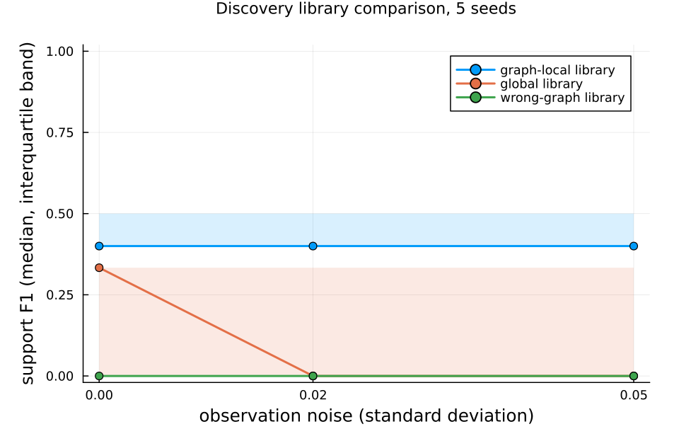

# Benchmarks

The recovery benchmarks are the evidence behind the claims in this
documentation. They are run by `BioDynaX.run_recovery_suite`, the scripts in
`benchmark/`, and two test entry points, and they are scored against the
thresholds in `RECOVERY_THRESHOLDS`. Loosening a threshold is treated as a
breaking change.

## What is run

The fast checks run in the default test suite (`Pkg.test()`, file
`test/test_recovery.jl`). They use exact or analytically generated
destruction-rate samples and short training runs:

- **Known kinetics**: linear, Michaelis-Menten, Hill, and competitive
  networks with all terms known; the relative error of the physical
  parameters after `train_ude` must stay below the threshold.
- **Analytical Hill recovery**: support F1 and rate error from exact samples
  of a Hill rate; with 0.5% noise the nested subset selection must reach a
  combined support F1 of at least 0.99 on the same library.
- **Graph-local versus global library**: the same noisy samples plus a
  correlated distractor `z`. The check is library membership: `z` must be
  absent from the graph-local library and present in the global one. After
  subset selection both libraries can reach the same F1; the difference is
  the prior, not the score.
- **Three-state and six-state graph priors** with a wrong-graph negative
  control: the graph-local library must contain the true regulator and no
  false parent; a library built from a deliberately wrong graph must miss the
  true regulator.
- **Partial observation**: recovery from subsampled destruction-rate values
  and the residual of the resulting hybrid model. Training on missing states
  is not part of the benchmark.
- **Identifiability interventions**: freezing `k_prod`, normalizing the
  sampled rate, and changing the production rate; the production-rate versus
  destruction-scale collinearity must persist (cosine at least 0.95).
- **Negative control at 5% noise**: analytical recovery must fail the 0.99
  criterion, so that the noise limit stays visible.

The trained-model checks run in `test/run_recovery_hard.jl` (about 10 minutes
on a 4-core machine; CI allows 180)
and follow the [reference protocol](concepts.md#The-reference-protocol):

- **Hill unknown term, no noise**: nine experiments generated once, training
  on experiments 1 to 7. The neural rate must match the true rate on the
  discovery grid (`nn_rate_rmse` at most 0.12) before discovery runs; then
  support recall must be at least 0.99, combined F1 at least 0.50, the hybrid
  residual on experiment 1 at most 0.30, and the scale warning must be raised
  with a cosine of at least 0.95. The residual and the neural-rate error on
  experiments 8 and 9 are reported.
- **The same protocol with 2% observation noise.**
- **Michaelis-Menten unknown term**: neural-rate error and residual only. The
  Hill recall criterion is not applied, and canonical Michaelis-Menten
  support from the trained network is not claimed.

The trained-model library comparison (`BioDynaX.evaluate_trained_graph_local`,
full protocol in `test/run_m4_b_protocol.jl`) runs discovery with the
graph-local, global, and wrong-graph libraries on one trained model's sampled
rate.

## Benchmark scripts

| Script | What it does | CI |
|---|---|---|
| `benchmark/recovery_suite.jl` | fast sections, then the trained-model Hill and Michaelis-Menten sections with the printed report | no |
| `benchmark/sindy_baseline.jl` | graph-local versus global library on the same samples; a DataDrivenSparse row when that package is loaded | no |
| `benchmark/recovery_seeds.jl` | analytical recovery on seeds 103, 107, 111, 113, 127; `--ude` runs the trained-model protocol on each seed | no |
| `benchmark/noise_grid.jl` | analytical Hill recovery at 0, 0.5, 2, 5, and 10% rate noise | no |
| `benchmark/functional_identifiability.jl` | the five-restart functional-identifiability diagnostic | no |
| `benchmark/ude_f1_attempt.jl` | replays the trained-model nuisance terms on the same library to document that they persist | no |
| `benchmark/scale_basis.jl` | library size versus node count | no |
| `benchmark/library_comparison_study.jl` | the library comparison study: five seeds, three noise levels, three libraries; resumable CSV output and a summary table | weekly |
| `benchmark/plot_library_comparison.jl` | figure of support F1 against noise per library from the study CSV (needs Plots) | no |
| `benchmark/allocation_gate.jl` | allocation count of the in-place right-hand side | yes |
| `benchmark/probe_datadriven.jl` | checks whether DataDrivenSparse resolves in an isolated environment | yes, allowed to fail |

## Representative results

The numbers below were recorded with the 0.9.2 protocol. They are single
runs at fixed seeds, not success rates. A rerun of `test/run_recovery_hard.jl`
for the 0.10.0 release, with freshly resolved dependency versions, passed
every threshold but did not reproduce the recorded values exactly; the rerun
values are listed under each table. Exact values depend on the dependency
versions in the environment; the thresholds are what the package promises.

Trained-model recovery (`test/run_recovery_hard.jl`, training on experiments
1 to 7, held-out 8 and 9):

| Run | `nn_rate_rmse` | `support_recall` | `support_f1` | `data_residual` | `data_residual_train` | `data_residual_holdout` | `d_rmse_holdout` |
|---|---|---|---|---|---|---|---|
| Hill, seed 103, no noise | 0.046 | 1.0 | 0.571 | 0.0042 | 0.0022 | 0.0041 | 0.012 |
| Hill, seed 113, 2% noise | 0.037 | 1.0 | 0.571 | 0.022 | 0.021 | 0.021 | 0.018 |
| Michaelis-Menten, seed 123 | 0.036 | not applied | 0.667 | 0.0054 | 0.0015 | 0.0032 | 0.0053 |

Rerun for 0.10.0 (September 2026): Hill seed 103 gave `nn_rate_rmse` 0.037,
recall 1.0, F1 0.571, `data_residual` 0.0020, train 0.0010, held-out 0.0015,
`d_rmse_holdout` 0.0046; Hill seed 113 with 2% noise gave 0.098, 1.0, 0.571,
0.022, 0.020, 0.020, 0.072; Michaelis-Menten seed 123 gave 0.028, recall not
applied, F1 0.571, 0.0033, 0.0008, 0.0010, 0.0099.

Environment of the rerun: Julia 1.10.12, OrdinaryDiffEq 7.8.1,
SciMLSensitivity 7.119.2, Lux 1.31.4, Optimization 5.9.0, Zygote 0.7.13
(SciMLBase 3.50.2). No Manifest is committed, so each installation resolves
its own dependency versions, and benchmark values move with them; the
thresholds in `RECOVERY_THRESHOLDS` are what is checked.

A support F1 of 0.571 means the true Hill monomials were all recovered
(recall 1.0) together with two nuisance terms, a constant and a linear term.
`benchmark/ude_f1_attempt.jl` shows that subset selection and scale
normalization on the same library do not remove them.

Analytical recovery across seeds (`benchmark/recovery_seeds.jl`, 0.5% noise):
all five seeds reach F1 1.00 and recall 1.00 (reproduced for 0.10.0).

Noise grid (`benchmark/noise_grid.jl`, seed 104; reproduced for 0.10.0, where
the 10% row gave F1 0.50 instead of the recorded 0.40):

| rate noise | F1 | recall | passes 0.99 |
|---|---|---|---|
| 0 | 1.00 | 1.00 | yes |
| 0.5% | 1.00 | 1.00 | yes |
| 2% | 1.00 | 1.00 | yes |
| 5% | 0.40 | 0.50 | no |
| 10% | 0.40 | 0.50 | no |

Analytical recovery holds through 2% noise and breaks at 5%. Discovery from
raw trajectories with finite-difference derivatives is therefore only
claimed up to 2% noise.

Graph-local versus global library (`benchmark/sindy_baseline.jl`, seed 104,
two-state fixture with an `r^2`-like distractor; reproduced for 0.10.0):
both libraries reach F1 1.00 with no false parent after subset selection. The
prior shows up as
library membership of the distractor, not as an F1 gap. The DataDrivenSparse
row is unavailable because that package does not resolve against the
ModelingToolkit versions this package allows; `benchmark/probe_datadriven.jl`
reproduces the resolve error.

Six-state graph prior (`BioDynaX.run_recovery_suite` with
`sections = (:six_state, :six_state_wrong_graph)`): the graph-local library
contains the true regulator and no false parent and excludes the distractor;
the global library includes the distractor and admits a false parent; the
wrong-graph library misses the true regulator. Combined F1 is not scored on
this fixture because the target state itself sits in the local library.

## Library comparison study

The claim that a graph-local library recovers the unknown mechanism more
reliably than a global library, and that a wrong graph degrades it, is
tested as a study over seeds and noise levels on the four-state network of
the trained-model library comparison. The states are S, R, Q, and a
distractor Z; the unknown term is the Hill degradation of S with regulator
R, `D(R) = 1.7 R^2 / (0.36 + R^2)`. For each seed and noise level one model
is trained on three initial conditions with 40 points each (Adam 100, then
BFGS 50), its learned rate is sampled once on 80 designed coordinates, and
discovery runs three times on those samples: with the graph-local library
(monomials of S and R up to degree 2), with the global library (monomials
of all four states), and with the library of a deliberately wrong graph (Q
as the parent of S instead of R). The first candidate of each discovery is
scored against the true implicit support, `R^2` in the numerator and `R^2`
in the denominator. Two held-out initial conditions, never used for
training, give the held-out residual of the hybrid model that uses the
discovered rate.

The default study is seeds 103, 107, 111, 113, and 127, observation noise
0, 0.02, and 0.05 (standard deviation of additive Gaussian noise on the
observations), and the three libraries: 15 trainings and 45 rows.
`benchmark/library_comparison_study.jl` ran it in 28 minutes on 4 cores
(median training 107 s) and `benchmark/plot_library_comparison.jl` drew the
figure.



Median over the five seeds, with the first and third quartile in brackets:

| library | noise | support F1 | support recall | extra terms | held-out residual | neural-rate error |
|---|---|---|---|---|---|---|
| graph-local | 0 | 0.40 [0.40, 0.50] | 0.5 [0.5, 0.5] | 2 [1, 2] | 0.041 [0.024, 0.044] | 0.073 |
| graph-local | 0.02 | 0.40 [0.40, 0.50] | 0.5 [0.5, 0.5] | 2 [1, 2] | 0.032 [0.030, 0.056] | 0.075 |
| graph-local | 0.05 | 0.40 [0.40, 0.50] | 0.5 [0.5, 0.5] | 2 [1, 2] | 0.057 [0.054, 0.057] | 0.048 |
| global | 0 | 0.33 [0.00, 0.33] | 0.5 [0.0, 0.5] | 3 [3, 5] | 0.127 [0.125, 0.127] | 0.073 |
| global | 0.02 | 0.00 [0.00, 0.33] | 0.0 [0.0, 0.5] | 5 [3, 5] | 0.154 [0.139, 0.154] | 0.075 |
| global | 0.05 | 0.00 [0.00, 0.33] | 0.0 [0.0, 0.5] | 5 [3, 5] | 0.161 [0.114, 0.208] | 0.048 |
| wrong graph | 0 | 0.00 [0.00, 0.00] | 0.0 [0.0, 0.0] | 2 [2, 2] | 0.252 [0.251, 0.257] | 0.073 |
| wrong graph | 0.02 | 0.00 [0.00, 0.00] | 0.0 [0.0, 0.0] | 2 [2, 2] | 0.265 [0.249, 0.335] | 0.075 |
| wrong graph | 0.05 | 0.00 [0.00, 0.00] | 0.0 [0.0, 0.0] | 2 [2, 2] | 0.266 [0.247, 0.342] | 0.048 |

The neural-rate error is a property of the trained model, so it is the same
for the three libraries of a run. Three of the 45 rows (graph-local at
seeds 103 and 111 and global at seed 103, all at noise 0.05) have no finite
residual because the hybrid model with the discovered rate diverged; the
residual medians are over the finite values.

Environment of the run: Julia 1.10.12, OrdinaryDiffEq 7.8.1,
SciMLSensitivity 7.119.2, Lux 1.31.4, Optimization 5.9.0, Zygote 0.7.13
(SciMLBase 3.50.2), 2026-09-05. No Manifest is committed, so a rerun with
other dependency versions can give other values.

What the numbers show. The graph-local library has the highest support F1
at every noise level and a held-out residual three to five times smaller
than the global library's; the wrong-graph library recovers no true term in
any of its 15 runs and has the largest residual. No library recovers the
full true support: the graph-local recall is 0.5 in all 15 runs because
every graph-local candidate is a polynomial in R (`R^2` in the numerator
with `R` in all 15 runs and `1` in 7 of them, for example
`2.05 R - 0.62 R^2` at seed 103 without noise) and no denominator term is
selected, so the rational form of the Hill rate is not recovered.
The global library recovers `R^2` in 7 of 15 runs and adds `Q^2` and `Z^2`
in 14 of 15; its median F1 falls from 0.33 without noise to 0 at noise 0.02
and 0.05. Within this noise range the graph-local scores do not change, and
the neural-rate error varies more across seeds (0.035 to 0.19) than across
noise levels. The study therefore supports the ordering graph-local, then
global, then wrong graph on this network; it does not show recovery of the
exact mechanism, and it is five seeds on one network.

## Report fields

| Field | Meaning |
|---|---|
| `rmse`, `rel` | relative error of the physical parameters (known kinetics) |
| `nn_correlation`, `nn_rate_rmse` | trained neural rate versus the true rate on the discovery grid |
| `support_recall` | fraction of the true monomials recovered |
| `support_f1` | F1 of the recovered numerator and denominator support |
| `discovered_rate_rmse` | discovered rate versus the true rate on the grid |
| `data_residual` | hybrid-model residual on training experiment 1 |
| `data_residual_train`, `data_residual_holdout` | mean residuals on experiments 1 to 7 and on 8 and 9 |
| `d_rmse_holdout`, `d_rmse_holdout_domain` | neural-rate error at held-out regulator values and on the training-derived band |
| `local_f1`, `global_f1` | discovery F1 with the graph-local and the global library |
| `local_has_true_parent`, `local_false_parent`, `Z_in_local_library` | library-membership checks |
| `identifiability` | the production/destruction trade-off report |
| `closed_loop_residual` | hybrid residual after discovery from subsampled rate values |

## Running locally

```bash
julia --project=. -e 'using Pkg; Pkg.test()'
julia --project=. test/run_recovery_hard.jl
julia --project=. test/run_m4_b_protocol.jl
julia --project=. benchmark/recovery_suite.jl
julia --project=. benchmark/sindy_baseline.jl
julia --project=. benchmark/recovery_seeds.jl
julia --project=. benchmark/noise_grid.jl
julia --project=. benchmark/library_comparison_study.jl
```

`benchmark/library_comparison_study.jl --timed` runs one seed and one noise
level and prints the extrapolated wall time of the default study.
