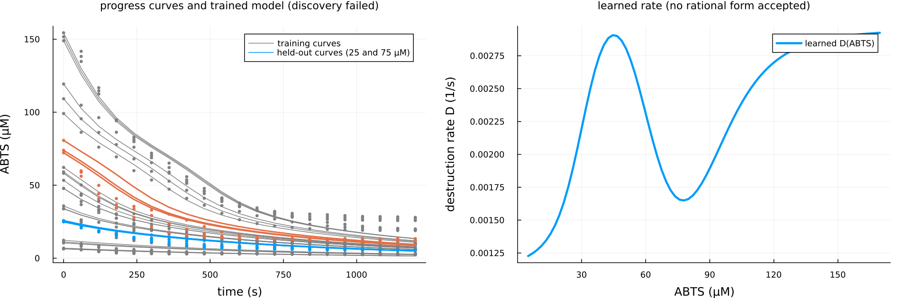

# Case study: laccase-catalysed oxidation of ABTS (measured data)

This page runs the one-call workflow on measured data: nine substrate-depletion
progress curves of the oxidation of ABTS by a laccase, in triplicate, from an
EnzymeML document published with the EnzymeML paper. It is the first real
dataset the package has been run on. Nothing on this page runs in the test
suite or in CI (it needs network access to download the data and about ten
minutes of training); every number below comes from the run described in
[Results](@ref laccase-results), in this environment.

## Why this dataset and not the p53–Mdm2 loop

The case study planned for this release was the p53–Mdm2 negative-feedback
loop, with the single-cell time series of nuclear p53 and Mdm2 fluorescence of
Geva-Zatorsky et al. (2006), *Molecular Systems Biology* 2:2006.0033, or a
later Lahav-laboratory dataset with both reporters. None was accessible from
the environment in which this release was prepared: the journal site, PubMed
Central, Zenodo, Dryad, Figshare, OSF, the laboratories' sites, and Cell Press
were all unreachable (the network policy of the session allowed GitHub only),
and no GitHub deposit of per-cell p53 and Mdm2 traces was found (the
Lahav-laboratory repositories on GitHub hold tracking software without data,
and the one repository with "p53 oscillations" in its name holds model
simulations). The first fallback, the two ssrA-tagged fluorescent proteins
competing for ClpXP of Cookson et al. (2011), *Molecular Systems Biology*
7:561, was unreachable for the same reason. The second fallback, a published
enzyme progress-curve dataset with substrate depletion under saturating
kinetics, was accessible on GitHub and is what this page uses. The p53–Mdm2
protocol is written out at the end of the page so that it can be run when
the data are at hand.

## Data

- Source: `Scenario4/ABTS_Measurement_Ngubane.omex` in the GitHub repository
  [EnzymeML/Lauterbach_2022](https://github.com/EnzymeML/Lauterbach_2022),
  the supporting repository of Lauterbach, S. et al. (2023), "EnzymeML:
  seamless data flow and modeling of enzymatic data", *Nature Methods* 20,
  400–402, [doi:10.1038/s41592-022-01763-1](https://doi.org/10.1038/s41592-022-01763-1).
  The document's creator is Sandile Ngubane (2021-10-15).
- Format: an EnzymeML document (an OMEX archive: an SBML file with the
  species, reactions, and measurement metadata, and one CSV file per
  measurement).
- Content: laccase 2 (lap2, 0.93 µmol/l in every measurement, held constant)
  oxidising 2,2'-azino-bis(3-ethylbenzothiazoline-6-sulphonic acid) (ABTS).
  Nine measurements with nominal initial ABTS of 5, 10, 25, 35, 50, 65, 75,
  110, and 150 µmol/l (the measured first points run from 6.3 to 154 µmol/l),
  each with 21 points at 60 s intervals from 0 to 1200 s and three replicates,
  observing the ABTS concentration in µmol/l. The document also declares an
  enzyme-inactivation reaction, which is not part of the model here.
- Download: `examples/laccase_abts/download_data.jl` fetches the file from
  the repository at commit `348b742f3c5f7e4e0d0a679b22ccd6b4d9bfdbe3`
  (branch `main`, 2022-04-11) and checks its SHA-256,
  `d026cb2038c27e1bb7ceb7f4d60686b9a6feec6e92d1817aa9e6f9c09ff54975`
  (10111 bytes), before unpacking it with `unzip`.
- Licence: the repository has no licence file and the document no licence
  statement, so the data are not redistributed with the package; the
  download script and this page record where they come from. The article
  is open access under CC BY 4.0, which covers the article, not
  necessarily the repository. Cite the article above when using the data.

## Preprocessing

`examples/laccase_abts/preprocess.jl` does the following and nothing else:

1. Concentrations are divided by 100 µmol/l and times by 1000 s, so the model
   state is ABTS in units of 100 µmol/l and its time unit is 1000 s. Nothing
   is smoothed, trimmed, or interpolated; the 21 points of every replicate
   enter as measured. A global scale, rather than a per-curve normalisation,
   keeps the nine curves comparable, since they are absolute concentrations
   of the same substrate.
2. Every replicate curve is one experiment (27 experiments); its initial
   condition is its own measured value at t = 0.
3. The 25 µmol/l and 75 µmol/l curves (the third and seventh in order of
   initial concentration) are held out with all their replicates, six
   experiments of 27, about 22%. The rule was fixed before any run: two
   interior curves, so that the held-out residual measures interpolation
   between trained initial concentrations.

## Model

One observed state, ABTS, with the per-concentration destruction rate
unknown:

```math
\frac{d[\mathrm{ABTS}]}{dt} = -D([\mathrm{ABTS}])\,[\mathrm{ABTS}],
```

declared as a reaction with `known = false` regulated by ABTS itself and, for
clarity, as the edge ABTS → ABTS of kind `UNKNOWN_NN`. The enzyme
concentration is the same in every curve, so it is not a state and is
absorbed into `D`. The literature form for a single substrate and a
constant enzyme is Michaelis–Menten depletion,
`-Vmax [ABTS] / (K + [ABTS])`, which in this parametrisation is
`D = Vmax / (K + [ABTS])`: a constant numerator over a denominator linear in
ABTS, or `a / (1 + b [ABTS])` with `a = Vmax / K` and `b = 1 / K` in the
package's normalisation of the constant denominator coefficient. The
compiled mechanism requires a production term, so a basal production of ABTS
is declared with both of its parameters frozen during training at 1e-8
(the positivity constraint of the reference defaults does not admit zero),
a production of 1e-16 model units per model time unit.

Recovered coefficients are in model units (ABTS per 100 µmol/l, rates per
1000 s). Because the enzyme concentration and the production scale are
fixed rather than fitted, the scale of `D` is set by the data alone here;
the identifiability diagnostic still runs and its numbers are reported.

## Protocol

`examples/laccase_abts/run_case_study.jl` calls `discover_unknown_term`
twice with the reference defaults (warm-up on the first training experiment,
Adam 100 then BFGS 50, the learned rate sampled on the regulator grid of the
training experiments, bootstrap 8, discovery seed 3), once without and once
with `stability_selection = StabilitySelection()` (100 resamples, τ = 0.8),
with the six held-out experiments passed as `holdout = 6` and the same
random seed. Nothing is tuned per curve. `examples/laccase_abts/plot_case_study.jl`
draws the figure from the files the run writes.

## [Results](@id laccase-results)

Run on 2026-09-06 with Julia 1.10.12, OrdinaryDiffEq 7.8.1, SciMLSensitivity
7.119.2, Lux 1.31.4, Optimization 5.9.0, Zygote 0.7.13 (SciMLBase 3.50.2), 4
cores with four benchmark trainings running alongside: 208 s for the run with
the reference defaults and 105 s for the run with stability selection (both
train the same model; the second run's training finished faster because the
first had compiled the code).

**Training.** The hybrid model fits the curves: final training loss 0.0020
(mean squared error in model units), root-mean-square error of the trained
model against the data 3.8 µmol/l over the 21 training curves and 4.9 µmol/l
over the 6 held-out curves (per curve, from 0.7 µmol/l at 5 µmol/l initial
ABTS to 8.8 µmol/l at 150 µmol/l). The frozen production parameters stayed at
1e-8. The identifiability diagnostic reports a collinearity of 0.42 between
the (frozen) production rate and the destruction scale and does not flag the
edge; with no fitted production parameter the Fisher condition number is
infinite, and the diagnostic is not informative here.

**Discovery: no rational rate was accepted.** With the reference defaults and
with stability selection alike, the discovery returned `DenominatorUnsafe`:
the sparse implicit fit selected a denominator that changes sign on the
sample domain ("discovered denominator is singular on train/validation/domain
data"), and the safety check rejected the candidate. There is no discovered
equation, no hybrid residual, and no selection-frequency table (the stage
runs after a candidate exists). The result is the same without the
bootstrap, so it is not a bootstrap artefact.

**Why.** The learned per-concentration rate is not a decreasing function of
ABTS, which Michaelis–Menten depletion with a constant enzyme would require.
Sampled on the regulator grid (5 to 152 µmol/l, 80 points) it is
non-monotone:

| ABTS (µmol/l) | 5 | 26 | 47 | 68 | 88 | 109 | 130 | 151 |
|---|---|---|---|---|---|---|---|---|
| learned D (1/s) | 0.00123 | 0.00189 | 0.00290 | 0.00188 | 0.00184 | 0.00250 | 0.00280 | 0.00290 |

The rate rises overall with concentration and has a bump near 47 µmol/l. The
data themselves say why a one-state model cannot do better: every curve
flattens at a non-zero concentration (about 2.5 µmol/l for the 5 µmol/l
curve, 9 to 10 µmol/l for the 50 µmol/l curve, 26 to 28 µmol/l for the
150 µmol/l curve), and the fraction consumed in 1200 s is larger at high
initial concentration (83% at 150 µmol/l, 60% at 6.5 µmol/l). A destruction
rate that depends on the ABTS concentration alone, without time, cannot stop
at a curve-dependent plateau: the trained model runs below the measured
plateaus at late times (visible in the figure; the mean error of 3.8 µmol/l
hides this systematic miss), its rate is a compromise across curves that
produces the bumps, and no low-order rational function fits the bumps with
a positive denominator.
The source document's own model includes an enzyme-inactivation reaction,
which is a time-dependent loss of activity that this one-state model does
not represent.



**Comparison with the literature form.** The discovered form cannot be
compared, since none was accepted. The learned rate is the opposite of the
literature form in its trend (increasing rather than decreasing in the
substrate), which is the signature of a missing state rather than of a
different kinetics.

## What this does and does not show

This case study shows the workflow running end to end on measured data with
the same defaults as the synthetic benchmarks: the data loader, the scaled
units, the frozen production term, the held-out split, the training, and the
discovery stage with its safety check. It shows the safety check doing its
job: a rational rate that would have a pole on the data domain was refused
rather than reported, and the failure is stated as such in the report. It
does not show mechanism recovery on measured data, and it does not test the
package's central claim (recovering a regulated destruction term from a
partner state) because the accessible dataset has one observed state and no
regulator. What it points to is the next step: a two-state model with the
enzyme as a latent state (initial value known, 0.93 µmol/l, decaying with a
fitted inactivation rate) and the unknown destruction regulated by ABTS and
the enzyme, which the compiler supports but the one-call workflow, which is
built for one regulator, does not; and the p53–Mdm2 study below when its data
are at hand. Nothing here was tuned: the run uses the reference defaults, and
the only choices (units, held-out curves, the frozen production) were fixed
before the first run and are listed above.

## The p53–Mdm2 protocol, for when the data are accessible

Two states, p53 (P) and Mdm2 (M). Known: production of M activated by P as
a mass-action term (the simplest form consistent with the delayed
transcriptional activation of the 2006 model; a Hill form is the
alternative), linear degradation of M, constant production of P. Unknown: the
destruction term of P, regulated by M, declared as a reaction with
`known = false` and the edge P ← M. Fluorescence units are arbitrary, so
each trace would be normalised to its own maximum, and recovered coefficients
would be in those units with the production/destruction scale not
separately identifiable. Cells with sustained oscillations would be selected
by the paper's criterion where stated and otherwise by a documented rule
(for example at least four peaks in 48 h), resampled to a common grid, one
experiment per cell, about 20% of cells held out, and `discover_unknown_term`
run with the reference defaults and then with stability selection, reporting
the identifiability diagnostic, the training and held-out residuals, the
learned destruction rate against M with the discovered rational form, and the
selection frequencies; the discovered form would be compared with the
Mdm2-mediated degradation term of the literature model (monotone in M,
saturating or not).
